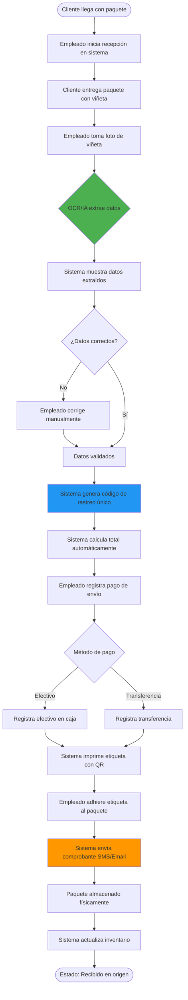
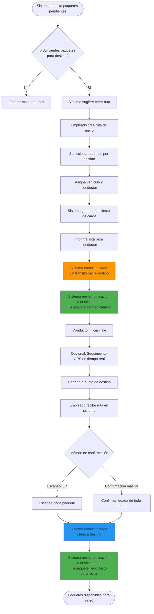
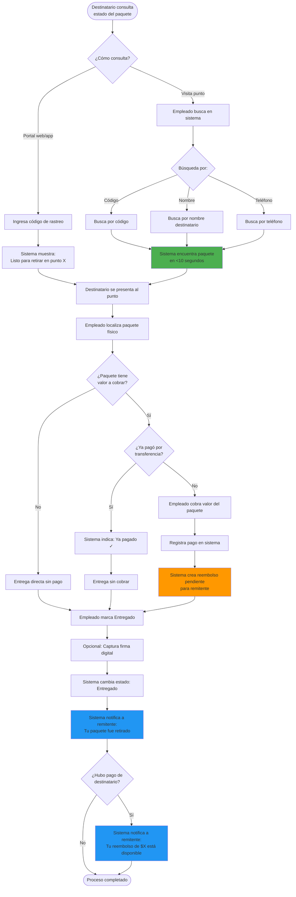
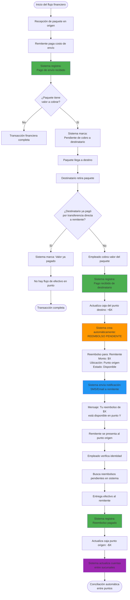
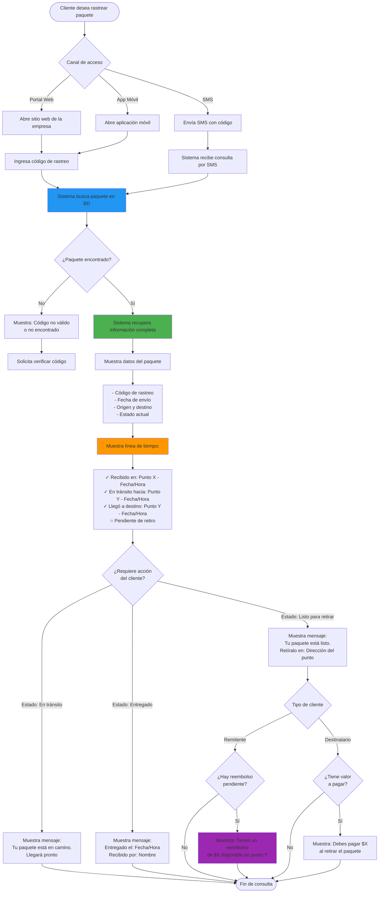
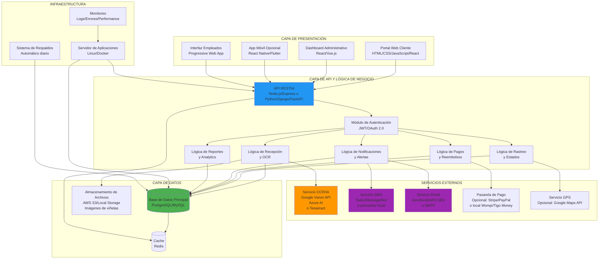
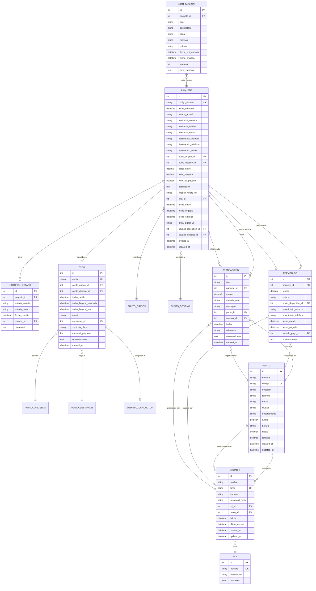

# ANÁLISIS Y DISEÑO DE SISTEMA DE GESTIÓN LOGÍSTICA
## Empresa de Paquetería - El Salvador

---

**Documento de Análisis y Diseño de Sistema**  
**Versión:** 1.0  
**Fecha:** 6 de enero de 2026  
**Autor:** Consultoría de Sistemas DeepAgent  
**Cliente:** Empresa de Logística y Paquetería Nacional

---

## TABLA DE CONTENIDOS

1. [Resumen Ejecutivo](#1-resumen-ejecutivo)
2. [Análisis del Proceso Actual (AS-IS)](#2-análisis-del-proceso-actual-as-is)
3. [Propuesta de Proceso Mejorado (TO-BE)](#3-propuesta-de-proceso-mejorado-to-be)
4. [Diagramas de Flujo del Sistema](#4-diagramas-de-flujo-del-sistema)
5. [Arquitectura del Sistema](#5-arquitectura-del-sistema)
6. [Modelo de Datos](#6-modelo-de-datos)
7. [Casos de Uso Detallados](#7-casos-de-uso-detallados)
8. [Funcionalidades del Sistema](#8-funcionalidades-del-sistema)
9. [Wireframes y Mockups Conceptuales](#9-wireframes-y-mockups-conceptuales)
10. [Puntos de Automatización Implementados](#10-puntos-de-automatización-implementados)
11. [Recomendaciones Tecnológicas](#11-recomendaciones-tecnológicas)
12. [Plan de Implementación](#12-plan-de-implementación)
13. [Consideraciones Adicionales](#13-consideraciones-adicionales)
14. [Conclusiones y Próximos Pasos](#14-conclusiones-y-próximos-pasos)

---

# 1. RESUMEN EJECUTIVO

## 1.1 Visión General del Proyecto

La empresa de logística y paquetería opera actualmente con un sistema manual basado en viñetas escritas a mano, lo que genera ineficiencias operativas, errores humanos y falta de visibilidad en tiempo real para clientes y administración. Este documento presenta el análisis completo y el diseño de un **Sistema Integral de Gestión Logística (SIGL)** que transformará digitalmente las operaciones de la empresa.

El sistema propuesto integrará tecnologías modernas de Inteligencia Artificial, Reconocimiento Óptico de Caracteres (OCR), automatización de procesos y plataformas de rastreo en tiempo real para optimizar la cadena de valor desde la recepción hasta la entrega final de paquetes.

## 1.2 Contexto del Negocio

**Operación Actual:**
- **Cobertura:** Red nacional con múltiples puntos de servicio (San Salvador, La Unión, Santa Ana, entre otros)
- **Modelo de negocio:** Recepción de paquetes en un punto, consolidación por destino y entrega en otro punto
- **Volumen crítico:** San Salvador maneja el mayor flujo, especialmente miércoles y sábados (8am-1pm)
- **Personal:** Entre 2 empleados (puntos pequeños) hasta 10-15 empleados (San Salvador)
- **Documentación:** Viñetas manuscritas con información básica
- **Sistema actual:** Excel u hojas de cálculo con funcionalidad muy limitada

## 1.3 Objetivos Principales

### Objetivos Estratégicos
1. **Digitalización Completa:** Eliminar el 95% de la documentación manual en papel
2. **Visibilidad Total:** Proporcionar rastreo en tiempo real para el 100% de los envíos
3. **Eficiencia Operativa:** Reducir tiempo de procesamiento de paquetes en un 60%
4. **Satisfacción del Cliente:** Aumentar la transparencia y confianza mediante notificaciones automáticas
5. **Control Financiero:** Automatizar la gestión de pagos y reembolsos con precisión del 99.9%

### Objetivos Operacionales
- Implementar sistema OCR/IA para digitalización automática de viñetas manuscritas
- Desarrollar plataforma web/móvil de rastreo accesible 24/7
- Crear sistema de notificaciones automáticas por SMS/email
- Establecer flujos de trabajo optimizados para cada etapa operativa
- Implementar dashboard ejecutivo con KPIs en tiempo real

## 1.4 Beneficios Esperados

### Beneficios Cuantitativos

| Área de Impacto | Métrica Actual | Métrica Proyectada | Mejora |
|-----------------|----------------|-------------------|---------|
| Tiempo de registro de paquete | 3-5 minutos | 45 segundos | 80% reducción |
| Errores de transcripción | 8-12% | <1% | 90% reducción |
| Consultas telefónicas "¿Dónde está mi paquete?" | 150-200/día | 20-30/día | 85% reducción |
| Tiempo de procesamiento de reembolsos | 2-4 días | <1 hora | 95% reducción |
| Capacidad de procesamiento (paquetes/hora) | 15-20 | 50-60 | 200% aumento |

### Beneficios Cualitativos

**Para la Empresa:**
- Mejor toma de decisiones basada en datos en tiempo real
- Mayor control sobre operaciones distribuidas
- Reducción de pérdidas por errores administrativos
- Imagen corporativa moderna y profesional
- Escalabilidad para crecimiento futuro

**Para los Empleados:**
- Reducción de tareas repetitivas y manuales
- Herramientas digitales intuitivas y fáciles de usar
- Menor estrés por manejo de efectivo y cálculos manuales
- Acceso a información centralizada y actualizada

**Para los Clientes:**
- Transparencia total del estado de sus envíos
- Notificaciones proactivas automáticas
- Reducción de tiempo de espera en puntos de atención
- Confianza en el manejo de sus pagos y reembolsos
- Experiencia moderna similar a empresas internacionales (DHL, FedEx)

## 1.5 Alcance del Documento

Este documento técnico proporciona:
- Análisis detallado de procesos actuales y propuestos
- Arquitectura de software y especificaciones técnicas
- Modelo de datos completo con relaciones entre entidades
- Casos de uso para todos los actores del sistema
- Especificaciones funcionales de cada módulo
- Recomendaciones tecnológicas específicas para el contexto salvadoreño
- Plan de implementación por fases con cronograma realista
- Consideraciones de capacitación, migración y soporte

Este documento servirá como **base técnica completa** para la fase de desarrollo del sistema con herramientas de desarrollo asistido por IA.

---

# 2. ANÁLISIS DEL PROCESO ACTUAL (AS-IS)

## 2.1 Descripción Detallada del Proceso Actual

### 2.1.1 Recepción de Paquetes en Punto de Origen

**Flujo Operativo:**

1. **Llegada del Cliente Remitente**
   - El cliente llega al punto de servicio con su paquete
   - Espera en fila (especialmente crítico miércoles/sábados en San Salvador: 8am-1pm)
   - No existe sistema de turnos o citas previas

2. **Llenado de Viñeta Manuscrita**
   - El empleado o el cliente llena una viñeta física en papel
   - **Datos registrados:**
     - Nombre del remitente
     - Teléfono del remitente
     - Nombre del destinatario
     - Teléfono del destinatario
     - Punto de destino (ej: Santa Ana, La Unión)
     - Valor del paquete (si aplica - para pago del destinatario)
     - Costo de envío
     - Total a pagar por el remitente
   - **Problemas frecuentes:**
     - Letra ilegible
     - Datos incompletos o incorrectos
     - Confusión entre campos (destino/destinatario)
     - Cálculos erróneos del total

3. **Cobro y Documentación**
   - El empleado calcula manualmente el total (costo envío + valor paquete si aplica)
   - El **remitente SIEMPRE paga el costo de envío** en efectivo
   - Si el paquete tiene valor (mercancía), ese monto se anota para cobro al destinatario
   - Se registra el pago en una libreta manual o planilla de Excel
   - La viñeta se adhiere al paquete
   - No se genera comprobante digital ni código de rastreo

4. **Almacenamiento Temporal**
   - El paquete se coloca en un área designada según destino
   - Agrupación física rudimentaria por ciudad de destino
   - No hay registro digital de ubicación o cantidad de paquetes pendientes

### 2.1.2 Consolidación y Envío

**Flujo Operativo:**

1. **Decisión de Envío**
   - Proceso no estandarizado: se espera "tener suficientes paquetes" para el mismo destino
   - Criterio subjetivo del encargado de punto
   - No hay optimización algorítmica de rutas o consolidación

2. **Preparación del Envío**
   - Se cuentan manualmente los paquetes para cada destino
   - Se crea una "lista de envío" manuscrita o en Excel básico
   - No hay registro sistemático de salida de paquetes

3. **Transporte**
   - Asignación manual de vehículo/conductor
   - No hay sistema de seguimiento GPS
   - No se notifica automáticamente a destinatarios
   - El conductor lleva lista manuscrita

### 2.1.3 Recepción en Punto de Destino

**Flujo Operativo:**

1. **Llegada de Paquetes**
   - El conductor entrega paquetes al punto de destino
   - Se verifica manualmente contra lista de envío
   - Frecuentes discrepancias (paquetes faltantes, viñetas despegadas, datos ilegibles)

2. **Almacenamiento en Destino**
   - Paquetes se colocan en área de espera
   - No hay notificación automática al destinatario
   - El destinatario debe llamar o presentarse físicamente para consultar

### 2.1.4 Entrega al Destinatario

**Flujo Operativo:**

1. **Consulta del Destinatario**
   - El destinatario llama por teléfono o visita el punto
   - El empleado busca manualmente entre los paquetes
   - Pérdida de tiempo considerable en horas pico

2. **Verificación de Pago**
   - Se revisa la viñeta para verificar:
     - Si el paquete tiene valor a cobrar
     - Si ya se recibió transferencia del destinatario al remitente
   - **Escenario A:** Paquete con valor y destinatario NO ha pagado al remitente:
     - Destinatario paga el valor del paquete en efectivo al empleado
     - Se registra manualmente el pago
   - **Escenario B:** Paquete con valor y destinatario YA pagó por transferencia:
     - Destinatario solo retira, no paga nada
   - **Escenario C:** Paquete sin valor (solo envío):
     - Destinatario retira directamente sin pagar

3. **Registro de Entrega**
   - Se marca manualmente que el paquete fue retirado
   - Registro en libreta o Excel
   - No hay captura de firma digital
   - No se notifica automáticamente al remitente

### 2.1.5 Gestión de Reembolsos

**Flujo Operativo:**

1. **Cuando el Destinatario Pagó en el Punto**
   - El dinero queda en caja del punto de destino
   - Debe ser "devuelto" al remitente que está en el punto de origen
   - **Proceso actual:**
     - Se registra manualmente la deuda hacia el remitente
     - El remitente debe llamar o visitar para consultar si puede retirar
     - No hay notificación automática
     - Proceso manual de verificación de saldos pendientes
     - Alto riesgo de error u olvido

2. **Flujo de Efectivo entre Puntos**
   - No hay sistema automatizado de cuentas por cobrar/pagar entre sucursales
   - Conciliaciones manuales periódicas
   - Riesgo de descuadres financieros

### 2.1.6 Paquetes No Retirados (Devolución)

**Flujo Operativo:**

1. **Decisión de Devolución**
   - Después de X días (no estandarizado), se decide devolver el paquete
   - No hay notificación sistemática previa al destinatario

2. **Transporte de Regreso**
   - Mismo proceso manual de envío, pero en reversa
   - **Política actual:** NO se reembolsa el costo de envío original

3. **Entrega al Remitente Original**
   - Se notifica al remitente (llamada telefónica)
   - Remitente debe recoger su paquete
   - No recupera el costo de envío pagado

## 2.2 Identificación de Puntos de Dolor y Problemas

### 2.2.1 Problemas Operativos

| Problema | Descripción | Impacto |
|----------|-------------|---------|
| **Viñetas ilegibles** | Escritura a mano difícil de leer genera confusión y errores en destino/entrega | Alto - 10-15% de paquetes afectados |
| **Datos incompletos** | Falta información crítica (teléfonos, destino exacto) | Alto - Imposibilidad de notificar o entregar |
| **Errores de cálculo** | Cálculo manual de totales genera descuadres de caja | Medio - Pérdidas financieras |
| **Pérdida de viñetas** | Viñetas adheridas se despegan durante transporte | Alto - Paquete sin identificación |
| **Búsqueda manual** | Localizar un paquete específico toma 5-15 minutos en horas pico | Alto - Colas largas, insatisfacción |
| **Sin rastreo** | Clientes no pueden consultar estado de su paquete online | Alto - 150-200 llamadas diarias |
| **Consolidación ineficiente** | Decisión subjetiva de cuándo enviar paquetes | Medio - Costos de transporte no optimizados |
| **Sin control de rutas** | No hay optimización ni seguimiento GPS | Medio - Ineficiencia de combustible |

### 2.2.2 Problemas Financieros

| Problema | Descripción | Impacto |
|----------|-------------|---------|
| **Manejo de efectivo riesgoso** | Gran volumen de efectivo en puntos sin control digital | Crítico - Riesgo de robo/pérdida |
| **Reembolsos sin notificación** | Remitentes no saben cuándo pueden retirar su dinero | Alto - Llamadas constantes, insatisfacción |
| **Descuadres de caja** | Cierres de caja manuales con frecuentes errores | Alto - Pérdidas no identificadas |
| **Flujo entre sucursales no rastreado** | No hay sistema de cuentas por cobrar/pagar entre puntos | Crítico - Imposibilidad de auditar |
| **Conciliaciones lentas** | Cuadrar cuentas entre puntos toma días o semanas | Alto - Decisiones sin información financiera actualizada |

### 2.2.3 Problemas de Experiencia del Cliente

| Problema | Descripción | Impacto |
|----------|-------------|---------|
| **Falta de transparencia** | Cliente no sabe dónde está su paquete | Crítico - Insatisfacción, desconfianza |
| **Sin notificaciones** | Destinatario no sabe cuándo llegó su paquete | Alto - Paquetes sin retirar acumulados |
| **Proceso de reembolso opaco** | Remitente no sabe cuándo puede cobrar | Alto - Frustración, pérdida de confianza |
| **Largas esperas** | Colas de 30-60 minutos en horas pico | Alto - Mala experiencia de servicio |
| **Sin comprobante digital** | Solo viñeta física como prueba | Medio - Dificultad para reclamar |

### 2.2.4 Problemas Administrativos

| Problema | Descripción | Impacto |
|----------|-------------|---------|
| **Sin reportes en tiempo real** | Gerencia no sabe cuántos paquetes están en tránsito | Alto - Decisiones sin datos |
| **Imposibilidad de auditar** | No hay trazabilidad completa de transacciones | Crítico - Riesgo legal y financiero |
| **Sin KPIs** | No se miden tiempos de entrega, satisfacción, etc. | Alto - Imposibilidad de mejorar |
| **Escalabilidad limitada** | Sistema manual no puede crecer sin contratar mucho personal | Crítico - Freno al crecimiento |
| **Dependencia de personal** | Todo el conocimiento está en cabezas de empleados | Alto - Riesgo operativo por rotación |

## 2.3 Ineficiencias y Áreas de Mejora Identificadas

### 2.3.1 Ineficiencias de Tiempo

```
Proceso Manual Actual:
├─ Recepción de paquete: 3-5 minutos
│  └─ (Llenar viñeta + calcular + cobrar + registrar en Excel)
├─ Búsqueda de paquete en destino: 5-15 minutos
│  └─ (Búsqueda física + verificar viñeta + consultar registros)
├─ Procesamiento de reembolso: 2-4 días
│  └─ (Consulta manual + verificación + notificación telefónica)
└─ Responder consulta de rastreo: 5-10 minutos por llamada
   └─ (Buscar en registros + hacer llamadas entre sucursales)

TIEMPO TOTAL PERDIDO ESTIMADO: 40-50 horas/semana solo en San Salvador
```

### 2.3.2 Oportunidades de Automatización (Alto Impacto)

1. **Captura de datos de viñetas → OCR con IA**
   - Eliminar transcripción manual
   - Reducir errores de lectura
   - Acelerar registro de paquetes

2. **Generación de códigos de rastreo → Automático**
   - Identificador único por paquete
   - Base para rastreo online
   - Integración con sistema de estados

3. **Notificaciones a clientes → Automáticas**
   - Email/SMS cuando paquete llega a destino
   - Notificación de reembolso disponible
   - Recordatorios de retiro pendiente

4. **Cálculos financieros → Automáticos**
   - Cálculo de totales sin error
   - Registro de transacciones en tiempo real
   - Conciliación automática entre puntos

5. **Consolidación de envíos → Algoritmo inteligente**
   - Agrupar paquetes por destino automáticamente
   - Optimizar rutas de transporte
   - Reducir viajes y costos

6. **Reportes y dashboards → Tiempo real**
   - KPIs actualizados automáticamente
   - Alertas de paquetes rezagados
   - Visibilidad total para gerencia

### 2.3.3 Áreas Críticas para Mejora Inmediata

**Prioridad 1 (Crítica - Implementar en Fase 1):**
1. Sistema de rastreo básico con código único
2. Digitalización de recepción de paquetes
3. Notificación automática de llegada a destino
4. Control básico de pagos y reembolsos

**Prioridad 2 (Alta - Implementar en Fase 2):**
1. OCR/IA para lectura de viñetas
2. Dashboard para empleados con búsqueda rápida
3. Notificaciones de reembolsos disponibles
4. Reportes básicos para administración

**Prioridad 3 (Media - Implementar en Fase 3):**
1. Optimización de rutas con algoritmos
2. App móvil para clientes
3. Analytics avanzado y predicciones
4. Integración con pasarelas de pago

---

# 3. PROPUESTA DE PROCESO MEJORADO (TO-BE)

## 3.1 Visión del Proceso Optimizado

El proceso mejorado transforma completamente la operación actual, introduciendo automatización en cada etapa, visibilidad en tiempo real y una experiencia de usuario moderna tanto para empleados como para clientes.

### 3.1.1 Principios del Diseño TO-BE

1. **Digital First:** Toda transacción genera un registro digital inmediato
2. **Automatización Máxima:** Eliminar tareas manuales repetitivas mediante IA y algoritmos
3. **Transparencia Total:** Clientes y administración tienen visibilidad completa 24/7
4. **Eficiencia Operativa:** Procesos optimizados para reducir tiempos y errores
5. **Escalabilidad:** Capacidad de crecer sin incremento proporcional de personal

## 3.2 Proceso Mejorado Detallado

### 3.2.1 Recepción de Paquetes (OPTIMIZADO)

**Flujo con Sistema Nuevo:**

1. **Llegada del Cliente Remitente**
   - ✅ **Mejora:** Sistema de turnos digitales (opcional - para horas pico)
   - Cliente entrega paquete con viñeta manuscrita (transición gradual)

2. **Captura Digital con OCR/IA**
   - Empleado abre módulo de recepción en tablet/computadora
   - **Acción:** Toma foto de la viñeta manuscrita con cámara
   - **Sistema:** IA/OCR extrae automáticamente los datos:
     - Nombre remitente
     - Teléfono remitente
     - Nombre destinatario
     - Teléfono destinatario
     - Punto de destino
     - Valor del paquete
     - Costo de envío
   - **Validación:** Empleado revisa/corrige datos en pantalla (15 segundos)
   - ✅ **Beneficio:** Reducción de tiempo de 3-5 min → 45 segundos

3. **Generación Automática de Datos**
   - **Sistema genera automáticamente:**
     - Código de rastreo único (ej: SV-2026010612345)
     - Etiqueta con código QR para pegar en paquete
     - Fecha/hora de recepción
     - Estado inicial: "Recibido en [punto origen]"
     - Cálculo automático del total (sin errores)
   - ✅ **Beneficio:** Eliminación de errores de cálculo, rastreo habilitado

4. **Registro de Pago**
   - Empleado registra pago del costo de envío (efectivo/transferencia/tarjeta)
   - **Sistema:**
     - Registra transacción en tiempo real
     - Actualiza caja del punto automáticamente
     - Marca "Envío pagado por remitente: ✓"
   - **Comprobante digital:** Sistema genera y envía comprobante por email/SMS al remitente
   - ✅ **Beneficio:** Control financiero automático, transparencia

5. **Impresión y Etiquetado**
   - Sistema imprime etiqueta con código QR y resumen de datos
   - Empleado adhiere etiqueta al paquete
   - ✅ **Beneficio:** Backup físico si viñeta se pierde

6. **Almacenamiento con Registro Digital**
   - Empleado coloca paquete en área de destino correspondiente
   - **Sistema:**
     - Registra ubicación física en inventario
     - Agrega paquete a lista de "Pendientes de envío a [destino]"
   - ✅ **Beneficio:** Visibilidad instantánea de inventario

**TIEMPO TOTAL PROCESO OPTIMIZADO: 45-60 segundos (vs 3-5 minutos antes)**

### 3.2.2 Consolidación y Envío (OPTIMIZADO)

**Flujo con Sistema Nuevo:**

1. **Planificación Inteligente de Envíos**
   - **Sistema analiza automáticamente:**
     - Cantidad de paquetes por destino
     - Prioridad (paquetes con más tiempo de espera)
     - Capacidad de vehículos disponibles
     - Días de envío programados
   - **Sistema sugiere:** "Envío a Santa Ana: 23 paquetes listos - Vehículo recomendado: Van mediana"
   - ✅ **Beneficio:** Optimización de consolidación sin intervención manual

2. **Creación de Ruta de Envío**
   - Empleado/encargado crea "Ruta de Envío" en el sistema
   - Selecciona paquetes a enviar (sistema los filtra por destino)
   - Asigna conductor y vehículo
   - **Sistema:**
     - Genera lista digital de paquetes en la ruta
     - Cambia estado de todos los paquetes a "En tránsito hacia [destino]"
     - **Envía notificación automática** a destinatarios: "Tu paquete [código] está en camino"
   - Imprime manifiesto de carga para conductor
   - ✅ **Beneficio:** Rastreabilidad completa, notificaciones proactivas

3. **Durante el Transporte**
   - **Opcional (Fase avanzada):** Seguimiento GPS del vehículo
   - Clientes pueden ver en tiempo real que su paquete está en ruta
   - ✅ **Beneficio:** Transparencia total

### 3.2.3 Recepción en Punto de Destino (OPTIMIZADO)

**Flujo con Sistema Nuevo:**

1. **Registro de Llegada**
   - Empleado en punto de destino abre módulo "Recepción de Ruta"
   - **Opción A (Rápida):** Escanea código QR de cada paquete con lector/cámara
   - **Opción B (Manual):** Marca llegada de toda la ruta con un clic
   - **Sistema:**
     - Cambia estado a "Llegó a destino - [punto destino]"
     - **Envía notificación automática** a cada destinatario: "Tu paquete llegó a [punto]. ¡Listo para retirar!"
   - ✅ **Beneficio:** Notificación instantánea, sin llamadas manuales

2. **Almacenamiento en Destino**
   - Paquetes se organizan físicamente
   - Sistema mantiene lista digital de "Paquetes disponibles para retiro"
   - ✅ **Beneficio:** Búsqueda instantánea por código/nombre/teléfono

### 3.2.4 Entrega al Destinatario (OPTIMIZADO)

**Flujo con Sistema Nuevo:**

1. **Consulta del Destinatario**
   - **Opción A (Preferida):** Destinatario consulta en portal web con código de rastreo
   - **Opción B:** Destinatario llama o se presenta
   - Empleado busca en sistema por:
     - Código de rastreo
     - Nombre del destinatario
     - Teléfono del destinatario
   - **Sistema:** Encuentra paquete instantáneamente (vs 5-15 min manual)
   - ✅ **Beneficio:** Reducción de tiempo de búsqueda en 95%

2. **Verificación de Pago**
   - **Sistema muestra claramente:**
     - ¿Tiene valor a cobrar? → **Sí: $50.00** / No
     - ¿Destinatario ya pagó por transferencia? → **Sí ✓** / No
   - **Escenario A:** Paquete con valor y NO ha pagado:
     - Empleado cobra $50.00 al destinatario
     - Registra pago en sistema
     - **Sistema automáticamente:**
       - Marca "Pagado por destinatario: ✓"
       - **Crea reembolso pendiente** para remitente
       - **Envía notificación** al remitente: "Tu reembolso de $50 está disponible en [punto]"
   - **Escenario B:** Paquete con valor pero YA pagó por transferencia:
     - Sistema indica "Ya pagado por transferencia ✓"
     - Destinatario retira sin pagar
   - **Escenario C:** Paquete sin valor:
     - Destinatario retira directamente
   - ✅ **Beneficio:** Cero errores de cobro, reembolso automático

3. **Registro de Entrega**
   - Empleado marca "Entregado" en sistema
   - **Opcional:** Captura firma digital del destinatario en tablet/pantalla
   - **Sistema:**
     - Cambia estado a "Entregado - [fecha/hora]"
     - Registra quién entregó (empleado)
     - **Envía notificación** al remitente: "Tu paquete fue retirado por [destinatario]"
   - ✅ **Beneficio:** Trazabilidad completa, remitente informado

**TIEMPO TOTAL PROCESO OPTIMIZADO: 1-2 minutos (vs 10-20 minutos antes)**

### 3.2.5 Gestión de Reembolsos (OPTIMIZADO)

**Flujo con Sistema Nuevo:**

1. **Creación Automática de Reembolso**
   - Cuando destinatario paga en punto de destino, **sistema automáticamente:**
     - Crea registro de "Reembolso pendiente" para remitente
     - Monto: Valor del paquete pagado por destinatario
     - Estado: "Disponible para retiro"
     - Ubicación: Punto de origen del remitente

2. **Notificación Proactiva**
   - **Sistema envía automáticamente:**
     - Email/SMS al remitente: "Hola [nombre], tu reembolso de $[monto] está disponible en [punto]. Presenta tu DUI para retirarlo."
   - ✅ **Beneficio:** Remitente informado sin tener que llamar

3. **Retiro de Reembolso**
   - Remitente se presenta al punto con identificación
   - Empleado busca reembolsos pendientes por nombre/teléfono/DUI
   - Verifica identidad
   - Entrega efectivo
   - **Registra en sistema:** "Reembolso pagado - [fecha/hora/empleado]"
   - **Sistema automáticamente:**
     - Descuenta de caja del punto
     - Actualiza cuentas entre sucursales
   - ✅ **Beneficio:** Control financiero automático, auditable

**TIEMPO TOTAL PROCESO OPTIMIZADO: <1 hora desde pago hasta notificación (vs 2-4 días antes)**

### 3.2.6 Paquetes No Retirados - Devolución (OPTIMIZADO)

**Flujo con Sistema Nuevo:**

1. **Detección Automática**
   - **Sistema monitorea automáticamente:**
     - Paquetes con estado "Llegó a destino" por más de 7 días (configurable)
   - **Sistema genera alertas:**
     - Para empleados: "5 paquetes sin retirar por >7 días"
     - **Envía recordatorio al destinatario:** "Tu paquete [código] sigue esperando. Retíralo en [punto]."
   - ✅ **Beneficio:** Reducción de paquetes acumulados

2. **Proceso de Devolución**
   - Después de X días (ej: 15 días), sistema marca "Pendiente de devolución"
   - Se crea ruta de devolución (inversa)
   - **Sistema notifica al remitente:** "Tu paquete no fue retirado. Será devuelto a [punto]. NO se reembolsa costo de envío."
   - Paquete cambia a estado "En devolución"
   - ✅ **Beneficio:** Proceso estructurado y transparente

3. **Entrega de Devolución**
   - Remitente retira paquete en punto de origen
   - Sistema registra entrega de devolución
   - **Política:** Confirmación de NO reembolso de envío
   - ✅ **Beneficio:** Claridad en políticas, auditable

## 3.3 Comparación AS-IS vs TO-BE

### 3.3.1 Tabla Comparativa por Proceso

| Proceso | AS-IS (Manual) | TO-BE (Automatizado) | Mejora |
|---------|---------------|---------------------|---------|
| **Recepción de Paquete** | 3-5 minutos<br>Viñeta manuscrita<br>Errores de transcripción<br>Sin código de rastreo | 45 segundos<br>OCR extrae datos<br>0 errores<br>Código único generado | ⬆️ 80% más rápido<br>⬆️ 100% precisión<br>✅ Rastreo habilitado |
| **Consulta de Estado** | Llamada telefónica<br>5-10 min por consulta<br>150-200 llamadas/día | Portal web/app 24/7<br>Consulta instantánea<br>~30 llamadas/día | ⬆️ 85% reducción llamadas<br>✅ Autoservicio |
| **Notificación de Llegada** | Llamada manual (si se hace)<br>O destinatario pregunta | SMS/Email automático<br>Instantáneo | ✅ 100% notificados<br>⬆️ 0 trabajo manual |
| **Búsqueda de Paquete** | 5-15 minutos<br>Búsqueda física | <10 segundos<br>Búsqueda digital | ⬆️ 95% más rápido |
| **Cálculo de Totales** | Manual<br>8-12% error | Automático<br><0.1% error | ✅ 99% precisión |
| **Gestión de Reembolso** | 2-4 días<br>Sin notificación<br>Remitente debe llamar | <1 hora<br>Notificación automática<br>Proactivo | ⬆️ 95% más rápido<br>✅ Experiencia positiva |
| **Reportes Gerenciales** | Semanales<br>Excel manual<br>Datos desactualizados | Tiempo real<br>Dashboard automático<br>Datos actuales | ✅ Decisiones informadas<br>✅ KPIs en vivo |
| **Conciliación Financiera** | Semanal<br>Propensa a errores<br>Toma días | Automática<br>En tiempo real<br>Instantánea | ⬆️ 99% precisión<br>✅ Auditable |

### 3.3.2 Impacto por Stakeholder

#### Para el Cliente Remitente

| Aspecto | AS-IS | TO-BE |
|---------|--------|-------|
| Tiempo en punto | 5-10 minutos | 2-3 minutos |
| Comprobante | Viñeta física | Email/SMS con código |
| Rastreo | No disponible | Portal web 24/7 |
| Notificación de retiro | No recibe | SMS automático |
| Consulta de reembolso | Llamar/visitar | Notificación automática |

#### Para el Cliente Destinatario

| Aspecto | AS-IS | TO-BE |
|---------|--------|-------|
| Saber si llegó | Llamar/adivinar | SMS/Email automático |
| Rastreo | No disponible | Portal web 24/7 |
| Tiempo de retiro | 10-20 minutos | 2-3 minutos |
| Claridad de pago | Confuso | Sistema indica claramente |

#### Para Empleados

| Aspecto | AS-IS | TO-BE |
|---------|--------|-------|
| Registro de paquete | Transcripción manual 3-5 min | Foto + validación 45 seg |
| Búsqueda de paquete | 5-15 minutos físicamente | 10 segundos en sistema |
| Cálculos | Manual (propenso a error) | Automático |
| Atención de llamadas | 30-40% del tiempo | 5-10% del tiempo |
| Manejo de efectivo | Alto riesgo | Registrado digitalmente |

#### Para Administración

| Aspecto | AS-IS | TO-BE |
|---------|--------|-------|
| Visibilidad de operaciones | Reportes semanales desactualizados | Dashboard en tiempo real |
| Toma de decisiones | Basada en intuición | Basada en datos |
| Control financiero | Conciliación manual semanal | Automática en tiempo real |
| Auditoría | Difícil/imposible | Trazabilidad completa |
| Escalabilidad | Requiere mucho personal | Sistema escala fácilmente |

### 3.3.3 Retorno de Inversión Estimado

**Inversión inicial estimada:** $25,000 - $40,000 USD  
(Desarrollo, hardware, capacitación, migración)

**Ahorros y beneficios anuales estimados:**

| Concepto | Ahorro/Beneficio Anual |
|----------|----------------------|
| Reducción de errores administrativos | $8,000 |
| Reducción de tiempo de empleados (eficiencia) | $15,000 |
| Reducción de llamadas/consultas telefónicas | $6,000 |
| Aumento de capacidad sin contratar personal | $18,000 |
| Reducción de pérdidas por descuadres | $4,000 |
| Mejor imagen corporativa → Aumento de clientes | $10,000+ |
| **TOTAL ESTIMADO** | **$61,000+** |

**ROI Proyectado:** Recuperación de inversión en 6-8 meses  
**Beneficio neto a 3 años:** $140,000 - $180,000 USD

---

# 4. DIAGRAMAS DE FLUJO DEL SISTEMA

## 4.1 Flujo de Recepción de Paquetes (con OCR)



## 4.2 Flujo de Envío y Tránsito



## 4.3 Flujo de Retiro de Paquetes



## 4.4 Flujo de Pagos y Reembolsos



## 4.5 Flujo de Rastreo para Clientes



## 4.6 Flujo de Gestión de Paquetes No Retirados

```mermaid
flowchart TD
    Start([Paquete llega a destino]) --> A[Sistema registra:<br>Estado: Listo para retirar<br>Fecha: DD/MM/AAAA]
    A --> B[Sistema monitorea automáticamente<br>tiempo transcurrido]
    B --> C{¿Han pasado<br>3 días?}
    C -->|No| B
    C -->|Sí| D[Sistema envía:<br>RECORDATORIO 1]
    D --> E[SMS/Email: Tu paquete sigue<br>esperando en punto X]
    E --> F{¿Han pasado<br>7 días?}
    F -->|No| B
    F -->|Sí| G[Sistema genera ALERTA<br>para empleados]
    G --> H[Dashboard muestra:<br>Paquetes sin retirar >7 días]
    H --> I[Sistema envía:<br>RECORDATORIO 2]
    I --> J[SMS/Email: Última oportunidad.<br>Retira tu paquete o será devuelto]
    J --> K{¿Han pasado<br>15 días?}
    K -->|No| B
    K -->|Sí| L[Sistema marca automáticamente:<br>PENDIENTE DE DEVOLUCIÓN]
    L --> M[Sistema notifica a empleados:<br>Preparar paquete para devolución]
    M --> N[Sistema notifica a remitente:<br>Tu paquete no fue retirado.<br>Será devuelto. NO se reembolsa envío]
    N --> O[Empleado incluye paquete<br>en ruta de devolución]
    O --> P[Sistema cambia estado:<br>EN DEVOLUCIÓN]
    P --> Q[Sistema notifica a remitente:<br>Tu paquete está en camino de regreso]
    Q --> R[Paquete llega a punto origen]
    R --> S[Sistema cambia estado:<br>DEVUELTO - Listo para retirar por remitente]
    S --> T[Sistema notifica a remitente:<br>Tu paquete está disponible para retiro]
    T --> U{¿Remitente lo retira?}
    U -->|Sí| V[Empleado entrega paquete]
    V --> W[Sistema registra:<br>Devolución entregada]
    W --> X([Caso cerrado])
    U -->|No - Más de 30 días| Y[Sistema genera alerta crítica:<br>Gestión especial requerida]
    Y --> Z[Decisión administrativa:<br>Contacto directo / Donación / Subasta]
    Z --> X
    
    style C fill:#FFC107
    style F fill:#FF9800
    style K fill:#FF5722
    style L fill:#F44336
    style D fill:#2196F3
    style I fill:#2196F3
    style N fill:#2196F3
    style Q fill:#2196F3
    style T fill:#2196F3
```



---

# 5. ARQUITECTURA DEL SISTEMA

## 5.1 Diagrama de Arquitectura General



## 5.2 Componentes Principales y Responsabilidades

### 5.2.1 CAPA DE PRESENTACIÓN (Frontend)

#### A. Portal Web Cliente
**Tecnología recomendada:** React.js con TypeScript o Next.js

**Responsabilidades:**
- Interfaz pública para rastreo de paquetes
- Formulario de consulta por código de rastreo
- Visualización de estados y línea de tiempo
- Responsive design (móvil y desktop)
- Acceso sin autenticación (público)

**Páginas principales:**
1. **Página de inicio:** Formulario de rastreo destacado
2. **Página de resultados de rastreo:** Timeline visual del estado del paquete
3. **Página de información:** Puntos de servicio, horarios, tarifas
4. **Página de contacto:** Formulario de consultas

#### B. Dashboard Administrativo
**Tecnología recomendada:** React.js con Material-UI o Ant Design

**Responsabilidades:**
- Panel de control para gerencia y administración
- Visualización de KPIs en tiempo real
- Generación de reportes financieros y operativos
- Gestión de puntos/sucursales
- Gestión de usuarios y permisos
- Configuración del sistema

**Módulos principales:**
1. **Dashboard principal:** Métricas clave, gráficos
2. **Gestión de paquetes:** Lista completa, filtros avanzados, búsqueda
3. **Gestión financiera:** Caja, reembolsos, conciliaciones
4. **Gestión de rutas:** Creación, seguimiento, historial
5. **Reportes:** Reportes predefinidos y personalizados
6. **Configuración:** Parámetros del sistema, tarifas, usuarios

#### C. Interfaz para Empleados (PWA)
**Tecnología recomendada:** Progressive Web App (React/Vue.js)

**Responsabilidades:**
- Interfaz optimizada para operaciones diarias
- Módulo de recepción con cámara para OCR
- Búsqueda rápida de paquetes
- Registro de entregas
- Gestión de caja del punto
- Funciona offline con sincronización posterior (opcional - Fase avanzada)

**Pantallas principales:**
1. **Recepción de paquetes:** Captura foto viñeta → Validación → Impresión etiqueta
2. **Búsqueda de paquetes:** Por código/nombre/teléfono
3. **Entrega de paquetes:** Registro de retiro y pagos
4. **Gestión de rutas:** Crear ruta, confirmar llegada
5. **Caja del día:** Resumen de ingresos/egresos, cierre de caja

#### D. App Móvil (Opcional - Fase 3)
**Tecnología recomendada:** React Native o Flutter

**Responsabilidades:**
- App nativa para iOS y Android
- Funcionalidad similar al portal web cliente
- Notificaciones push
- Escaneo de QR codes para rastreo rápido

### 5.2.2 CAPA DE API Y LÓGICA DE NEGOCIO (Backend)

#### API RESTful Principal
**Tecnología recomendada:** 
- **Opción A:** Node.js con Express.js (JavaScript/TypeScript)
- **Opción B:** Python con FastAPI o Django REST Framework

**Responsabilidades:**
- Exponer endpoints RESTful para todas las operaciones
- Validación de datos de entrada
- Manejo de errores y respuestas estándar
- Documentación automática (Swagger/OpenAPI)
- Rate limiting y seguridad

**Endpoints principales:**

```
AUTENTICACIÓN
POST   /api/auth/login
POST   /api/auth/logout
POST   /api/auth/refresh-token

PAQUETES
POST   /api/packages/create          - Crear nuevo paquete
GET    /api/packages/:id             - Obtener detalles de paquete
GET    /api/packages/track/:code     - Rastrear paquete por código
PUT    /api/packages/:id/status      - Actualizar estado
GET    /api/packages/search          - Búsqueda avanzada
POST   /api/packages/:id/deliver     - Registrar entrega

RECEPCIÓN Y OCR
POST   /api/reception/upload-label   - Subir imagen de viñeta
POST   /api/reception/process-ocr    - Procesar OCR
POST   /api/reception/validate       - Validar datos extraídos

RUTAS
POST   /api/routes/create            - Crear ruta de envío
GET    /api/routes/:id               - Obtener ruta
PUT    /api/routes/:id/start         - Iniciar ruta
PUT    /api/routes/:id/complete      - Completar ruta
GET    /api/routes/pending           - Rutas pendientes

PAGOS Y REEMBOLSOS
POST   /api/payments/record          - Registrar pago
GET    /api/payments/:packageId      - Obtener pagos de paquete
GET    /api/refunds/pending          - Obtener reembolsos pendientes
POST   /api/refunds/:id/pay          - Registrar pago de reembolso

NOTIFICACIONES
POST   /api/notifications/send       - Enviar notificación manual
GET    /api/notifications/history    - Historial de notificaciones

REPORTES
GET    /api/reports/daily            - Reporte diario
GET    /api/reports/financial        - Reporte financiero
GET    /api/reports/kpis             - KPIs en tiempo real

ADMINISTRACIÓN
GET    /api/admin/points             - Obtener puntos de servicio
POST   /api/admin/points             - Crear punto
GET    /api/admin/users              - Obtener usuarios
POST   /api/admin/users              - Crear usuario
```

#### Módulo de Autenticación y Autorización
**Tecnología:** JWT (JSON Web Tokens) + bcrypt para passwords

**Responsabilidades:**
- Autenticación de usuarios (empleados, administradores)
- Generación y validación de tokens JWT
- Control de roles y permisos
- Sesiones seguras

**Roles definidos:**
1. **Super Admin:** Acceso total al sistema
2. **Administrador:** Acceso a reportes y configuración
3. **Empleado de Punto:** Operaciones de recepción/entrega en su punto
4. **Empleado de Ruta (Conductor):** Solo visualización de su ruta asignada

#### Módulo de Lógica de Recepción y OCR
**Responsabilidades:**
- Recibir imagen de viñeta manuscrita
- Enviar a servicio OCR externo (Google Vision, Azure, etc.)
- Procesar respuesta del OCR
- Aplicar lógica de negocio para interpretar datos:
  - Identificar campos (remitente, destinatario, destino, valores)
  - Validar formato de teléfonos, nombres
  - Aplicar correcciones basadas en aprendizaje (ej: "Sta Ana" → "Santa Ana")
- Generar código de rastreo único
- Crear registro de paquete en base de datos
- Registrar transacción de pago inicial

**Código de rastreo generado:**
- Formato: `[País][AñoMesDía][Secuencial]`
- Ejemplo: `SV20260106012345`
  - SV: El Salvador
  - 20260106: 6 de enero de 2026
  - 012345: Secuencial del día

#### Módulo de Lógica de Rastreo y Estados
**Responsabilidades:**
- Gestionar transiciones de estados de paquetes
- Validar transiciones permitidas (máquina de estados)
- Registrar historial completo de cambios de estado con timestamps
- Proporcionar API de consulta pública para rastreo
- Calcular tiempos de tránsito y estadísticas

**Estados del sistema:**
1. **RECIBIDO_ORIGEN** - Paquete registrado en punto de origen
2. **EN_TRANSITO** - Paquete en ruta hacia destino
3. **LLEGO_DESTINO** - Paquete disponible para retiro
4. **ENTREGADO** - Paquete retirado por destinatario
5. **EN_DEVOLUCION** - Paquete en retorno al origen
6. **DEVUELTO** - Paquete devuelto y disponible para remitente
7. **CANCELADO** - Paquete cancelado por alguna razón

#### Módulo de Lógica de Pagos y Reembolsos
**Responsabilidades:**
- Registrar pagos de costo de envío (en recepción)
- Registrar pagos de valor de paquete (en entrega)
- Crear automáticamente registros de reembolsos pendientes
- Calcular saldos de caja por punto
- Gestionar cuentas por cobrar/pagar entre sucursales
- Proporcionar API para conciliación financiera
- Registrar todos los movimientos para auditoría

**Flujo de cuentas entre sucursales:**
```
Cuando destinatario paga $50 en Punto B:
1. Caja Punto B: +$50
2. Se crea: Reembolso pendiente de $50 en Punto A
3. Cuenta: Punto B debe $50 a Punto A
4. Cuando remitente cobra en Punto A:
   - Caja Punto A: -$50 (sale del efectivo)
   - Cuenta: Punto B debe $50 a Punto A (sigue existiendo hasta conciliación)
5. Conciliación periódica:
   - Se transfiere $50 de Punto B a Punto A
   - Se cierra la cuenta
```

#### Módulo de Notificaciones y Alertas
**Responsabilidades:**
- Enviar notificaciones automáticas por SMS y/o Email
- Gestionar plantillas de mensajes
- Registrar todas las notificaciones enviadas
- Reintentar envíos fallidos
- Proporcionar preferencias de notificación por usuario

**Notificaciones automáticas configuradas:**

| Evento | Destinatario | Canal | Plantilla |
|--------|-------------|-------|-----------|
| Paquete recibido | Remitente | SMS+Email | "Tu paquete [código] fue recibido. Rastréalo en [link]" |
| Paquete en tránsito | Destinatario | SMS | "Tu paquete [código] está en camino hacia [punto]" |
| Paquete llegó a destino | Destinatario | SMS+Email | "Tu paquete llegó a [punto]. ¡Listo para retirar!" |
| Paquete entregado | Remitente | SMS | "Tu paquete fue retirado por [destinatario]" |
| Reembolso disponible | Remitente | SMS+Email | "Tu reembolso de $[monto] está disponible en [punto]" |
| Recordatorio retiro (3 días) | Destinatario | SMS | "Tu paquete sigue esperando en [punto]" |
| Advertencia devolución (7 días) | Destinatario | SMS+Email | "Última oportunidad. Retira tu paquete o será devuelto" |
| Paquete en devolución | Remitente | SMS | "Tu paquete no fue retirado. Está en devolución. NO se reembolsa envío" |

#### Módulo de Reportes y Analytics
**Responsabilidades:**
- Generar reportes operativos y financieros
- Calcular KPIs en tiempo real
- Proporcionar datos para dashboards
- Exportar reportes en PDF/Excel
- Análisis de tendencias y predicciones (Fase avanzada)

**KPIs calculados:**
- Paquetes recibidos hoy/semana/mes
- Paquetes en tránsito
- Paquetes pendientes de retiro
- Tiempo promedio de entrega
- Tasa de entrega exitosa vs devoluciones
- Ingresos del día/semana/mes por punto
- Reembolsos pendientes por punto
- Empleados más eficientes (paquetes procesados)

### 5.2.3 SERVICIOS EXTERNOS

#### Servicio OCR/IA
**Opciones recomendadas (en orden de preferencia):**

1. **Google Cloud Vision API**
   - **Pros:** Excelente precisión con texto manuscrito, soporte de español, fácil integración
   - **Precio:** ~$1.50 por 1000 imágenes (después de 1000 gratis/mes)
   - **Recomendado para:** Empresa con presupuesto medio-alto, requiere máxima precisión

2. **Microsoft Azure AI Document Intelligence**
   - **Pros:** Muy buena precisión, modelos específicos para documentos, incluye lectura de manuscrito
   - **Precio:** ~$1.00 por 1000 páginas
   - **Recomendado para:** Integración con otros servicios Azure

3. **AWS Textract**
   - **Pros:** Buena integración con AWS, extracción de formularios estructurados
   - **Precio:** ~$1.50 por 1000 páginas
   - **Recomendado para:** Infraestructura ya en AWS

4. **Tesseract OCR (Open Source) + Fine-tuning**
   - **Pros:** Completamente gratuito, control total
   - **Contras:** Requiere entrenamiento para manuscritos, menor precisión inicial
   - **Recomendado para:** Presupuesto limitado, equipo técnico capaz de entrenar modelos

**Recomendación final:** Comenzar con Google Cloud Vision API por mejor relación precisión/costo/facilidad.

#### Servicio de SMS
**Opciones para El Salvador:**

1. **Twilio** (Internacional)
   - **Precio:** ~$0.0525 USD por SMS a El Salvador
   - **Pros:** Muy confiable, excelente documentación, fácil integración
   - **Contras:** Más caro

2. **MessageBird** (Internacional)
   - **Precio:** ~$0.045 USD por SMS a El Salvador
   - **Pros:** Buena alternativa a Twilio, menor costo

3. **Proveedores locales salvadoreños**
   - Investigar proveedores locales como **Tigo**, **Claro**, **Movistar** (si ofrecen API de SMS)
   - **Pros:** Potencialmente más económico, mejor entregabilidad local
   - **Contras:** Documentación puede ser limitada

**Recomendación:** Twilio para comenzar (confiabilidad probada), evaluar proveedor local en Fase 2 para reducir costos.

#### Servicio de Email
**Opciones:**

1. **SendGrid**
   - **Precio:** Gratis hasta 100 emails/día, luego desde $15/mes
   - **Pros:** Muy usado, excelente entregabilidad, plantillas HTML

2. **AWS SES (Simple Email Service)**
   - **Precio:** $0.10 por 1000 emails (muy económico)
   - **Pros:** Extremadamente económico si ya usa AWS
   - **Contras:** Requiere verificación de dominio

3. **SMTP propio del servidor**
   - **Precio:** Gratis (incluido en hosting)
   - **Contras:** Puede ser marcado como spam, menos confiable

**Recomendación:** SendGrid en plan gratuito para comenzar, migrar a AWS SES si volumen crece.

#### Pasarela de Pago (Opcional - Fase 3)
**Opciones para El Salvador:**

1. **Wompi** (Guatemala/Centroamérica)
   - Pasarela de pagos regional

2. **Tigo Money / Chivo Wallet**
   - Billeteras digitales populares en El Salvador

3. **Stripe** (Internacional)
   - Más completo pero requiere cuenta empresarial

**Nota:** En Fase 1-2, el sistema solo REGISTRA pagos en efectivo/transferencia. La integración de pasarela es para permitir pagos online en el futuro.

### 5.2.4 CAPA DE DATOS

#### Base de Datos Principal
**Tecnología recomendada:** PostgreSQL 14+

**Justificación:**
- Open source y gratuito
- Excelente rendimiento
- Soporte robusto de transacciones (crítico para finanzas)
- JSON support para datos flexibles
- Amplia comunidad y documentación

**Alternativa:** MySQL 8+ (también excelente opción)

**Características de la BD:**
- **Tamaño estimado inicial:** 500 MB - 1 GB
- **Crecimiento estimado:** ~100 MB/mes (depende de volumen)
- **Backups:** Diarios automáticos + semanales completos
- **Retención:** Datos operativos: 2 años, Datos financieros: 7 años (legal)

#### Cache (Opcional - Fase 2+)
**Tecnología:** Redis

**Uso:**
- Cachear consultas frecuentes de rastreo
- Almacenar sesiones de usuario
- Colas de notificaciones pendientes
- Mejorar performance de dashboards

#### Almacenamiento de Archivos
**Tecnología recomendada:** 
- **Opción A (Cloud):** AWS S3 o Google Cloud Storage
- **Opción B (Local):** Sistema de archivos del servidor con backups

**Contenido almacenado:**
- Imágenes de viñetas originales (para auditoría)
- Comprobantes generados (PDF)
- Logos y recursos estáticos
- Fotos de firma digital (opcional)

**Tamaño estimado:**
- ~100 KB por viñeta fotografiada
- 100 paquetes/día = 10 MB/día = 300 MB/mes = 3.6 GB/año

### 5.2.5 INFRAESTRUCTURA

#### Servidor de Aplicaciones
**Opciones de hosting:**

1. **VPS (Virtual Private Server)**
   - Proveedores: DigitalOcean, Linode, Vultr
   - **Especificaciones recomendadas (Fase 1):**
     - 2 vCPU
     - 4 GB RAM
     - 80 GB SSD
     - Precio: ~$20-30 USD/mes
   - **Pros:** Control total, costo predecible

2. **Cloud (AWS/Google Cloud/Azure)**
   - **Pros:** Escalabilidad automática, servicios integrados
   - **Contras:** Costo puede aumentar rápidamente

3. **Hosting local en El Salvador**
   - Investigar proveedores locales
   - **Pros:** Menor latencia para usuarios locales
   - **Contras:** Puede ser más caro o limitado

**Recomendación:** VPS en DigitalOcean (balance costo/rendimiento/facilidad)

**Sistema operativo:** Ubuntu Server 22.04 LTS

**Contenedorización:** Docker + Docker Compose (facilita despliegue y mantenimiento)

#### Sistema de Respaldos
**Estrategia 3-2-1:**
- **3** copias de los datos
- **2** medios diferentes (servidor + cloud storage)
- **1** copia off-site (fuera del servidor principal)

**Automatización:**
- Backup diario de base de datos (automático a las 2 AM)
- Backup semanal completo (incluye archivos)
- Retención: 7 backups diarios + 4 backups semanales + 12 backups mensuales

**Herramienta:** Scripts bash + cron + rclone (para sincronizar a cloud)

#### Monitoreo y Logging
**Herramientas:**
1. **Logs de aplicación:** Winston (Node.js) o Python logging
2. **Monitoreo de servidor:** PM2 (Node.js) o Supervisor (Python)
3. **Alertas:** Configurar alertas por email si el servidor cae
4. **Analytics de errores (Opcional - Fase 2):** Sentry.io

**Métricas monitoreadas:**
- Uso de CPU y RAM
- Espacio en disco
- Errores de aplicación
- Tiempo de respuesta de API
- Disponibilidad del servicio (uptime)

---

# 6. MODELO DE DATOS

## 6.1 Diagrama Entidad-Relación



## 6.2 Descripción Detallada de Entidades

### 6.2.1 PAQUETE
**Descripción:** Entidad central que representa cada paquete en el sistema.

| Campo | Tipo | Descripción | Restricciones |
|-------|------|-------------|---------------|
| `id` | INT | Identificador único interno | PK, AUTO_INCREMENT |
| `codigo_rastreo` | VARCHAR(50) | Código único para rastreo público | UNIQUE, NOT NULL, INDEX |
| `fecha_creacion` | DATETIME | Fecha/hora de registro en sistema | NOT NULL |
| `estado_actual` | ENUM | Estado actual del paquete | NOT NULL, VALUES: ver estados |
| `remitente_nombre` | VARCHAR(200) | Nombre completo del remitente | NOT NULL |
| `remitente_telefono` | VARCHAR(20) | Teléfono del remitente | NOT NULL |
| `remitente_email` | VARCHAR(100) | Email del remitente | NULLABLE |
| `destinatario_nombre` | VARCHAR(200) | Nombre completo del destinatario | NOT NULL |
| `destinatario_telefono` | VARCHAR(20) | Teléfono del destinatario | NOT NULL |
| `destinatario_email` | VARCHAR(100) | Email del destinatario | NULLABLE |
| `punto_origen_id` | INT | ID del punto donde se recibió | FK a PUNTO, NOT NULL |
| `punto_destino_id` | INT | ID del punto de destino | FK a PUNTO, NOT NULL |
| `costo_envio` | DECIMAL(10,2) | Costo del envío | NOT NULL, >= 0 |
| `valor_paquete` | DECIMAL(10,2) | Valor de la mercancía (si aplica) | DEFAULT 0, >= 0 |
| `valor_ya_pagado` | BOOLEAN | ¿Destinatario ya pagó por transferencia? | DEFAULT FALSE |
| `descripcion` | TEXT | Descripción del contenido | NULLABLE |
| `imagen_vineta_url` | VARCHAR(500) | URL de imagen de viñeta original | NULLABLE |
| `ruta_id` | INT | ID de la ruta de envío (si aplica) | FK a RUTA, NULLABLE |
| `fecha_envio` | DATETIME | Fecha/hora de salida en ruta | NULLABLE |
| `fecha_llegada` | DATETIME | Fecha/hora de llegada a destino | NULLABLE |
| `fecha_entrega` | DATETIME | Fecha/hora de retiro por destinatario | NULLABLE |
| `firma_digital_url` | VARCHAR(500) | URL de firma digital de entrega | NULLABLE |
| `usuario_recepcion_id` | INT | Empleado que recibió el paquete | FK a USUARIO, NOT NULL |
| `usuario_entrega_id` | INT | Empleado que entregó el paquete | FK a USUARIO, NULLABLE |
| `created_at` | TIMESTAMP | Timestamp de creación del registro | DEFAULT CURRENT_TIMESTAMP |
| `updated_at` | TIMESTAMP | Timestamp de última actualización | ON UPDATE CURRENT_TIMESTAMP |

**Estados posibles (ENUM):**
- `RECIBIDO_ORIGEN`
- `EN_TRANSITO`
- `LLEGO_DESTINO`
- `ENTREGADO`
- `EN_DEVOLUCION`
- `DEVUELTO`
- `CANCELADO`

**Índices adicionales:**
- `idx_estado_actual` en `estado_actual`
- `idx_punto_origen` en `punto_origen_id`
- `idx_punto_destino` en `punto_destino_id`
- `idx_fecha_creacion` en `fecha_creacion`
- `idx_remitente_telefono` en `remitente_telefono`
- `idx_destinatario_telefono` en `destinatario_telefono`

### 6.2.2 HISTORIAL_ESTADO
**Descripción:** Registra todos los cambios de estado de cada paquete (auditoría completa).

| Campo | Tipo | Descripción | Restricciones |
|-------|------|-------------|---------------|
| `id` | INT | Identificador único | PK, AUTO_INCREMENT |
| `paquete_id` | INT | ID del paquete | FK a PAQUETE, NOT NULL |
| `estado_anterior` | VARCHAR(50) | Estado previo | NULLABLE (NULL en primer registro) |
| `estado_nuevo` | VARCHAR(50) | Estado nuevo | NOT NULL |
| `fecha_cambio` | DATETIME | Fecha/hora del cambio | NOT NULL, DEFAULT NOW() |
| `usuario_id` | INT | Usuario que realizó el cambio | FK a USUARIO, NULLABLE |
| `comentario` | TEXT | Observación opcional | NULLABLE |

**Índices:**
- `idx_paquete` en `paquete_id`
- `idx_fecha_cambio` en `fecha_cambio`

### 6.2.3 PUNTO
**Descripción:** Sucursales o puntos de servicio de la empresa.

| Campo | Tipo | Descripción | Restricciones |
|-------|------|-------------|---------------|
| `id` | INT | Identificador único | PK, AUTO_INCREMENT |
| `nombre` | VARCHAR(100) | Nombre del punto | NOT NULL |
| `codigo` | VARCHAR(20) | Código corto (ej: "SS-CENTRO") | UNIQUE, NOT NULL |
| `direccion` | TEXT | Dirección completa | NOT NULL |
| `telefono` | VARCHAR(20) | Teléfono de contacto | NOT NULL |
| `email` | VARCHAR(100) | Email de contacto | NULLABLE |
| `ciudad` | VARCHAR(100) | Ciudad | NOT NULL |
| `departamento` | VARCHAR(100) | Departamento | NOT NULL |
| `activo` | BOOLEAN | ¿Punto activo? | DEFAULT TRUE |
| `horario` | TEXT | Horario de atención | NULLABLE |
| `latitud` | DECIMAL(10,8) | Coordenada para mapas | NULLABLE |
| `longitud` | DECIMAL(11,8) | Coordenada para mapas | NULLABLE |
| `created_at` | TIMESTAMP | Timestamp de creación | DEFAULT CURRENT_TIMESTAMP |
| `updated_at` | TIMESTAMP | Timestamp de actualización | ON UPDATE CURRENT_TIMESTAMP |

**Ejemplos de registros:**
```
- San Salvador Centro: SS-CENTRO
- Santa Ana Principal: SA-PRINCIPAL
- La Unión: LU-PRINCIPAL
```

### 6.2.4 RUTA
**Descripción:** Rutas de transporte entre puntos.

| Campo | Tipo | Descripción | Restricciones |
|-------|------|-------------|---------------|
| `id` | INT | Identificador único | PK, AUTO_INCREMENT |
| `codigo` | VARCHAR(50) | Código de ruta | UNIQUE, NOT NULL |
| `punto_origen_id` | INT | Punto de salida | FK a PUNTO, NOT NULL |
| `punto_destino_id` | INT | Punto de llegada | FK a PUNTO, NOT NULL |
| `fecha_salida` | DATETIME | Fecha/hora de salida | NOT NULL |
| `fecha_llegada_estimada` | DATETIME | Fecha/hora estimada de llegada | NOT NULL |
| `fecha_llegada_real` | DATETIME | Fecha/hora real de llegada | NULLABLE |
| `estado` | ENUM | Estado de la ruta | NOT NULL |
| `conductor_id` | INT | Usuario conductor asignado | FK a USUARIO, NULLABLE |
| `vehiculo_placa` | VARCHAR(20) | Placa del vehículo | NULLABLE |
| `cantidad_paquetes` | INT | Cantidad de paquetes en la ruta | DEFAULT 0 |
| `observaciones` | TEXT | Notas adicionales | NULLABLE |
| `created_at` | TIMESTAMP | Timestamp de creación | DEFAULT CURRENT_TIMESTAMP |

**Estados de ruta (ENUM):**
- `PROGRAMADA`
- `EN_CURSO`
- `COMPLETADA`
- `CANCELADA`

**Código de ruta generado:**
- Formato: `R-[ORIGEN]-[DESTINO]-[FECHA]`
- Ejemplo: `R-SS-SA-20260106`

### 6.2.5 USUARIO
**Descripción:** Empleados y administradores del sistema.

| Campo | Tipo | Descripción | Restricciones |
|-------|------|-------------|---------------|
| `id` | INT | Identificador único | PK, AUTO_INCREMENT |
| `nombre` | VARCHAR(200) | Nombre completo | NOT NULL |
| `email` | VARCHAR(100) | Email (usado para login) | UNIQUE, NOT NULL |
| `telefono` | VARCHAR(20) | Teléfono | NULLABLE |
| `password_hash` | VARCHAR(255) | Hash de contraseña (bcrypt) | NOT NULL |
| `rol_id` | INT | Rol del usuario | FK a ROL, NOT NULL |
| `punto_id` | INT | Punto donde trabaja | FK a PUNTO, NULLABLE |
| `activo` | BOOLEAN | ¿Usuario activo? | DEFAULT TRUE |
| `ultimo_acceso` | DATETIME | Último login | NULLABLE |
| `created_at` | TIMESTAMP | Timestamp de creación | DEFAULT CURRENT_TIMESTAMP |
| `updated_at` | TIMESTAMP | Timestamp de actualización | ON UPDATE CURRENT_TIMESTAMP |

**Nota de seguridad:** 
- Nunca almacenar contraseñas en texto plano
- Usar bcrypt con factor de costo 12+
- Implementar rate limiting en login

### 6.2.6 ROL
**Descripción:** Roles y permisos del sistema.

| Campo | Tipo | Descripción | Restricciones |
|-------|------|-------------|---------------|
| `id` | INT | Identificador único | PK, AUTO_INCREMENT |
| `nombre` | VARCHAR(50) | Nombre del rol | UNIQUE, NOT NULL |
| `descripcion` | TEXT | Descripción del rol | NULLABLE |
| `permisos` | JSON | Objeto JSON con permisos | NOT NULL |

**Roles predefinidos:**

```json
{
  "nombre": "SUPER_ADMIN",
  "permisos": {
    "paquetes": ["crear", "leer", "actualizar", "eliminar"],
    "rutas": ["crear", "leer", "actualizar", "eliminar"],
    "usuarios": ["crear", "leer", "actualizar", "eliminar"],
    "puntos": ["crear", "leer", "actualizar", "eliminar"],
    "reportes": ["ver_todos", "exportar"],
    "configuracion": ["modificar"]
  }
}

{
  "nombre": "ADMINISTRADOR",
  "permisos": {
    "paquetes": ["leer", "actualizar"],
    "rutas": ["leer"],
    "usuarios": ["leer"],
    "puntos": ["leer"],
    "reportes": ["ver_todos", "exportar"],
    "configuracion": []
  }
}

{
  "nombre": "EMPLEADO_PUNTO",
  "permisos": {
    "paquetes": ["crear", "leer", "actualizar"],
    "rutas": ["crear", "leer"],
    "reportes": ["ver_propio_punto"],
    "caja": ["gestionar_propio_punto"]
  }
}

{
  "nombre": "CONDUCTOR",
  "permisos": {
    "rutas": ["leer_propias", "actualizar_propias"],
    "paquetes": ["leer"]
  }
}
```

### 6.2.7 TRANSACCION
**Descripción:** Registro de todos los movimientos financieros.

| Campo | Tipo | Descripción | Restricciones |
|-------|------|-------------|---------------|
| `id` | INT | Identificador único | PK, AUTO_INCREMENT |
| `tipo` | ENUM | Tipo de transacción | NOT NULL |
| `paquete_id` | INT | Paquete relacionado | FK a PAQUETE, NOT NULL |
| `monto` | DECIMAL(10,2) | Monto de la transacción | NOT NULL |
| `metodo_pago` | ENUM | Método de pago | NOT NULL |
| `concepto` | VARCHAR(200) | Descripción del concepto | NOT NULL |
| `punto_id` | INT | Punto donde se realizó | FK a PUNTO, NOT NULL |
| `usuario_id` | INT | Usuario que procesó | FK a USUARIO, NOT NULL |
| `fecha` | DATETIME | Fecha/hora de la transacción | NOT NULL, DEFAULT NOW() |
| `referencia` | VARCHAR(100) | Número de referencia (si aplica) | NULLABLE |
| `observaciones` | TEXT | Notas adicionales | NULLABLE |
| `created_at` | TIMESTAMP | Timestamp de creación | DEFAULT CURRENT_TIMESTAMP |

**Tipos de transacción (ENUM):**
- `PAGO_ENVIO` - Pago del costo de envío (remitente)
- `PAGO_VALOR_PAQUETE` - Pago del valor del paquete (destinatario)
- `PAGO_REEMBOLSO` - Pago de reembolso (a remitente)
- `AJUSTE` - Ajuste manual

**Métodos de pago (ENUM):**
- `EFECTIVO`
- `TRANSFERENCIA`
- `TARJETA`
- `OTRO`

**Índices:**
- `idx_tipo` en `tipo`
- `idx_punto` en `punto_id`
- `idx_fecha` en `fecha`
- `idx_paquete` en `paquete_id`

### 6.2.8 REEMBOLSO
**Descripción:** Reembolsos pendientes para remitentes.

| Campo | Tipo | Descripción | Restricciones |
|-------|------|-------------|---------------|
| `id` | INT | Identificador único | PK, AUTO_INCREMENT |
| `paquete_id` | INT | Paquete que originó el reembolso | FK a PAQUETE, NOT NULL |
| `monto` | DECIMAL(10,2) | Monto a reembolsar | NOT NULL, > 0 |
| `estado` | ENUM | Estado del reembolso | NOT NULL |
| `punto_disponible_id` | INT | Punto donde se puede cobrar | FK a PUNTO, NOT NULL |
| `beneficiario_nombre` | VARCHAR(200) | Nombre del remitente | NOT NULL |
| `beneficiario_telefono` | VARCHAR(20) | Teléfono del remitente | NOT NULL |
| `fecha_creado` | DATETIME | Fecha de creación del reembolso | NOT NULL, DEFAULT NOW() |
| `fecha_pagado` | DATETIME | Fecha en que se pagó | NULLABLE |
| `usuario_pago_id` | INT | Usuario que pagó el reembolso | FK a USUARIO, NULLABLE |
| `observaciones` | TEXT | Notas adicionales | NULLABLE |

**Estados del reembolso (ENUM):**
- `PENDIENTE` - Disponible para cobrar
- `PAGADO` - Ya fue cobrado
- `CANCELADO` - Cancelado por alguna razón

**Índices:**
- `idx_estado` en `estado`
- `idx_punto_disponible` en `punto_disponible_id`
- `idx_beneficiario_telefono` en `beneficiario_telefono`

### 6.2.9 NOTIFICACION
**Descripción:** Registro de todas las notificaciones enviadas.

| Campo | Tipo | Descripción | Restricciones |
|-------|------|-------------|---------------|
| `id` | INT | Identificador único | PK, AUTO_INCREMENT |
| `paquete_id` | INT | Paquete relacionado | FK a PAQUETE, NOT NULL |
| `tipo` | ENUM | Tipo de notificación | NOT NULL |
| `destinatario` | VARCHAR(200) | Email o teléfono destinatario | NOT NULL |
| `canal` | ENUM | Canal de envío | NOT NULL |
| `mensaje` | TEXT | Contenido del mensaje | NOT NULL |
| `estado` | ENUM | Estado del envío | NOT NULL |
| `fecha_programada` | DATETIME | Fecha programada de envío | NOT NULL |
| `fecha_enviada` | DATETIME | Fecha real de envío | NULLABLE |
| `intentos` | INT | Número de intentos de envío | DEFAULT 0 |
| `error_mensaje` | TEXT | Mensaje de error (si falló) | NULLABLE |

**Tipos de notificación (ENUM):**
- `PAQUETE_RECIBIDO`
- `PAQUETE_EN_TRANSITO`
- `PAQUETE_LLEGO`
- `PAQUETE_ENTREGADO`
- `REEMBOLSO_DISPONIBLE`
- `RECORDATORIO_RETIRO`
- `ADVERTENCIA_DEVOLUCION`
- `PAQUETE_DEVOLUCION`

**Canales (ENUM):**
- `SMS`
- `EMAIL`
- `PUSH` (para app móvil en futuro)

**Estados (ENUM):**
- `PENDIENTE`
- `ENVIADA`
- `FALLIDA`
- `CANCELADA`

**Índices:**
- `idx_estado` en `estado`
- `idx_fecha_programada` en `fecha_programada`
- `idx_paquete` en `paquete_id`

## 6.3 Relaciones entre Entidades

### Relaciones Principales

1. **PAQUETE → PUNTO (Origen y Destino)**
   - Un paquete tiene UN punto de origen y UN punto de destino
   - Un punto puede tener MUCHOS paquetes como origen o destino
   - Relación: Many-to-One (dos veces)

2. **PAQUETE → HISTORIAL_ESTADO**
   - Un paquete tiene MUCHOS registros de historial
   - Un historial pertenece a UN paquete
   - Relación: One-to-Many
   - Útil para: Auditoría completa, timeline en portal de rastreo

3. **PAQUETE → TRANSACCION**
   - Un paquete puede tener VARIAS transacciones (pago envío + pago valor + reembolso)
   - Una transacción pertenece a UN paquete
   - Relación: One-to-Many

4. **PAQUETE → REEMBOLSO**
   - Un paquete puede generar UN reembolso (o ninguno)
   - Un reembolso pertenece a UN paquete
   - Relación: One-to-One (opcional)

5. **PAQUETE → RUTA**
   - Un paquete puede estar en UNA ruta (o ninguna si aún no se envió)
   - Una ruta contiene MUCHOS paquetes
   - Relación: Many-to-One

6. **RUTA → PUNTO (Origen y Destino)**
   - Una ruta tiene UN punto de origen y UN punto de destino
   - Un punto puede ser origen/destino de MUCHAS rutas
   - Relación: Many-to-One (dos veces)

7. **USUARIO → PUNTO**
   - Un usuario trabaja en UN punto (o ninguno si es admin general)
   - Un punto tiene MUCHOS usuarios
   - Relación: Many-to-One

8. **USUARIO → ROL**
   - Un usuario tiene UN rol
   - Un rol puede tener MUCHOS usuarios
   - Relación: Many-to-One

9. **NOTIFICACION → PAQUETE**
   - Una notificación está relacionada con UN paquete
   - Un paquete puede tener MUCHAS notificaciones
   - Relación: Many-to-One

### Integridad Referencial

**Eliminaciones en cascada NO PERMITIDAS:**
- No eliminar físicamente registros de PAQUETE, TRANSACCION, HISTORIAL_ESTADO (auditoría)
- Usar "soft delete" (campo `deleted_at` o cambiar `estado` a CANCELADO)

**Eliminaciones en cascada PERMITIDAS:**
- Si se elimina un PAQUETE (en caso excepcional), eliminar su HISTORIAL_ESTADO y NOTIFICACIONES

---

# 7. CASOS DE USO DETALLADOS

## 7.1 Actores del Sistema

### Actores Primarios
1. **Empleado de Recepción:** Empleado que recibe paquetes en puntos de servicio
2. **Empleado de Entrega:** Empleado que entrega paquetes a destinatarios
3. **Conductor:** Persona que transporta paquetes entre puntos
4. **Cliente Remitente:** Persona que envía un paquete
5. **Cliente Destinatario:** Persona que recibe un paquete
6. **Administrador:** Personal administrativo/gerencia

### Actores Secundarios
7. **Sistema OCR/IA:** Servicio externo de reconocimiento de texto
8. **Sistema de Notificaciones:** Servicios de SMS/Email
9. **Sistema Automatizado:** Tareas programadas (cron jobs)

## 7.2 Casos de Uso por Actor

### 7.2.1 Empleado de Recepción

#### CU-01: Registrar Nuevo Paquete

**Actor principal:** Empleado de Recepción  
**Precondiciones:** 
- Empleado autenticado en el sistema
- Cliente remitente presenta paquete con viñeta

**Flujo Principal:**
1. Empleado selecciona "Nuevo Paquete" en el sistema
2. Empleado toma foto de la viñeta manuscrita con la cámara
3. Sistema envía imagen al servicio OCR/IA
4. Sistema extrae automáticamente:
   - Nombre remitente
   - Teléfono remitente
   - Nombre destinatario
   - Teléfono destinatario
   - Punto de destino
   - Valor del paquete
   - Costo de envío
5. Sistema muestra datos extraídos en pantalla
6. Empleado revisa y corrige datos si es necesario
7. Empleado confirma datos
8. Sistema genera automáticamente:
   - Código de rastreo único
   - Cálculo del total a pagar
9. Empleado registra método de pago (efectivo/transferencia)
10. Sistema registra transacción de pago de envío
11. Sistema imprime etiqueta con código QR
12. Empleado adhiere etiqueta al paquete
13. Sistema envía comprobante por SMS/Email al remitente
14. Sistema registra paquete con estado "RECIBIDO_ORIGEN"
15. Empleado almacena paquete físicamente

**Flujo Alternativo 4a: OCR falla o no puede extraer datos**
- 4a.1. Sistema muestra formulario vacío
- 4a.2. Empleado llena datos manualmente
- Continúa en paso 7

**Flujo Alternativo 6a: Datos incorrectos detectados por empleado**
- 6a.1. Empleado corrige campos específicos
- Continúa en paso 7

**Postcondiciones:**
- Paquete registrado en base de datos
- Estado: RECIBIDO_ORIGEN
- Transacción de pago registrada
- Notificación enviada al remitente
- Código de rastreo disponible para consulta pública

**Reglas de Negocio:**
- RN-01: Código de rastreo debe ser único en todo el sistema
- RN-02: Remitente SIEMPRE paga costo de envío en recepción
- RN-03: Teléfonos deben tener formato válido (8 dígitos El Salvador)
- RN-04: Punto de destino debe ser diferente al punto de origen

---

#### CU-02: Crear Ruta de Envío

**Actor principal:** Empleado de Recepción (o Encargado de Punto)  
**Precondiciones:**
- Empleado autenticado
- Existen paquetes con estado RECIBIDO_ORIGEN en el punto

**Flujo Principal:**
1. Empleado selecciona "Gestión de Rutas" → "Nueva Ruta"
2. Sistema muestra paquetes pendientes de envío agrupados por destino
3. Empleado selecciona destino (ej: Santa Ana)
4. Sistema muestra lista de paquetes para ese destino
5. Empleado selecciona paquetes a incluir en la ruta
6. Sistema muestra cantidad de paquetes seleccionados
7. Empleado asigna:
   - Conductor (si aplica)
   - Vehículo (placa)
   - Fecha/hora de salida
8. Sistema genera código de ruta automáticamente
9. Sistema imprime manifiesto de carga con lista de paquetes
10. Empleado confirma creación de ruta
11. Sistema:
    - Crea registro de RUTA
    - Actualiza estado de todos los paquetes a "EN_TRANSITO"
    - Registra fecha de envío en cada paquete
    - **Envía notificación automática** a cada destinatario: "Tu paquete está en camino"
12. Sistema muestra confirmación con código de ruta

**Flujo Alternativo 3a: No hay paquetes para destino seleccionado**
- 3a.1. Sistema muestra mensaje: "No hay paquetes pendientes para este destino"
- Fin del caso de uso

**Postcondiciones:**
- Ruta creada con estado PROGRAMADA o EN_CURSO
- Paquetes actualizados a estado EN_TRANSITO
- Notificaciones enviadas a destinatarios
- Manifiesto impreso para conductor

**Reglas de Negocio:**
- RN-05: Una ruta debe tener al menos 1 paquete
- RN-06: Todos los paquetes en una ruta deben tener el mismo destino
- RN-07: No se puede modificar una ruta una vez iniciada (solo cancelar y crear nueva)

---

#### CU-03: Recibir Ruta en Punto de Destino

**Actor principal:** Empleado de Recepción (en punto de destino)  
**Precondiciones:**
- Empleado autenticado
- Existe una ruta EN_CURSO con destino al punto actual

**Flujo Principal:**
1. Conductor llega al punto de destino con paquetes
2. Empleado selecciona "Recibir Ruta"
3. Sistema muestra rutas pendientes de llegada a este punto
4. Empleado selecciona la ruta correspondiente
5. Sistema muestra lista de paquetes en la ruta
6. **Opción A - Confirmación Rápida (Recomendada):**
   - 6a.1. Empleado hace clic en "Confirmar Llegada de Toda la Ruta"
   - 6a.2. Sistema marca todos los paquetes como llegados
7. **Opción B - Confirmación Individual:**
   - 7b.1. Empleado escanea código QR de cada paquete
   - 7b.2. Sistema marca cada paquete como llegado individualmente
8. Sistema:
   - Actualiza estado de todos los paquetes a "LLEGO_DESTINO"
   - Registra fecha/hora de llegada
   - Actualiza estado de ruta a "COMPLETADA"
   - **Envía notificación automática** a cada destinatario: "Tu paquete llegó a [punto]. ¡Listo para retirar!"
9. Sistema muestra confirmación

**Flujo Alternativo 6c: Faltan paquetes físicamente**
- 6c.1. Empleado reporta paquetes faltantes
- 6c.2. Sistema marca esos paquetes con estado especial "EXTRAVIADO_EN_RUTA"
- 6c.3. Sistema genera alerta para administración
- Continúa con paquetes presentes

**Postcondiciones:**
- Paquetes actualizados a estado LLEGO_DESTINO
- Ruta marcada como COMPLETADA
- Notificaciones enviadas a destinatarios
- Paquetes disponibles para retiro

**Reglas de Negocio:**
- RN-08: Solo el punto de destino de la ruta puede confirmar llegada
- RN-09: Paquetes extraviados deben ser investigados antes de 24 horas

---

### 7.2.2 Empleado de Entrega

#### CU-04: Buscar Paquete para Entrega

**Actor principal:** Empleado de Entrega  
**Precondiciones:**
- Empleado autenticado
- Destinatario se presenta a retirar paquete

**Flujo Principal:**
1. Empleado selecciona "Buscar Paquete"
2. Sistema muestra opciones de búsqueda:
   - Por código de rastreo
   - Por nombre del destinatario
   - Por teléfono del destinatario
3. Empleado ingresa criterio de búsqueda
4. Sistema busca en base de datos
5. Sistema muestra resultados:
   - Código de rastreo
   - Nombre remitente
   - Nombre destinatario
   - Estado actual
   - Valor a cobrar (si aplica)
   - Indicador si ya pagó por transferencia
6. Empleado verifica identidad del destinatario
7. Empleado selecciona el paquete correcto
8. Sistema muestra pantalla de entrega (ver CU-05)

**Flujo Alternativo 4a: No se encuentra paquete**
- 4a.1. Sistema muestra "No se encontraron resultados"
- 4a.2. Empleado sugiere al cliente verificar información
- Fin del caso de uso

**Flujo Alternativo 5a: Múltiples resultados**
- 5a.1. Sistema muestra lista de paquetes coincidentes
- 5a.2. Empleado identifica el paquete correcto con ayuda del cliente
- Continúa en paso 7

**Postcondiciones:**
- Empleado tiene información completa del paquete
- Listo para proceder con entrega

**Reglas de Negocio:**
- RN-10: Solo se pueden entregar paquetes con estado LLEGO_DESTINO
- RN-11: Empleado debe verificar identidad antes de entregar

---

#### CU-05: Entregar Paquete a Destinatario

**Actor principal:** Empleado de Entrega  
**Precondiciones:**
- Paquete encontrado (ver CU-04)
- Paquete tiene estado LLEGO_DESTINO
- Identidad del destinatario verificada

**Flujo Principal:**
1. Sistema muestra pantalla de entrega con:
   - Datos del paquete
   - **¿Tiene valor a cobrar?** → Monto
   - **¿Ya pagó por transferencia?** → Sí/No
2. **Flujo A - Sin valor a cobrar:**
   - 2a.1. Sistema indica "Entrega directa - Sin cobro"
   - Continúa en paso 7
3. **Flujo B - Con valor, YA pagó por transferencia:**
   - 3b.1. Sistema indica "Ya pagado por transferencia ✓"
   - 3b.2. Sistema muestra "Entrega directa - Sin cobro"
   - Continúa en paso 7
4. **Flujo C - Con valor, NO ha pagado:**
   - 4c.1. Sistema muestra "COBRAR: $[monto]"
   - 4c.2. Empleado cobra monto al destinatario
   - 4c.3. Empleado selecciona método de pago recibido (efectivo/transferencia)
   - 4c.4. Sistema registra transacción tipo "PAGO_VALOR_PAQUETE"
   - 4c.5. Sistema actualiza caja del punto: +$[monto]
   - 4c.6. Sistema **crea automáticamente REEMBOLSO pendiente** para remitente
   - 4c.7. Sistema **envía notificación** al remitente: "Tu reembolso de $[monto] está disponible en [punto origen]"
5. Empleado localiza paquete físicamente
6. Empleado entrega paquete al destinatario
7. **Opcional:** Sistema solicita captura de firma digital en tablet/pantalla
8. Empleado confirma "Entregado"
9. Sistema:
   - Actualiza estado del paquete a "ENTREGADO"
   - Registra fecha/hora de entrega
   - Registra empleado que entregó
   - Guarda firma digital (si se capturó)
   - **Envía notificación** al remitente: "Tu paquete fue retirado por [destinatario] el [fecha/hora]"
10. Sistema muestra confirmación

**Flujo Alternativo 2d: Destinatario no tiene dinero para pagar**
- 2d.1. Empleado informa que no se puede entregar sin pago
- 2d.2. Paquete permanece en estado LLEGO_DESTINO
- Fin del caso de uso

**Postcondiciones:**
- Paquete entregado con estado ENTREGADO
- Transacción de pago registrada (si aplicaba)
- Reembolso creado para remitente (si aplicaba)
- Notificaciones enviadas
- Firma digital capturada (opcional)

**Reglas de Negocio:**
- RN-12: Si paquete tiene valor y destinatario no ha pagado, NO se puede entregar sin cobrar
- RN-13: Reembolso debe crearse automáticamente al cobrar al destinatario
- RN-14: Notificación al remitente debe enviarse inmediatamente

---

#### CU-06: Gestionar Reembolso (Pagar a Remitente)

**Actor principal:** Empleado de Entrega (en punto de origen)  
**Precondiciones:**
- Empleado autenticado
- Existe reembolso pendiente en el punto actual
- Remitente se presenta con identificación

**Flujo Principal:**
1. Remitente se presenta indicando que tiene un reembolso disponible
2. Empleado selecciona "Gestión de Reembolsos"
3. Sistema muestra lista de reembolsos pendientes en este punto
4. Empleado busca por:
   - Nombre del beneficiario
   - Teléfono
   - Código de paquete
5. Sistema muestra detalles del reembolso:
   - Monto a pagar
   - Beneficiario
   - Paquete origen
   - Fecha de creación
6. Empleado verifica identidad del remitente (DUI, cédula, etc.)
7. Empleado entrega efectivo al remitente
8. Empleado confirma "Reembolso Pagado"
9. Sistema:
   - Actualiza estado del reembolso a "PAGADO"
   - Registra fecha/hora de pago
   - Registra empleado que pagó
   - Crea transacción tipo "PAGO_REEMBOLSO"
   - Actualiza caja del punto: -$[monto]
   - Actualiza cuentas entre sucursales (punto destino debe al punto origen)
10. Sistema muestra confirmación
11. **Opcional:** Sistema imprime comprobante de reembolso

**Flujo Alternativo 6a: Identidad no coincide**
- 6a.1. Empleado rechaza pago
- 6a.2. Reembolso permanece pendiente
- Fin del caso de uso

**Flujo Alternativo 7a: No hay efectivo en caja**
- 7a.1. Empleado coordina con encargado para obtener efectivo
- 7a.2. Una vez disponible, continúa en paso 8

**Postcondiciones:**
- Reembolso marcado como PAGADO
- Transacción registrada
- Caja actualizada
- Cuentas entre sucursales actualizadas

**Reglas de Negocio:**
- RN-15: Solo se puede pagar reembolso en el punto indicado (punto_disponible_id)
- RN-16: Se debe verificar identidad antes de pagar
- RN-17: No se puede pagar el mismo reembolso dos veces

---

### 7.2.3 Cliente Remitente

#### CU-07: Rastrear Paquete Enviado

**Actor principal:** Cliente Remitente  
**Precondiciones:**
- Cliente tiene código de rastreo (recibido por SMS/Email)
- Acceso a internet

**Flujo Principal:**
1. Cliente accede al portal web de la empresa
2. Cliente ingresa código de rastreo en formulario principal
3. Cliente hace clic en "Rastrear"
4. Sistema busca paquete en base de datos
5. Sistema valida que el código existe
6. Sistema recupera información completa del paquete y su historial
7. Sistema muestra pantalla de rastreo con:
   - **Datos básicos:**
     - Código de rastreo
     - Fecha de envío
     - Origen → Destino
     - Estado actual (con ícono visual)
   - **Línea de tiempo (Timeline):**
     - ✅ Recibido en: [Punto Origen] - [Fecha/Hora]
     - ✅ En tránsito hacia: [Punto Destino] - [Fecha/Hora]
     - ✅ Llegó a destino: [Punto Destino] - [Fecha/Hora]
     - ⏳ Pendiente de retiro
   - **Información específica para remitente:**
     - "Este es tu envío" (detecta por rol)
     - **Si hay reembolso pendiente:**
       - 💰 "Tienes un reembolso de $[monto] disponible en [punto]. Presenta tu DUI para retirarlo."
     - **Si paquete fue entregado:**
       - ✅ "Entregado el [fecha/hora]. Recibido por: [nombre destinatario]"

**Flujo Alternativo 5a: Código no existe**
- 5a.1. Sistema muestra mensaje "Código de rastreo no encontrado. Por favor verifica el código."
- Fin del caso de uso

**Postcondiciones:**
- Cliente tiene información actualizada de su envío
- Cliente sabe si hay reembolso disponible

**Reglas de Negocio:**
- RN-18: Rastreo es público, no requiere autenticación
- RN-19: Se debe mostrar información clara sobre reembolsos disponibles

---

#### CU-08: Retirar Reembolso

**Actor principal:** Cliente Remitente  
**Precondiciones:**
- Existe reembolso pendiente para el remitente
- Remitente recibió notificación de disponibilidad

**Flujo Principal:**
1. Remitente se presenta al punto indicado en la notificación
2. Remitente informa al empleado que tiene un reembolso
3. Empleado busca reembolso (ver CU-06)
4. Empleado verifica identidad
5. Empleado entrega efectivo
6. Sistema registra pago
7. Remitente recibe su dinero

**(Este caso de uso es principalmente ejecutado por el empleado, pero se incluye desde la perspectiva del cliente)**

**Postcondiciones:**
- Remitente recibe su dinero
- Reembolso marcado como pagado

---

### 7.2.4 Cliente Destinatario

#### CU-09: Rastrear Paquete a Recibir

**Actor principal:** Cliente Destinatario  
**Precondiciones:**
- Cliente tiene código de rastreo (recibido por notificación)
- Acceso a internet

**Flujo Principal:**
1. Cliente accede al portal web
2. Cliente ingresa código de rastreo
3. Sistema muestra información del paquete
4. Sistema detecta que el usuario consulta como destinatario
5. Sistema muestra información específica:
   - Timeline del paquete
   - **Si estado es "LLEGO_DESTINO":**
     - 📍 "Tu paquete está listo para retirar en:"
     - Nombre del punto
     - Dirección
     - Horario de atención
     - Mapa (opcional)
     - **Si tiene valor a cobrar:**
       - 💵 "Debes pagar $[monto] al retirar el paquete"
     - **Si ya pagó por transferencia:**
       - ✅ "Pago recibido. Solo presenta tu identificación para retirar."
   - **Si estado es "EN_TRANSITO":**
     - 🚚 "Tu paquete está en camino. Llegará pronto."

**Postcondiciones:**
- Cliente sabe dónde y cuándo retirar
- Cliente sabe si debe pagar algo

---

#### CU-10: Retirar Paquete en Punto de Destino

**Actor principal:** Cliente Destinatario  
**Precondiciones:**
- Paquete tiene estado LLEGO_DESTINO
- Destinatario se presenta al punto

**Flujo Principal:**
1. Destinatario se presenta al punto con identificación
2. Destinatario proporciona código de rastreo o nombre
3. Empleado busca paquete (ver CU-04)
4. Empleado verifica identidad
5. **Si debe pagar:** Destinatario paga el monto indicado
6. Empleado entrega paquete
7. **Opcional:** Destinatario firma digitalmente
8. Destinatario recibe su paquete

**(Este caso de uso es principalmente ejecutado por el empleado, pero se incluye desde la perspectiva del cliente)**

**Postcondiciones:**
- Destinatario recibe su paquete
- Paquete marcado como ENTREGADO

---

### 7.2.5 Administrador

#### CU-11: Ver Dashboard Ejecutivo

**Actor principal:** Administrador  
**Precondiciones:**
- Administrador autenticado con permisos de reportes

**Flujo Principal:**
1. Administrador inicia sesión en panel administrativo
2. Sistema muestra dashboard principal con KPIs en tiempo real:
   - **Métricas del día:**
     - Paquetes recibidos hoy
     - Paquetes en tránsito
     - Paquetes entregados hoy
     - Ingresos del día
   - **Métricas semanales/mensuales:**
     - Gráfico de tendencia de paquetes
     - Comparativa con período anterior
   - **Estado de puntos:**
     - Tabla con actividad por punto
     - Paquetes pendientes en cada punto
   - **Alertas y notificaciones:**
     - Paquetes sin retirar >7 días
     - Paquetes extraviados
     - Reembolsos pendientes acumulados
   - **Métricas financieras:**
     - Ingresos por punto
     - Reembolsos pendientes totales
     - Cuentas entre sucursales
3. Administrador puede hacer clic en cualquier métrica para ver detalle

**Postcondiciones:**
- Administrador tiene visibilidad completa de operaciones

---

#### CU-12: Generar Reporte Financiero

**Actor principal:** Administrador  
**Precondiciones:**
- Administrador autenticado con permisos

**Flujo Principal:**
1. Administrador selecciona "Reportes" → "Reporte Financiero"
2. Sistema muestra formulario con opciones:
   - Rango de fechas (desde - hasta)
   - Puntos a incluir (todos o específicos)
   - Tipo de reporte:
     - Ingresos por envíos
     - Pagos de paquetes recibidos
     - Reembolsos pagados
     - Resumen completo
3. Administrador selecciona opciones
4. Administrador hace clic en "Generar Reporte"
5. Sistema genera reporte con:
   - **Resumen ejecutivo:**
     - Total ingresos por envíos
     - Total pagos de paquetes
     - Total reembolsos pagados
     - Balance neto por punto
   - **Detalles por punto:**
     - Tabla con transacciones
   - **Cuentas entre sucursales:**
     - Punto A debe X a Punto B
   - **Gráficos:**
     - Ingresos por día
     - Distribución por punto
6. Sistema muestra opciones:
   - Ver en pantalla
   - Exportar a PDF
   - Exportar a Excel
7. Administrador selecciona formato de exportación
8. Sistema genera archivo y lo descarga

**Postcondiciones:**
- Reporte generado y exportado
- Administrador tiene información financiera completa

---

#### CU-13: Gestionar Usuarios del Sistema

**Actor principal:** Administrador (Super Admin)  
**Precondiciones:**
- Administrador autenticado con rol SUPER_ADMIN

**Flujo Principal:**
1. Administrador selecciona "Administración" → "Usuarios"
2. Sistema muestra lista de usuarios con:
   - Nombre
   - Email
   - Rol
   - Punto asignado
   - Estado (activo/inactivo)
   - Último acceso
3. Administrador puede:
   - **Crear nuevo usuario:**
     - Clic en "Nuevo Usuario"
     - Llenar formulario (nombre, email, rol, punto, contraseña inicial)
     - Sistema valida datos
     - Sistema crea usuario
     - Sistema envía credenciales por email
   - **Editar usuario:**
     - Clic en ícono de edición
     - Modificar datos
     - Sistema guarda cambios
   - **Desactivar usuario:**
     - Clic en ícono de desactivar
     - Sistema confirma acción
     - Sistema marca usuario como inactivo (no puede iniciar sesión)
   - **Resetear contraseña:**
     - Clic en "Resetear contraseña"
     - Sistema genera nueva contraseña temporal
     - Sistema envía por email

**Postcondiciones:**
- Usuarios gestionados correctamente
- Control de acceso mantenido

**Reglas de Negocio:**
- RN-20: Solo SUPER_ADMIN puede crear/editar usuarios
- RN-21: Email debe ser único en el sistema
- RN-22: No se pueden eliminar usuarios, solo desactivar (para auditoría)

---

### 7.2.6 Sistema Automatizado

#### CU-14: Enviar Notificaciones Automáticas

**Actor principal:** Sistema Automatizado  
**Trigger:** Cambio de estado de paquete

**Flujo Principal:**
1. Sistema detecta cambio de estado de un paquete
2. Sistema identifica tipo de notificación según estado:
   - RECIBIDO_ORIGEN → Notificar remitente
   - EN_TRANSITO → Notificar destinatario
   - LLEGO_DESTINO → Notificar destinatario
   - ENTREGADO → Notificar remitente
3. Sistema recupera datos de contacto (teléfono/email)
4. Sistema genera mensaje según plantilla correspondiente
5. Sistema crea registro en tabla NOTIFICACION con estado PENDIENTE
6. Sistema envía notificación:
   - **Si es SMS:** Llama a API de Twilio
   - **Si es Email:** Llama a API de SendGrid
7. Sistema espera confirmación de envío
8. **Si envío exitoso:**
   - Sistema actualiza estado a ENVIADA
   - Sistema registra fecha_enviada
9. **Si envío falla:**
   - Sistema actualiza estado a FALLIDA
   - Sistema registra error_mensaje
   - Sistema programa reintento después de 5 minutos
   - Sistema incrementa contador de intentos

**Flujo de Reintentos:**
10. Cada 5 minutos, sistema busca notificaciones FALLIDAS con <3 intentos
11. Sistema reintenta envío
12. Si después de 3 intentos sigue fallando, genera alerta para administrador

**Postcondiciones:**
- Notificación enviada o marcada como fallida
- Cliente informado del estado de su paquete

---

#### CU-15: Detectar Paquetes Sin Retirar y Enviar Recordatorios

**Actor principal:** Sistema Automatizado  
**Trigger:** Tarea programada (cron job diario a las 8:00 AM)

**Flujo Principal:**
1. Sistema ejecuta consulta SQL:
   ```sql
   SELECT * FROM paquete 
   WHERE estado_actual = 'LLEGO_DESTINO' 
   AND fecha_llegada <= NOW() - INTERVAL 3 DAY
   AND fecha_llegada > NOW() - INTERVAL 4 DAY
   ```
2. Sistema identifica paquetes que llegaron hace exactamente 3 días
3. Para cada paquete:
   - Sistema genera notificación tipo RECORDATORIO_RETIRO
   - Sistema envía SMS/Email al destinatario: "Tu paquete [código] sigue esperando en [punto]. Retíralo pronto."
4. Sistema repite proceso para paquetes de 7 días:
   - Notificación tipo ADVERTENCIA_DEVOLUCION
   - Mensaje: "Última oportunidad. Tu paquete [código] será devuelto si no lo retiras en 48 horas."
5. Sistema repite proceso para paquetes de 15 días:
   - Sistema cambia estado del paquete a PENDIENTE_DEVOLUCION
   - Sistema notifica a empleados del punto de destino
   - Sistema notifica al remitente sobre devolución

**Postcondiciones:**
- Recordatorios enviados
- Paquetes antiguos marcados para devolución
- Empleados alertados

**Reglas de Negocio:**
- RN-23: Recordatorio 1 a los 3 días
- RN-24: Advertencia a los 7 días
- RN-25: Devolución automática a los 15 días

---

#### CU-16: Generar Reportes Automáticos Diarios

**Actor principal:** Sistema Automatizado  
**Trigger:** Tarea programada (cron job diario a las 11:59 PM)

**Flujo Principal:**
1. Sistema ejecuta al final del día
2. Sistema recopila estadísticas del día:
   - Paquetes recibidos por punto
   - Paquetes enviados por punto
   - Paquetes entregados por punto
   - Ingresos por punto
   - Reembolsos pagados por punto
3. Sistema genera reporte PDF con gráficos
4. Sistema envía reporte por email a administradores configurados
5. Sistema registra que el reporte fue generado

**Postcondiciones:**
- Reporte diario generado y enviado
- Administradores informados de actividad del día

---

# 8. FUNCIONALIDADES DEL SISTEMA

## 8.1 Módulo de Recepción

### 8.1.1 Escaneo de Viñeta con Cámara

**Descripción:**  
Interfaz optimizada para captura de imagen de viñetas manuscritas usando cámara del dispositivo (laptop con webcam, tablet, smartphone).

**Funcionalidades:**
- Botón "Capturar Viñeta" que activa la cámara
- Visualización en vivo del preview de la cámara
- Guías visuales para alinear la viñeta (marco superpuesto)
- Botón de captura con indicador de enfoque
- Opción de subir imagen desde galería (alternativa)
- Pre-procesamiento de imagen antes de enviar al OCR:
  - Corrección de brillo/contraste
  - Recorte automático de bordes
  - Conversión a escala de grises

**Tecnología sugerida:**
- Frontend: HTML5 `<video>` + `getUserMedia()` API
- Librería: `react-webcam` o `vue-webcam`
- Pre-procesamiento: Canvas API o librería `cropperjs`

---

### 8.1.2 Extracción Automática de Datos con IA

**Descripción:**  
Procesamiento de imagen capturada mediante servicio OCR/IA para extraer texto manuscrito.

**Funcionalidades:**
- Envío de imagen al servicio OCR (Google Vision API recomendado)
- Parsing de respuesta del OCR para identificar campos:
  - **Estrategia de parsing:**
    - Buscar patrones de teléfonos (ej: 8 dígitos consecutivos)
    - Buscar palabras clave ("remitente", "destinatario", "destino")
    - Buscar nombres de puntos conocidos ("Santa Ana", "La Unión")
    - Buscar montos con símbolos "$" o palabras "total", "envío"
- Aplicar correcciones basadas en diccionario:
  - "Sta Ana" → "Santa Ana"
  - "S. Salvador" → "San Salvador"
- Mapeo de datos extraídos a campos del formulario
- Indicador visual de confianza de extracción por campo (ej: verde = alta confianza, amarillo = revisar)

**Algoritmo de extracción:**
```
1. Enviar imagen a OCR → Recibir texto completo
2. Dividir texto en líneas
3. Para cada línea:
   a. Detectar si contiene teléfono (regex: \d{4}[-\s]?\d{4})
   b. Detectar si contiene nombre de punto (búsqueda en lista de puntos)
   c. Detectar si contiene monto (regex: \$?\d+\.?\d{0,2})
4. Clasificar líneas detectadas:
   - Primera ocurrencia de teléfono → Remitente
   - Segunda ocurrencia de teléfono → Destinatario
   - Línea con nombre de punto → Destino
   - Montos detectados → Costo envío / Valor paquete
5. Asignar a campos del formulario
```

---

### 8.1.3 Validación y Corrección de Datos

**Descripción:**  
Pantalla de revisión donde empleado valida/corrige datos extraídos automáticamente.

**Funcionalidades:**
- Formulario pre-llenado con datos del OCR
- Campos resaltados según nivel de confianza:
  - 🟢 Verde: Alta confianza (>90%) - Auto-validado
  - 🟡 Amarillo: Confianza media (60-90%) - Requiere revisión
  - 🔴 Rojo: Baja confianza (<60%) o no detectado - Requiere ingreso manual
- Validación en tiempo real:
  - Teléfonos: 8 dígitos, formato válido de El Salvador
  - Email: formato válido (si se proporciona)
  - Punto de destino: debe existir en catálogo
  - Montos: números positivos, máximo 2 decimales
- Autocompletado inteligente:
  - Nombres de puntos (dropdown con búsqueda)
  - Nombres de clientes frecuentes (opcional - si ya están en BD)
- Botón "Validar Datos" que ejecuta todas las validaciones
- Mensajes de error claros y específicos

**Interfaz:**
```
┌─────────────────────────────────────┐
│ DATOS DEL REMITENTE                 │
│ Nombre: [Juan Pérez        ] 🟢     │
│ Tel:    [7890-1234        ] 🟢     │
│ Email:  [juan@email.com   ] 🟡     │
├─────────────────────────────────────┤
│ DATOS DEL DESTINATARIO              │
│ Nombre: [María Gómez      ] 🟢     │
│ Tel:    [7123-4567        ] 🟢     │
├─────────────────────────────────────┤
│ ENVÍO                               │
│ Destino:      [Santa Ana ▼] 🟢     │
│ Costo envío:  [$5.00      ] 🟢     │
│ Valor paquete:[$25.00     ] 🟡     │
│ Total:         $30.00      (auto)   │
├─────────────────────────────────────┤
│ [❌ Cancelar] [✅ Validar Datos]    │
└─────────────────────────────────────┘
```

---

### 8.1.4 Generación de Código de Rastreo

**Descripción:**  
Generación automática de código único para cada paquete.

**Funcionalidades:**
- Generación de código con formato estandarizado
- Verificación de unicidad en base de datos
- Código fácil de leer y escribir (sin caracteres ambiguos)

**Formato del código:**
```
[PAÍS][AAAAMMDD][SECUENCIAL]
- PAÍS: SV (El Salvador)
- AAAAMMDD: Fecha de creación (20260106)
- SECUENCIAL: Número secuencial de 5 dígitos del día (00001-99999)

Ejemplo: SV-2026-0106-00123
         └┬┘ └──┬──┘ └─┬──┘
          │    fecha  secuencial
          país
```

**Implementación:**
```javascript
function generarCodigoRastreo() {
  const fecha = new Date();
  const anio = fecha.getFullYear();
  const mes = String(fecha.getMonth() + 1).padStart(2, '0');
  const dia = String(fecha.getDate()).padStart(2, '0');
  
  // Obtener último secuencial del día de la BD
  const ultimoSecuencial = obtenerUltimoSecuencialDelDia();
  const nuevoSecuencial = String(ultimoSecuencial + 1).padStart(5, '0');
  
  return `SV-${anio}-${mes}${dia}-${nuevoSecuencial}`;
}
```

---

### 8.1.5 Registro de Pago de Envío

**Descripción:**  
Registro de la transacción de pago del costo de envío por el remitente.

**Funcionalidades:**
- Selección de método de pago:
  - Efectivo
  - Transferencia bancaria
  - Tarjeta (si aplica en futuro)
- Para efectivo:
  - Campo "Monto recibido"
  - Cálculo automático de cambio
  - Actualización de caja del punto
- Para transferencia:
  - Campo "Número de referencia"
  - Opción de adjuntar comprobante (foto/PDF)
- Generación de transacción en BD tipo "PAGO_ENVIO"
- Actualización automática de balance de caja
- Generación de comprobante digital

**Interfaz:**
```
┌─────────────────────────────────────┐
│ REGISTRO DE PAGO                    │
│                                     │
│ Total a pagar: $30.00               │
│                                     │
│ Método de pago:                     │
│ ○ Efectivo ● Transferencia          │
│                                     │
│ [Efectivo seleccionado]             │
│ Monto recibido: [$50.00     ]       │
│ Cambio:          $20.00             │
│                                     │
│ [◀ Atrás] [✅ Registrar Pago]       │
└─────────────────────────────────────┘
```

---

### 8.1.6 Impresión de Etiqueta

**Descripción:**  
Generación e impresión de etiqueta física para adherir al paquete.

**Funcionalidades:**
- Generación de código QR con el código de rastreo
- Layout de etiqueta con información clave:
  - Código QR (grande y centrado)
  - Código de rastreo (texto legible)
  - Origen → Destino
  - Nombre destinatario
  - Teléfono destinatario
  - Fecha de envío
- Soporte para impresoras térmicas (formato 4"x6")
- Opción de imprimir múltiples copias
- Previsualización antes de imprimir

**Diseño de etiqueta:**
```
╔═══════════════════════════════════╗
║   EMPRESA LOGÍSTICA EL SALVADOR   ║
╠═══════════════════════════════════╣
║                                   ║
║          [CÓDIGO QR]              ║
║                                   ║
║     SV-2026-0106-00123            ║
╠═══════════════════════════════════╣
║ DE:  San Salvador Centro          ║
║ A:   Santa Ana Principal          ║
║                                   ║
║ PARA: María Gómez                 ║
║ TEL:  7123-4567                   ║
║                                   ║
║ FECHA: 06/01/2026                 ║
╚═══════════════════════════════════╝
```

**Tecnología:**
- Generación de QR: Librería `qrcode.js` o `node-qrcode`
- Impresión: CSS print styles + `window.print()` o librería especializada
- Para impresoras térmicas: Comandos ESC/POS o ZPL (Zebra)

---

## 8.2 Módulo de Gestión de Rutas

### 8.2.1 Agrupación de Paquetes por Destino

**Descripción:**  
Visualización inteligente de paquetes pendientes de envío organizados por destino.

**Funcionalidades:**
- Dashboard de rutas con vista de paquetes pendientes
- Agrupación automática por punto de destino
- Para cada destino, mostrar:
  - Nombre del punto
  - Cantidad de paquetes pendientes
  - Peso/volumen estimado total (opcional)
  - Paquete más antiguo (prioridad)
  - Sugerencia de vehículo según cantidad
- Filtros:
  - Por punto de origen
  - Por antigüedad (paquetes con >X días)
- Indicadores visuales de prioridad:
  - 🔴 Rojo: >5 días sin enviar (urgente)
  - 🟡 Amarillo: 3-5 días
  - 🟢 Verde: <3 días

**Interfaz:**
```
┌────────────────────────────────────────────────────┐
│ PAQUETES PENDIENTES DE ENVÍO                       │
│ Origen: San Salvador Centro                       │
├────────────────────────────────────────────────────┤
│                                                    │
│ 📦 SANTA ANA PRINCIPAL                            │
│    23 paquetes | Más antiguo: 4 días 🟡           │
│    Sugerencia: Van mediana                        │
│    [➕ Crear Ruta]                                │
│                                                    │
│ 📦 LA UNIÓN                                        │
│    8 paquetes | Más antiguo: 2 días 🟢            │
│    Sugerencia: Pick-up                            │
│    [➕ Crear Ruta]                                │
│                                                    │
│ 📦 SAN MIGUEL                                      │
│    45 paquetes | Más antiguo: 6 días 🔴           │
│    Sugerencia: Camión grande                      │
│    [➕ Crear Ruta] ⚠️ URGENTE                     │
│                                                    │
└────────────────────────────────────────────────────┘
```

---

### 8.2.2 Programación de Envíos

**Descripción:**  
Creación de rutas de envío con selección de paquetes y asignación de recursos.

**Funcionalidades:**
- Formulario de creación de ruta:
  - Selección de destino (pre-filtrado)
  - Fecha/hora de salida programada
  - Fecha/hora estimada de llegada
  - Lista de paquetes disponibles para ese destino
  - Selección múltiple de paquetes (checkbox o select-all)
  - Contador de paquetes seleccionados
  - Cálculo automático de peso/volumen total (opcional)
- Asignación de conductor (dropdown de usuarios con rol CONDUCTOR)
- Asignación de vehículo (campo de placa)
- Campo de observaciones
- Validaciones:
  - Al menos 1 paquete seleccionado
  - Fecha de salida no puede ser en el pasado
  - Fecha de llegada debe ser posterior a salida
- Botón "Crear Ruta" que:
  - Genera código de ruta
  - Cambia estado de paquetes a EN_TRANSITO
  - Envía notificaciones a destinatarios
  - Imprime manifiesto de carga

**Interfaz:**
```
┌────────────────────────────────────────────────────┐
│ CREAR NUEVA RUTA                                   │
├────────────────────────────────────────────────────┤
│ Origen:  San Salvador Centro (fijo)               │
│ Destino: [Santa Ana Principal ▼]                  │
│                                                    │
│ Salida:    [06/01/2026] [14:00]                   │
│ Llegada:   [06/01/2026] [16:30]                   │
│                                                    │
│ Conductor: [Carlos Martínez ▼]                    │
│ Vehículo:  [P123456         ]                     │
│                                                    │
│ ┌────────────────────────────────────────────┐    │
│ │ PAQUETES PARA SANTA ANA (23 disponibles)   │    │
│ │ ☐ Seleccionar todos                        │    │
│ │                                            │    │
│ │ ☑ SV-2026-0103-00045 | María López        │    │
│ │ ☑ SV-2026-0103-00078 | José Hernández     │    │
│ │ ☑ SV-2026-0104-00012 | Ana Martínez       │    │
│ │ ...                                        │    │
│ │ 23 paquetes seleccionados                  │    │
│ └────────────────────────────────────────────┘    │
│                                                    │
│ Observaciones:                                     │
│ [_____________________________________________]    │
│                                                    │
│ [❌ Cancelar] [✅ Crear Ruta]                      │
└────────────────────────────────────────────────────┘
```

---

### 8.2.3 Asignación a Vehículos/Conductores

**Descripción:**  
Gestión de conductores y vehículos disponibles para asignación a rutas.

**Funcionalidades:**
- Catálogo de conductores:
  - Lista de usuarios con rol CONDUCTOR
  - Estado: disponible / en ruta
  - Rutas activas asignadas
- Catálogo de vehículos (opcional - Fase 2):
  - Placa
  - Tipo (pick-up, van, camión)
  - Capacidad
  - Estado: disponible / en uso / mantenimiento
- Durante creación de ruta:
  - Dropdown solo muestra conductores disponibles
  - Validación: un conductor no puede tener >2 rutas activas simultáneas
- Historial de rutas por conductor (para evaluación de desempeño)

---

### 8.2.4 Manifiesto de Carga

**Descripción:**  
Documento impreso que acompaña al conductor con lista de paquetes de la ruta.

**Funcionalidades:**
- Generación automática al crear ruta
- Información del manifiesto:
  - **Encabezado:**
    - Código de ruta
    - Fecha/hora de salida
    - Origen → Destino
    - Conductor asignado
    - Vehículo (placa)
  - **Lista de paquetes:**
    - Número secuencial
    - Código de rastreo
    - Destinatario
    - Teléfono destinatario
    - Valor a cobrar (si aplica)
    - Casilla para marcar recibido en destino
  - **Pie:**
    - Total de paquetes: X
    - Firmas: Quien entrega / Quien recibe
- Formato: PDF imprimible en carta (8.5"x11")
- Opción de re-imprimir desde historial de rutas

**Ejemplo de manifiesto:**
```
═══════════════════════════════════════════════════
   EMPRESA LOGÍSTICA EL SALVADOR
   MANIFIESTO DE CARGA
═══════════════════════════════════════════════════

Ruta:      R-SS-SA-20260106
Fecha:     06/01/2026 14:00
Origen:    San Salvador Centro
Destino:   Santa Ana Principal
Conductor: Carlos Martínez
Vehículo:  P123456

───────────────────────────────────────────────────
No. │ Código Rastreo    │ Destinatario      │ Tel
───────────────────────────────────────────────────
1   │ SV-2026-0103-00045│ María López       │ 7890-1234
2   │ SV-2026-0103-00078│ José Hernández    │ 7123-4567
3   │ SV-2026-0104-00012│ Ana Martínez      │ 7456-7890
...
23  │ SV-2026-0105-00201│ Pedro Ramírez     │ 7789-0123
───────────────────────────────────────────────────
TOTAL: 23 PAQUETES
───────────────────────────────────────────────────

Entrega: ________________  Recibe: ________________
         (Firma)                   (Firma)
         San Salvador Centro       Santa Ana Principal

═══════════════════════════════════════════════════
```

---

## 8.3 Módulo de Rastreo

### 8.3.1 Portal Web/App para Clientes

**Descripción:**  
Interfaz pública para que clientes consulten el estado de sus paquetes.

**Funcionalidades:**
- **Página de inicio:**
  - Formulario de rastreo prominente y simple
  - Campo de texto para ingresar código
  - Botón "Rastrear"
  - Diseño responsive (móvil y desktop)
  - Sin necesidad de registro o login
- **Características:**
  - Búsqueda instantánea (sin recarga de página - AJAX)
  - Validación de formato de código antes de enviar
  - Mensaje de error amigable si código no existe
  - Opción de rastrear múltiples paquetes (pestañas)
  - Historial de búsquedas recientes (LocalStorage)
- **SEO y accesibilidad:**
  - Meta tags optimizados
  - Accesible (WCAG 2.1)
  - Carga rápida (<2 segundos)

**Diseño (wireframe):**
```
┌────────────────────────────────────────────────────┐
│ [LOGO] EMPRESA LOGÍSTICA EL SALVADOR               │
├────────────────────────────────────────────────────┤
│                                                    │
│         Rastrea tu paquete en tiempo real          │
│                                                    │
│   ┌──────────────────────────────────────────┐    │
│   │ Ingresa tu código de rastreo             │    │
│   │ [SV-2026-0106-00123____________] [🔍]    │    │
│   └──────────────────────────────────────────┘    │
│                                                    │
│   Ejemplo: SV-2026-0106-00123                     │
│                                                    │
├────────────────────────────────────────────────────┤
│ 📞 Contáctanos | 📍 Puntos de Servicio            │
└────────────────────────────────────────────────────┘
```

---

### 8.3.2 Estados del Paquete en Tiempo Real

**Descripción:**  
Visualización clara y comprensible del estado actual del paquete.

**Funcionalidades:**
- **Timeline visual interactivo:**
  - Línea de progreso con íconos
  - Estados completados: ✅ Verde
  - Estado actual: ⏳ Amarillo animado
  - Estados pendientes: ⚪ Gris
- **Estados mostrados:**
  1. ✅ Recibido en [Punto Origen] - [Fecha/Hora]
  2. ✅ En tránsito hacia [Punto Destino] - [Fecha/Hora]
  3. ✅ Llegó a destino - [Fecha/Hora]
  4. ⏳ Listo para retirar / Entregado - [Fecha/Hora]
- **Información adicional por estado:**
  - **Recibido:** "Tu paquete fue recibido y está siendo preparado para envío"
  - **En tránsito:** "Tu paquete está en camino. Llegará pronto a [destino]"
  - **Llegó a destino:** "Tu paquete llegó y está listo para retirar en [dirección del punto]"
  - **Entregado:** "Entregado el [fecha] a las [hora]. Recibido por: [nombre]"
- **Detalles del paquete:**
  - Código de rastreo
  - Fecha de envío
  - Origen → Destino
  - Tiempo estimado de entrega (si aplica)

**Diseño (wireframe de resultados):**
```
┌────────────────────────────────────────────────────┐
│ 📦 Estado de tu Paquete                            │
├────────────────────────────────────────────────────┤
│ Código: SV-2026-0106-00123                         │
│ Enviado: 06/01/2026                                │
│ De: San Salvador Centro → A: Santa Ana            │
├────────────────────────────────────────────────────┤
│                                                    │
│ ✅━━━━✅━━━━⏳━━━━⚪                              │
│ Recibido  Tránsito Llegó  Entregado              │
│                                                    │
│ ✅ Recibido en San Salvador Centro                │
│    06/01/2026 - 09:30 AM                          │
│    Tu paquete fue recibido y registrado           │
│                                                    │
│ ✅ En tránsito hacia Santa Ana                    │
│    06/01/2026 - 02:15 PM                          │
│    Tu paquete está en camino                      │
│                                                    │
│ ⏳ Llegó a destino                                │
│    06/01/2026 - 04:45 PM                          │
│    🎉 Tu paquete está listo para retirar!         │
│                                                    │
│    📍 Retíralo en:                                │
│    Santa Ana Principal                            │
│    Avenida José Matías Delgado #123               │
│    Horario: Lunes a Sábado 8:00 AM - 5:00 PM     │
│    Tel: 2440-1234                                 │
│                                                    │
│    💵 Debes pagar $25.00 al retirar               │
│                                                    │
│ [📋 Copiar código] [📤 Compartir]                 │
└────────────────────────────────────────────────────┘
```

---

### 8.3.3 Notificaciones Automáticas

**Descripción:**  
Sistema de notificaciones proactivas por SMS y Email.

**Funcionalidades:**
- **Triggers de notificaciones:**
  - Cambio de estado del paquete
  - Recordatorios programados
  - Alertas de reembolso
- **Canales:**
  - SMS (prioritario para notificaciones críticas)
  - Email (con más detalles y enlace al portal)
  - Push (futuro - app móvil)
- **Gestión de notificaciones:**
  - Cola de notificaciones pendientes
  - Sistema de reintentos para notificaciones fallidas
  - Registro de todas las notificaciones enviadas
  - Dashboard para monitorear tasa de entrega
- **Personalización:**
  - Plantillas de mensajes editables desde admin
  - Variables dinámicas: {nombre}, {codigo}, {punto}, {monto}, etc.
  - Opción de opt-out para clientes (solo para no-críticas)

**Plantillas de mensajes:**

```
1. PAQUETE RECIBIDO (SMS)
"Hola {remitente_nombre}! Tu paquete {codigo} fue recibido. 
Rastréalo en: {url}/rastrear/{codigo}"

2. PAQUETE EN TRÁNSITO (SMS)
"{destinatario_nombre}, tu paquete {codigo} está en camino 
hacia {punto_destino}. Te avisaremos cuando llegue."

3. PAQUETE LLEGÓ (SMS + EMAIL)
SMS: "¡Tu paquete {codigo} llegó a {punto_destino}! 
Retíralo en {direccion}. {si_tiene_valor: Debes pagar ${monto}}"

Email: [HTML con mapa, horarios, código destacado]

4. PAQUETE ENTREGADO (SMS)
"{remitente_nombre}, tu paquete {codigo} fue retirado por 
{destinatario_nombre} el {fecha_hora}."

5. REEMBOLSO DISPONIBLE (SMS + EMAIL)
"Hola {remitente_nombre}! Tu reembolso de ${monto} está 
disponible en {punto_origen}. Presenta tu DUI para retirarlo."

6. RECORDATORIO RETIRO (SMS)
"{destinatario_nombre}, tu paquete {codigo} sigue esperando 
en {punto}. Retíralo pronto para evitar devolución."

7. ADVERTENCIA DEVOLUCIÓN (SMS + EMAIL)
"ÚLTIMA OPORTUNIDAD: Tu paquete {codigo} será devuelto si no 
lo retiras en 48 horas. {punto} - {telefono}"
```

---

## 8.4 Módulo de Entrega

### 8.4.1 Registro de Llegada a Destino

**Descripción:**  
Proceso de confirmación de llegada de ruta al punto de destino.

**(Ver CU-03 en sección 7.2.1 para flujo detallado)**

**Funcionalidades clave:**
- Búsqueda de rutas pendientes de llegada
- Confirmación rápida de toda la ruta (recomendada)
- Confirmación individual por escaneo de QR (alternativa)
- Reportar paquetes faltantes
- Cambio automático de estado de paquetes
- Envío masivo de notificaciones

---

### 8.4.2 Notificación al Destinatario

**Descripción:**  
Notificación automática cuando el paquete está listo para retirar.

**(Ya descrito en sección 8.3.3)**

**Características específicas:**
- Envío inmediato al confirmar llegada
- Incluye ubicación y horarios del punto
- Indica si debe pagar algo al retirar
- Enlace directo al rastreo

---

### 8.4.3 Registro de Retiro

**Descripción:**  
Proceso de entrega del paquete al destinatario con registro en sistema.

**(Ver CU-05 en sección 7.2.2 para flujo detallado)**

**Funcionalidades clave:**
- Búsqueda rápida de paquete
- Verificación de pago (si aplica)
- Registro de transacción
- Creación automática de reembolso
- Captura de firma digital
- Notificación al remitente

---

### 8.4.4 Captura de Firma/Foto

**Descripción:**  
Captura de evidencia de entrega (firma digital o foto).

**Funcionalidades:**
- **Captura de firma:**
  - Canvas táctil para firmar con dedo o stylus
  - Botón "Limpiar" para reiniciar
  - Vista previa de firma
  - Guardado como imagen PNG
- **Captura de foto (opcional):**
  - Foto del paquete entregado
  - Foto de identificación del destinatario (opcional)
  - Guardado con timestamp
- **Almacenamiento:**
  - Subir a almacenamiento de archivos (S3/local)
  - Asociar URL con registro de paquete
  - Disponible para consulta posterior (auditoría)

**Tecnología:**
- Canvas HTML5 + `signature_pad.js`
- Guardar como base64 → convertir a PNG → subir a storage

**Interfaz:**
```
┌────────────────────────────────────────────────────┐
│ FIRMA DEL DESTINATARIO                             │
├────────────────────────────────────────────────────┤
│                                                    │
│ ┌────────────────────────────────────────────┐    │
│ │                                            │    │
│ │         [Área de firma táctil]             │    │
│ │            [Trazo de firma]                │    │
│ │                                            │    │
│ └────────────────────────────────────────────┘    │
│                                                    │
│ [🔄 Limpiar] [✅ Confirmar Firma]                 │
└────────────────────────────────────────────────────┘
```

---

## 8.5 Módulo de Pagos

### 8.5.1 Registro de Pagos de Envío

**(Ya descrito en sección 8.1.5)**

---

### 8.5.2 Registro de Pagos de Destinatarios

**(Ya descrito en CU-05, sección 7.2.2)**

**Funcionalidades clave:**
- Identificación automática si debe cobrar
- Registro de método de pago
- Actualización de caja
- Creación de reembolso pendiente

---

### 8.5.3 Cálculo Automático de Reembolsos

**Descripción:**  
Lógica automatizada para crear y gestionar reembolsos.

**Reglas de cálculo:**
```
Cuando destinatario paga $X al retirar paquete:
  1. Registrar transacción: PAGO_VALOR_PAQUETE = $X
  2. Actualizar caja punto destino: +$X
  3. Crear registro REEMBOLSO:
     - monto = $X
     - paquete_id = ID del paquete
     - beneficiario_nombre = remitente del paquete
     - beneficiario_telefono = teléfono del remitente
     - punto_disponible_id = punto_origen del paquete
     - estado = PENDIENTE
  4. Enviar notificación al remitente
  5. Crear cuenta entre sucursales:
     - Punto destino DEBE $X a Punto origen
```

**Validaciones:**
- No crear reembolso si destinatario ya pagó por transferencia
- No crear reembolso duplicado para el mismo paquete
- Verificar que monto sea positivo

---

### 8.5.4 Notificaciones de Reembolsos Disponibles

**(Ya descrito en sección 8.3.3)**

**Contenido de notificación:**
- Monto del reembolso
- Punto donde puede retirarlo
- Recordatorio de llevar identificación
- Horarios de atención

---

### 8.5.5 Control de Cuentas por Cobrar/Pagar

**Descripción:**  
Sistema de contabilidad entre sucursales para gestionar flujo de dinero.

**Funcionalidades:**
- **Registro de cuentas:**
  - Cuando se crea reembolso: Punto Destino DEBE a Punto Origen
  - Cuando se paga reembolso: Cuenta sigue abierta hasta conciliación
- **Dashboard de cuentas:**
  - Vista por sucursal: "Punto A debe $X a Punto B"
  - Totales acumulados
  - Filtro por rango de fechas
- **Proceso de conciliación:**
  - Opción "Conciliar Cuentas" entre dos puntos
  - Mostrar detalle de todos los reembolsos pagados
  - Confirmación de transferencia bancaria entre puntos
  - Registro de transacción de conciliación
  - Cerrar cuentas conciliadas
- **Reportes:**
  - Reporte de cuentas pendientes
  - Reporte de conciliaciones realizadas
  - Flujo de efectivo entre puntos

**Interfaz de dashboard:**
```
┌────────────────────────────────────────────────────┐
│ CUENTAS ENTRE SUCURSALES                           │
├────────────────────────────────────────────────────┤
│ San Salvador Centro - Cuentas por Cobrar:         │
│                                                    │
│ 💰 Santa Ana debe:    $450.00  [Conciliar]        │
│    15 reembolsos pendientes de transferencia      │
│                                                    │
│ 💰 La Unión debe:     $180.00  [Conciliar]        │
│    6 reembolsos pendientes de transferencia       │
│                                                    │
│ ✅ San Miguel: $0.00 (conciliado 05/01/2026)      │
│                                                    │
├────────────────────────────────────────────────────┤
│ TOTAL A COBRAR: $630.00                           │
└────────────────────────────────────────────────────┘
```

---

## 8.6 Módulo de Reportes

### 8.6.1 Reportes de Operaciones

**Descripción:**  
Reportes para monitorear la actividad operativa.

**Reportes disponibles:**

#### A) Reporte Diario de Operaciones
**Contenido:**
- Fecha del reporte
- Por cada punto:
  - Paquetes recibidos: Cantidad
  - Paquetes enviados: Cantidad
  - Paquetes entregados: Cantidad
  - Paquetes pendientes de retiro: Cantidad
- Totales generales
- Comparativa con día anterior
- Gráfico de barras por punto

#### B) Reporte de Rutas
**Contenido:**
- Rutas creadas en el período
- Por cada ruta:
  - Código de ruta
  - Origen → Destino
  - Cantidad de paquetes
  - Conductor
  - Fecha/hora salida y llegada
  - Tiempo de tránsito
  - Estado (completada/en curso)
- Promedio de tiempo de tránsito por ruta
- Rutas más frecuentes

#### C) Reporte de Paquetes Sin Retirar
**Contenido:**
- Paquetes con estado LLEGO_DESTINO
- Agrupados por punto
- Por cada paquete:
  - Código
  - Destinatario
  - Teléfono
  - Días sin retirar
  - Valor (si aplica)
- Indicadores de urgencia (>7 días)
- Sugerencias de acción

---

### 8.6.2 Reportes Financieros

**Descripción:**  
Reportes para control financiero y contabilidad.

**Reportes disponibles:**

#### A) Reporte de Ingresos por Envíos
**Contenido:**
- Período seleccionado
- Por cada punto:
  - Total de envíos realizados
  - Total ingreso por envíos
  - Desglose por método de pago (efectivo/transferencia)
- Total general
- Gráfico de tendencia diaria
- Comparativa con período anterior

#### B) Reporte de Pagos de Paquetes
**Contenido:**
- Período seleccionado
- Por cada punto:
  - Cantidad de paquetes entregados con cobro
  - Monto total cobrado a destinatarios
  - Desglose por método de pago
- Total general
- Este monto representa reembolsos a crear

#### C) Reporte de Reembolsos
**Contenido:**
- Período seleccionado
- Reembolsos creados: Cantidad y monto
- Reembolsos pagados: Cantidad y monto
- Reembolsos pendientes: Cantidad y monto
- Por punto:
  - Reembolsos pagados (salida de efectivo)
  - Balance de reembolsos
- Análisis de antigüedad de reembolsos pendientes

#### D) Reporte de Cierre de Caja
**Contenido:**
- Por punto y fecha:
  - Saldo inicial
  - Ingresos del día:
    - Por envíos
    - Por valor de paquetes cobrados
  - Egresos del día:
    - Reembolsos pagados
  - Saldo final
  - Efectivo físico contado
  - Diferencia (descuadre)
- Firmas de responsables

#### E) Reporte de Cuentas entre Sucursales
**Contenido:**
- Estado actual de cuentas
- Por cada par de sucursales:
  - Punto A debe a Punto B: $X
  - Detalle de reembolsos pendientes
  - Última conciliación
- Historial de conciliaciones realizadas
- Sugerencias de transferencias pendientes

---

### 8.6.3 Estadísticas y KPIs

**Descripción:**  
Dashboard con indicadores clave de rendimiento en tiempo real.

**KPIs monitoreados:**

#### Operativos:
1. **Paquetes Recibidos Hoy:** Contador en tiempo real
2. **Paquetes en Tránsito:** Cantidad actual
3. **Paquetes Entregados Hoy:** Contador + tasa vs ayer
4. **Tiempo Promedio de Entrega:** En horas, calculado desde recepción hasta entrega
5. **Tasa de Entrega Exitosa:** (Entregados / Total) %
6. **Tasa de Devolución:** (Devueltos / Total) %
7. **Paquetes Rezagados:** Cantidad con >7 días sin retirar
8. **Rutas Activas:** Cantidad de rutas EN_CURSO

#### Financieros:
1. **Ingresos del Día:** Total acumulado en tiempo real
2. **Ingresos del Mes:** Total del mes actual vs mes anterior
3. **Reembolsos Pendientes:** Monto total a pagar
4. **Ticket Promedio:** Ingreso promedio por paquete

#### Por Sucursal:
1. **Top 3 Sucursales por Volumen:** Ranking
2. **Top 3 Sucursales por Ingresos:** Ranking
3. **Ocupación de Sucursales:** Paquetes pendientes de retiro por capacidad

**Visualizaciones:**
- Gráficos de línea para tendencias
- Gráficos de barras para comparativas
- Gráficos de pastel para distribuciones
- Mapas de calor para actividad por sucursal
- Indicadores numéricos grandes para KPIs principales

**Tecnología:**
- Librería de gráficos: Chart.js, D3.js, o Plotly
- Actualización en tiempo real: WebSockets o polling cada 30 segundos

---

# 9. WIREFRAMES Y MOCKUPS CONCEPTUALES

## 9.1 Pantalla de Recepción de Paquetes

### Layout Principal

```
┌─────────────────────────────────────────────────────────────────┐
│ [≡] RECEPCIÓN DE PAQUETES          Usuario: Juan Pérez [⚙][✕]  │
├─────────────────────────────────────────────────────────────────┤
│                                                                 │
│ ┌─────────────────────────────────────────────────────────────┐ │
│ │ PASO 1: CAPTURAR VIÑETA                                     │ │
│ │                                                             │ │
│ │  ┌─────────────────────────────────────────────────┐       │ │
│ │  │                                                 │       │ │
│ │  │         [Vista previa de cámara]                │       │ │
│ │  │                                                 │       │ │
│ │  │              📷                                  │       │ │
│ │  │                                                 │       │ │
│ │  └─────────────────────────────────────────────────┘       │ │
│ │                                                             │ │
│ │  [📷 Capturar Foto]  [📁 Subir desde Galería]             │ │
│ └─────────────────────────────────────────────────────────────┘ │
│                                                                 │
│ ┌─────────────────────────────────────────────────────────────┐ │
│ │ PASO 2: VALIDAR DATOS EXTRAÍDOS                             │ │
│ │                                                             │ │
│ │ REMITENTE                                                   │ │
│ │ Nombre: [Juan Carlos Pérez____________] 🟢                  │ │
│ │ Tel:    [7890-1234__________________] 🟢                    │ │
│ │ Email:  [juan@email.com_____________] 🟡 (Opcional)        │ │
│ │                                                             │ │
│ │ DESTINATARIO                                                │ │
│ │ Nombre: [María Elena Gómez__________] 🟢                    │ │
│ │ Tel:    [7123-4567__________________] 🟢                    │ │
│ │ Email:  [_________________________] (Opcional)            │ │
│ │                                                             │ │
│ │ ENVÍO                                                       │ │
│ │ Destino:       [Santa Ana Principal ▼] 🟢                  │ │
│ │ Descripción:   [Electrodomésticos_______] (Opcional)       │ │
│ │                                                             │ │
│ │ VALORES                                                     │ │
│ │ Costo de envío:  [$5.00___] 🟢                              │ │
│ │ Valor del paquete: [$25.00__] 🟡                            │ │
│ │ Total a cobrar:   $30.00 (automático)                       │ │
│ │                                                             │ │
│ │ ☐ Destinatario ya pagó por transferencia                   │ │
│ └─────────────────────────────────────────────────────────────┘ │
│                                                                 │
│ ┌─────────────────────────────────────────────────────────────┐ │
│ │ PASO 3: REGISTRAR PAGO                                      │ │
│ │                                                             │ │
│ │ Total a pagar por remitente: $30.00                         │ │
│ │                                                             │ │
│ │ Método de pago:  ⚫ Efectivo  ○ Transferencia               │ │
│ │                                                             │ │
│ │ Monto recibido:  [$50.00___]                                │ │
│ │ Cambio:           $20.00                                    │ │
│ └─────────────────────────────────────────────────────────────┘ │
│                                                                 │
│         [❌ Cancelar]  [💾 Guardar y Registrar Paquete]        │
│                                                                 │
└─────────────────────────────────────────────────────────────────┘
```

### Características Visuales

- **Colores:**
  - Verde (#4CAF50): Datos validados correctamente
  - Amarillo (#FFC107): Requiere revisión
  - Rojo (#F44336): Error o campo obligatorio vacío
- **Iconos:**
  - 📷 Cámara
  - 🟢🟡🔴 Indicadores de estado
  - ✅ Confirmación
  - ❌ Cancelar
- **Interacción:**
  - Vista previa en vivo de la cámara
  - Validación en tiempo real (mientras se escribe)
  - Autocompletado en campos de puntos de destino
  - Cálculo automático de totales

---

## 9.2 Dashboard de Operaciones

### Layout Principal

```
┌─────────────────────────────────────────────────────────────────┐
│ [≡] DASHBOARD                     Punto: San Salvador Centro    │
│                                   Usuario: Ana López (Admin) [✕] │
├─────────────────────────────────────────────────────────────────┤
│                                                                 │
│ ┌─────────┬─────────┬─────────┬─────────┐                      │
│ │📦 Hoy   │🚚 Tráns│✅ Entre │💰 Ingre │                      │
│ │   45    │   23    │   31    │ $890.00 │                      │
│ │+12% ↑   │-5% ↓    │+8% ↑    │+15% ↑   │                      │
│ └─────────┴─────────┴─────────┴─────────┘                      │
│                                                                 │
│ ┌───────────────────────────────┬───────────────────────────┐   │
│ │ 📊 PAQUETES ÚLTIMOS 7 DÍAS    │ 🗺️ ACTIVIDAD POR PUNTO  │   │
│ │                               │                           │   │
│ │    ╭───╮                       │  San Salvador: ████ 45   │   │
│ │    │   │  ╭───╮                │  Santa Ana:   ███  23    │   │
│ │╭───┤   ├──┤   ├───╮            │  La Unión:    ██   12    │   │
│ ││   │   │  │   │   │            │  San Miguel:  ███  18    │   │
│ │└───┴───┴──┴───┴───┘            │                           │   │
│ │ L  M  M  J  V  S  D            │  [Ver Detalles]           │   │
│ └───────────────────────────────┴───────────────────────────┘   │
│                                                                 │
│ ┌─────────────────────────────────────────────────────────────┐ │
│ │ 🚨 ALERTAS Y NOTIFICACIONES                                 │ │
│ │                                                             │ │
│ │ ⚠️  5 paquetes sin retirar por >7 días en Santa Ana        │ │
│ │     [Ver Detalles]                                          │ │
│ │                                                             │ │
│ │ 💵  Reembolsos pendientes: $320.00                          │ │
│ │     12 reembolsos esperando pago                            │ │
│ │     [Gestionar]                                             │ │
│ │                                                             │ │
│ │ 🔴  Ruta R-SS-SM-20260105 con retraso de 2 horas           │ │
│ │     [Contactar Conductor]                                   │ │
│ └─────────────────────────────────────────────────────────────┘ │
│                                                                 │
│ ┌─────────────────────────────────────────────────────────────┐ │
│ │ 📋 ACCIONES RÁPIDAS                                         │ │
│ │                                                             │ │
│ │ [➕ Nuevo Paquete]  [🚚 Crear Ruta]  [🔍 Buscar Paquete]   │ │
│ │ [💰 Caja del Día]  [📊 Reportes]    [⚙️ Configuración]     │ │
│ └─────────────────────────────────────────────────────────────┘ │
│                                                                 │
└─────────────────────────────────────────────────────────────────┘
```

### Características

- **Cards de KPIs:** Métricas principales con tendencia (% y flecha)
- **Gráficos:** Visualización de tendencias y distribuciones
- **Alertas:** Notificaciones prioritarias con acción directa
- **Acciones rápidas:** Botones para tareas frecuentes
- **Actualización:** Datos en tiempo real (actualización cada 30 seg)

---

## 9.3 Portal de Rastreo para Clientes

### Página de Inicio

```
┌─────────────────────────────────────────────────────────────────┐
│                                                                 │
│        [LOGO]  EMPRESA LOGÍSTICA EL SALVADOR                    │
│                                                                 │
│        Rastrea tu paquete en tiempo real                        │
│        Envíos seguros a toda El Salvador                        │
│                                                                 │
│   ┌───────────────────────────────────────────────────────┐     │
│   │ Ingresa tu código de rastreo                          │     │
│   │                                                       │     │
│   │ [SV-2026-0106-00123_______________________] [🔍 Rastrear] │
│   │                                                       │     │
│   │ Ejemplo: SV-2026-0106-00123                           │     │
│   └───────────────────────────────────────────────────────┘     │
│                                                                 │
│   ┌───────────────────────────────────────────────────────┐     │
│   │ Búsquedas recientes:                                  │     │
│   │ • SV-2026-0105-00089  [Ver]                           │     │
│   │ • SV-2026-0104-00234  [Ver]                           │     │
│   └───────────────────────────────────────────────────────┘     │
│                                                                 │
│ ─────────────────────────────────────────────────────────────── │
│                                                                 │
│ 📍 NUESTROS PUNTOS DE SERVICIO                                  │
│                                                                 │
│ ┌───────────┬───────────┬───────────┐                           │
│ │San Salvador│Santa Ana  │La Unión   │                          │
│ │Av. Central │Calle 5    │Puerto     │                          │
│ │Tel: 2222...│Tel: 2440..│Tel: 2604..│                          │
│ │[Ver mapa]  │[Ver mapa] │[Ver mapa] │                          │
│ └───────────┴───────────┴───────────┘                           │
│                                                                 │
│ ─────────────────────────────────────────────────────────────── │
│                                                                 │
│ 📞 ¿Necesitas ayuda? Contáctanos: 2222-XXXX                    │
│ ✉️  info@empresalogistica.sv                                   │
│                                                                 │
└─────────────────────────────────────────────────────────────────┘
```

### Página de Resultados de Rastreo

```
┌─────────────────────────────────────────────────────────────────┐
│ [LOGO]  EMPRESA LOGÍSTICA      [🔍 Nueva búsqueda]  [📤 Compartir]│
├─────────────────────────────────────────────────────────────────┤
│                                                                 │
│ 📦 ESTADO DE TU PAQUETE                                         │
│                                                                 │
│ ┌─────────────────────────────────────────────────────────────┐ │
│ │ Código: SV-2026-0106-00123                                  │ │
│ │ Enviado: 06 de enero de 2026, 9:30 AM                      │ │
│ │ De: San Salvador Centro → A: Santa Ana Principal           │ │
│ └─────────────────────────────────────────────────────────────┘ │
│                                                                 │
│ ┌─────────────────────────────────────────────────────────────┐ │
│ │                   LÍNEA DE TIEMPO                           │ │
│ │                                                             │ │
│ │  ✅──────────✅──────────⏳──────────⚪                    │ │
│ │  Recibido    Tránsito    Llegó     Entregado              │ │
│ │                                                             │ │
│ │ ┌─────────────────────────────────────────────────────────┐ │ │
│ │ │ ✅ Recibido en San Salvador Centro                     │ │ │
│ │ │    06/01/2026 - 09:30 AM                               │ │ │
│ │ │    Tu paquete fue recibido y registrado exitosamente   │ │ │
│ │ └─────────────────────────────────────────────────────────┘ │ │
│ │                                                             │ │
│ │ ┌─────────────────────────────────────────────────────────┐ │ │
│ │ │ ✅ En tránsito hacia Santa Ana                         │ │ │
│ │ │    06/01/2026 - 02:15 PM                               │ │ │
│ │ │    Tu paquete está en camino hacia su destino          │ │ │
│ │ └─────────────────────────────────────────────────────────┘ │ │
│ │                                                             │ │
│ │ ┌─────────────────────────────────────────────────────────┐ │ │
│ │ │ ⏳ Llegó a destino                                     │ │ │
│ │ │    06/01/2026 - 04:45 PM                               │ │ │
│ │ │                                                         │ │ │
│ │ │    🎉 ¡Tu paquete está listo para retirar!             │ │ │
│ │ │                                                         │ │ │
│ │ │    📍 RETÍRALO EN:                                     │ │ │
│ │ │    Santa Ana Principal                                 │ │ │
│ │ │    Avenida José Matías Delgado #123, Santa Ana        │ │ │
│ │ │    Horario: Lunes a Sábado, 8:00 AM - 5:00 PM         │ │ │
│ │ │    Teléfono: 2440-1234                                 │ │ │
│ │ │    [🗺️ Ver en Mapa]                                    │ │ │
│ │ │                                                         │ │ │
│ │ │    💵 IMPORTANTE: Debes pagar $25.00 al retirar        │ │ │
│ │ │    Presenta tu identificación                          │ │ │
│ │ └─────────────────────────────────────────────────────────┘ │ │
│ │                                                             │ │
│ └─────────────────────────────────────────────────────────────┘ │
│                                                                 │
│ ┌─────────────────────────────────────────────────────────────┐ │
│ │ [📋 Copiar código]  [📱 Enviar por WhatsApp]  [📧 Enviar por Email] │
│ └─────────────────────────────────────────────────────────────┘ │
│                                                                 │
│ ─────────────────────────────────────────────────────────────── │
│ ¿Problemas con tu envío? [Contactar Soporte]                   │
│                                                                 │
└─────────────────────────────────────────────────────────────────┘
```

### Características Visuales

- **Diseño limpio:** Enfoque en la información del paquete
- **Timeline visual:** Fácil de entender el progreso
- **Colores:**
  - Verde: Estados completados
  - Amarillo/naranja: Estado actual
  - Gris: Estados pendientes
- **Responsive:** Optimizado para móviles
- **Acciones sociales:** Compartir en redes/mensajería

---

## 9.4 Pantalla de Retiro y Pagos

### Layout Principal

```
┌─────────────────────────────────────────────────────────────────┐
│ [≡] ENTREGA DE PAQUETES          Usuario: María Rodríguez [⚙][✕]│
├─────────────────────────────────────────────────────────────────┤
│                                                                 │
│ ┌─────────────────────────────────────────────────────────────┐ │
│ │ BUSCAR PAQUETE                                              │ │
│ │                                                             │ │
│ │ Buscar por:                                                 │ │
│ │ ⚫ Código de rastreo  ○ Nombre  ○ Teléfono                  │ │
│ │                                                             │ │
│ │ [SV-2026-0106-00123__________________________] [🔍 Buscar] │ │
│ └─────────────────────────────────────────────────────────────┘ │
│                                                                 │
│ ┌─────────────────────────────────────────────────────────────┐ │
│ │ RESULTADO                                                   │ │
│ │                                                             │ │
│ │ ✅ Paquete encontrado                                       │ │
│ │                                                             │ │
│ │ ┌──────────────────────────────────────────────────────┐    │ │
│ │ │ Código: SV-2026-0106-00123                           │    │ │
│ │ │ Estado: LISTO PARA RETIRAR                           │    │ │
│ │ │                                                      │    │ │
│ │ │ Remitente: Juan Carlos Pérez                         │    │ │
│ │ │ Destinatario: María Elena Gómez                      │    │ │
│ │ │ Teléfono: 7123-4567                                  │    │ │
│ │ │                                                      │    │ │
│ │ │ Fecha de llegada: 06/01/2026 - 04:45 PM             │    │ │
│ │ └──────────────────────────────────────────────────────┘    │ │
│ │                                                             │ │
│ │ [➡️ Proceder con Entrega]                                   │ │
│ └─────────────────────────────────────────────────────────────┘ │
│                                                                 │
│ ┌─────────────────────────────────────────────────────────────┐ │
│ │ VERIFICACIÓN DE PAGO                                        │ │
│ │                                                             │ │
│ │ ¿Este paquete tiene valor a cobrar?                         │ │
│ │ ⚫ SÍ   ○ NO                                                 │ │
│ │                                                             │ │
│ │ Valor del paquete: $25.00                                   │ │
│ │                                                             │ │
│ │ ¿El destinatario ya pagó por transferencia al remitente?    │ │
│ │ ○ SÍ   ⚫ NO                                                 │ │
│ │                                                             │ │
│ │ ┌──────────────────────────────────────────────────────┐    │ │
│ │ │ ⚠️  DEBES COBRAR AL DESTINATARIO                     │    │ │
│ │ │                                                      │    │ │
│ │ │ MONTO A COBRAR: $25.00                               │    │ │
│ │ │                                                      │    │ │
│ │ │ Método de pago:                                      │    │ │
│ │ │ ⚫ Efectivo  ○ Transferencia                          │    │ │
│ │ │                                                      │    │ │
│ │ │ [💵 Registrar Pago]                                  │    │ │
│ │ └──────────────────────────────────────────────────────┘    │ │
│ └─────────────────────────────────────────────────────────────┘ │
│                                                                 │
│ ┌─────────────────────────────────────────────────────────────┐ │
│ │ CONFIRMACIÓN DE ENTREGA                                     │ │
│ │                                                             │ │
│ │ ✅ Pago registrado correctamente                            │ │
│ │    Reembolso de $25.00 creado para remitente               │ │
│ │                                                             │ │
│ │ ┌───────────────────────────────────────────────────────┐   │ │
│ │ │ CAPTURA DE FIRMA (Opcional)                           │   │ │
│ │ │                                                       │   │ │
│ │ │  ┌─────────────────────────────────────────────┐      │   │ │
│ │ │  │                                             │      │   │ │
│ │ │  │        [Firma del destinatario aquí]        │      │   │ │
│ │ │  │                                             │      │   │ │
│ │ │  └─────────────────────────────────────────────┘      │   │ │
│ │ │                                                       │   │ │
│ │ │  [🔄 Limpiar]  [Omitir]                               │   │ │
│ │ └───────────────────────────────────────────────────────┘   │ │
│ │                                                             │ │
│ │ [❌ Cancelar]  [✅ CONFIRMAR ENTREGA]                       │ │
│ └─────────────────────────────────────────────────────────────┘ │
│                                                                 │
└─────────────────────────────────────────────────────────────────┘
```

### Características

- **Flujo guiado:** Pasos claros (Buscar → Verificar → Cobrar → Entregar)
- **Indicadores visuales:** Alertas destacadas para cobros
- **Validaciones:** No permite entregar sin cobrar (si aplica)
- **Feedback inmediato:** Confirmaciones de acciones completadas
- **Captura de firma:** Opcional pero recomendada

---

## 9.5 Panel de Administración

### Vista de Gestión de Paquetes

```
┌─────────────────────────────────────────────────────────────────┐
│ [≡] GESTIÓN DE PAQUETES                      Admin: Carlos M. [✕]│
├─────────────────────────────────────────────────────────────────┤
│                                                                 │
│ ┌─────────────────────────────────────────────────────────────┐ │
│ │ FILTROS                                                     │ │
│ │                                                             │ │
│ │ Punto:   [Todos ▼]  Estado: [Todos ▼]  Fecha: [Hoy ▼]     │ │
│ │ Buscar:  [________________________________] [🔍]           │ │
│ └─────────────────────────────────────────────────────────────┘ │
│                                                                 │
│ ┌─────────────────────────────────────────────────────────────┐ │
│ │ LISTA DE PAQUETES                          [↻ Actualizar]  │ │
│ │                                            [⬇ Exportar]     │ │
│ ├─────────────────────────────────────────────────────────────┤ │
│ │ Código        │Estado    │Origen→Destino │Fecha   │Acciones││
│ ├─────────────────────────────────────────────────────────────┤ │
│ │SV-2026-0106..│🟢Entregado│SS→SA         │06/01/26│👁 🖨️   ││
│ │SV-2026-0106..│🟡Llegó   │SS→LU         │06/01/26│👁 📝   ││
│ │SV-2026-0106..│🔵Tránsito│SS→SM         │06/01/26│👁 📍   ││
│ │SV-2026-0106..│⚪Recibido│SS→SA         │06/01/26│👁 ✏️   ││
│ │...                                                          ││
│ │ [◀ Anterior]  Página 1 de 23  [Siguiente ▶]                ││
│ └─────────────────────────────────────────────────────────────┘ │
│                                                                 │
│ ┌─────────────────────────────────────────────────────────────┐ │
│ │ ACCIONES MASIVAS                                            │ │
│ │                                                             │ │
│ │ [ ] Seleccionados: 0                                        │ │
│ │ [📧 Enviar Notificación]  [🖨️ Imprimir Etiquetas]          │ │
│ │ [📊 Generar Reporte]                                        │ │
│ └─────────────────────────────────────────────────────────────┘ │
│                                                                 │
└─────────────────────────────────────────────────────────────────┘
```

### Vista de Reportes

```
┌─────────────────────────────────────────────────────────────────┐
│ [≡] REPORTES                                  Admin: Carlos M. [✕]│
├─────────────────────────────────────────────────────────────────┤
│                                                                 │
│ ┌─────────────────────────────────────────────────────────────┐ │
│ │ GENERADOR DE REPORTES                                       │ │
│ │                                                             │ │
│ │ Tipo de reporte:                                            │ │
│ │ ⚫ Reporte Financiero                                        │ │
│ │ ○ Reporte de Operaciones                                    │ │
│ │ ○ Reporte de Rutas                                          │ │
│ │ ○ Reporte de Paquetes sin Retirar                           │ │
│ │ ○ Reporte de Cuentas entre Sucursales                       │ │
│ │                                                             │ │
│ │ Rango de fechas:                                            │ │
│ │ Desde: [01/01/2026] Hasta: [06/01/2026]                     │ │
│ │                                                             │ │
│ │ Puntos a incluir:                                           │ │
│ │ ☑ Todos  ☐ San Salvador  ☐ Santa Ana  ☐ La Unión           │ │
│ │                                                             │ │
│ │ Formato de salida:                                          │ │
│ │ ⚫ PDF  ○ Excel  ○ Ver en pantalla                           │ │
│ │                                                             │ │
│ │ [✅ Generar Reporte]                                        │ │
│ └─────────────────────────────────────────────────────────────┘ │
│                                                                 │
│ ┌─────────────────────────────────────────────────────────────┐ │
│ │ REPORTES RECIENTES                                          │ │
│ │                                                             │ │
│ │ • Reporte Financiero - Diciembre 2025  [⬇ Descargar]       │ │
│ │ • Reporte de Operaciones - Semana 1    [⬇ Descargar]       │ │
│ │ • Reporte de Rutas - 06/01/2026        [⬇ Descargar]       │ │
│ └─────────────────────────────────────────────────────────────┘ │
│                                                                 │
└─────────────────────────────────────────────────────────────────┘
```

### Características

- **Tablas dinámicas:** Ordenables, filtrables, paginadas
- **Acciones rápidas:** Íconos intuitivos para acciones comunes
- **Acciones masivas:** Selección múltiple para operaciones en lote
- **Generador de reportes:** Configuración flexible de parámetros
- **Historial:** Acceso rápido a reportes previamente generados

---

# 10. PUNTOS DE AUTOMATIZACIÓN IMPLEMENTADOS

## Resumen de Automatizaciones

Este sistema incorpora **26 automatizaciones clave** que eliminan tareas manuales, reducen errores y aceleran operaciones. A continuación se detalla cada una con su impacto esperado.

---

## 10.1 Automatizaciones de Recepción

### AUTO-01: Extracción Automática de Datos con OCR

**Descripción:** IA procesa imagen de viñeta manuscrita y extrae automáticamente todos los campos.

**Proceso manual eliminado:**
- Transcripción manual de cada campo (3-4 minutos)
- Verificación de legibilidad
- Re-preguntar al cliente datos ilegibles

**Impacto:**
- ⏱️ **Tiempo:** Reducción de 3-4 min → 15 seg (85% más rápido)
- ✅ **Precisión:** 92-98% de precisión con Google Vision API
- 👥 **Experiencia:** Cliente no necesita repetir información

**Tecnología:** Google Cloud Vision API + Parsing inteligente

---

### AUTO-02: Generación Automática de Código de Rastreo

**Descripción:** Sistema genera código único sin intervención humana.

**Proceso manual eliminado:**
- Consultar último código usado
- Incrementar manualmente
- Verificar que no existe duplicado

**Impacto:**
- ⏱️ **Tiempo:** Instantáneo (vs 30 segundos manual)
- ✅ **Unicidad:** Garantizada al 100%
- 🔢 **Formato:** Estandarizado y legible

**Algoritmo:**
```
Código = PAÍS + FECHA + SECUENCIAL
Verificación de unicidad en BD antes de asignar
```

---

### AUTO-03: Cálculo Automático de Totales

**Descripción:** Sistema calcula automáticamente costo envío + valor paquete.

**Proceso manual eliminado:**
- Sumar montos en calculadora
- Posibilidad de error aritmético

**Impacto:**
- ✅ **Precisión:** 100% (vs 88-92% manual)
- ⏱️ **Tiempo:** Instantáneo
- 💰 **Financiero:** Elimina descuadres por error de cálculo

---

### AUTO-04: Impresión Automática de Etiqueta

**Descripción:** Sistema genera e imprime etiqueta con QR al confirmar registro.

**Proceso manual eliminado:**
- Escribir datos en etiqueta a mano
- Duplicación de esfuerzo

**Impacto:**
- ⏱️ **Tiempo:** 10 segundos (vs 2 minutos manual)
- ✅ **Legibilidad:** Etiqueta impresa siempre legible
- 📱 **Tecnología:** Código QR escaneable para procesos futuros

---

### AUTO-05: Envío Automático de Comprobante

**Descripción:** Sistema envía comprobante digital por SMS/Email inmediatamente después de registro.

**Proceso manual eliminado:**
- Entregar comprobante físico (riesgo de pérdida)
- Cliente debe guardarlo manualmente

**Impacto:**
- 📧 **Entrega:** Instantánea
- ♻️ **Sostenible:** Reduce uso de papel
- 🔗 **Valor agregado:** Incluye enlace directo al rastreo

---

## 10.2 Automatizaciones de Gestión de Rutas

### AUTO-06: Agrupación Inteligente de Paquetes por Destino

**Descripción:** Sistema agrupa automáticamente paquetes pendientes por punto de destino.

**Proceso manual eliminado:**
- Revisar uno por uno los paquetes físicos
- Anotarlos en lista por destino

**Impacto:**
- ⏱️ **Tiempo:** Vista instantánea vs 15-20 min manual
- 📊 **Visibilidad:** Siempre actualizada en tiempo real
- 🎯 **Priorización:** Identifica automáticamente paquetes urgentes

---

### AUTO-07: Sugerencia de Vehículo según Volumen

**Descripción:** Sistema sugiere tipo de vehículo basado en cantidad de paquetes.

**Proceso manual eliminado:**
- Estimar capacidad necesaria mentalmente
- Equivocarse y necesitar segundo viaje

**Impacto:**
- 🚚 **Optimización:** Uso eficiente de flota
- 💰 **Ahorro:** Menos viajes = menos combustible
- ⏱️ **Tiempo:** Decisión inmediata

**Lógica:**
```
1-10 paquetes  → Pick-up
11-25 paquetes → Van mediana
26-50 paquetes → Camión grande
>50 paquetes   → Camión + remolque
```

---

### AUTO-08: Cambio Masivo de Estado al Crear Ruta

**Descripción:** Sistema cambia estado de todos los paquetes de la ruta a EN_TRANSITO con un clic.

**Proceso manual eliminado:**
- Cambiar estado uno por uno en Excel
- Anotar manualmente fecha de salida

**Impacto:**
- ⏱️ **Tiempo:** 1 segundo vs 5-10 minutos
- ✅ **Consistencia:** Todos actualizados simultáneamente
- 📊 **Datos:** Timestamp preciso de salida

---

### AUTO-09: Generación Automática de Manifiesto de Carga

**Descripción:** Sistema genera documento PDF listo para imprimir con todos los paquetes de la ruta.

**Proceso manual eliminado:**
- Escribir lista a mano
- Copiar códigos de rastreo uno por uno

**Impacto:**
- ⏱️ **Tiempo:** 10 segundos vs 10-15 minutos
- ✅ **Legibilidad:** Documento profesional impreso
- 📋 **Completo:** Incluye toda la información relevante

---

## 10.3 Automatizaciones de Notificaciones

### AUTO-10: Notificación Automática al Crear Ruta

**Descripción:** Sistema envía SMS/Email a todos los destinatarios cuando su paquete sale en ruta.

**Proceso manual eliminado:**
- Llamar a cada destinatario individualmente
- O no notificar (cliente sin información)

**Impacto:**
- ⏱️ **Tiempo:** 0 minutos (vs 30-60 min para 20 paquetes)
- 👥 **Experiencia:** Cliente informado proactivamente
- 📞 **Llamadas:** Reduce consultas "¿Cuándo llega mi paquete?"

**Tasa de envío:** 20 notificaciones en <30 segundos

---

### AUTO-11: Notificación Automática de Llegada a Destino

**Descripción:** Sistema envía notificación cuando paquete llega a punto de destino.

**Proceso manual eliminado:**
- Llamar a cada destinatario (raramente se hacía)
- Destinatario llamaba preguntando si ya llegó

**Impacto:**
- 📞 **Llamadas entrantes:** Reducción de 60-70%
- ⏱️ **Retiro rápido:** Clientes retiran más pronto
- 😊 **Satisfacción:** Experiencia moderna y proactiva

---

### AUTO-12: Notificación Automática de Entrega a Remitente

**Descripción:** Sistema notifica al remitente cuando destinatario retira el paquete.

**Proceso manual eliminado:**
- Remitente llamaba para confirmar si ya lo retiraron
- O nunca se enteraba

**Impacto:**
- 😊 **Tranquilidad:** Remitente sabe que llegó bien
- 📞 **Llamadas:** Reduce consultas
- 🔗 **Relación:** Cierra el ciclo de comunicación

---

### AUTO-13: Notificación Automática de Reembolso Disponible

**Descripción:** Sistema notifica al remitente cuando puede cobrar su reembolso.

**Proceso manual eliminado:**
- Remitente llamaba preguntando si ya podía cobrar
- Empleado tenía que buscar manualmente

**Impacto:**
- ⏱️ **Tiempo:** Notificación instantánea (vs 2-4 días de espera sin información)
- 💰 **Financiero:** Reembolsos se cobran más rápido (mejor flujo de caja)
- 😊 **Satisfacción:** Proceso transparente

---

### AUTO-14: Recordatorios Automáticos de Paquetes Sin Retirar

**Descripción:** Sistema envía recordatorios a los 3 y 7 días si paquete no es retirado.

**Proceso manual eliminado:**
- Revisar manualmente qué paquetes llevan días sin retirar
- Llamar a cada cliente (raramente se hacía)

**Impacto:**
- 📦 **Retiros:** Aumenta tasa de retiro en 25-30%
- 💰 **Devoluciones:** Reduce costos de devolución
- 📞 **Proactivo:** Evita acumulación de paquetes

**Cronograma:**
- Día 3: Recordatorio amigable
- Día 7: Advertencia de devolución
- Día 15: Proceso de devolución automático

---

## 10.4 Automatizaciones Financieras

### AUTO-15: Registro Automático de Transacciones

**Descripción:** Cada pago registrado genera automáticamente entrada en tabla de transacciones.

**Proceso manual eliminado:**
- Anotar en cuaderno de caja
- Transcribir a Excel al final del día

**Impacto:**
- ✅ **Precisión:** 100% de transacciones registradas
- ⏱️ **Tiempo real:** Balance actualizado instantáneamente
- 📊 **Auditable:** Trazabilidad completa

---

### AUTO-16: Actualización Automática de Caja

**Descripción:** Sistema suma/resta automáticamente de balance de caja según transacciones.

**Proceso manual eliminado:**
- Calcular balance manualmente
- Cuadrar al final del día

**Impacto:**
- ✅ **Precisión:** Elimina errores aritméticos
- 📊 **Visibilidad:** Gerencia ve caja en tiempo real
- ⏱️ **Cierre rápido:** Cierre de caja en 5 minutos vs 30-60 minutos

---

### AUTO-17: Creación Automática de Reembolso

**Descripción:** Cuando destinatario paga, sistema crea automáticamente registro de reembolso pendiente.

**Proceso manual eliminado:**
- Anotar en lista de "pendientes de reembolsar"
- Calcular cuánto se debe a cada remitente

**Impacto:**
- ✅ **Garantía:** 100% de reembolsos rastreados (vs 70-80% manual)
- 💰 **Financiero:** Elimina olvidos (pérdida de dinero o cliente)
- 📊 **Reportes:** Visibilidad de reembolsos pendientes

---

### AUTO-18: Actualización Automática de Cuentas entre Sucursales

**Descripción:** Sistema registra automáticamente deudas entre puntos cuando se crea reembolso.

**Proceso manual eliminado:**
- Llevar control manual en Excel
- Conciliar una vez por semana/mes

**Impacto:**
- 📊 **Visibilidad:** Gerencia ve cuentas en tiempo real
- ⏱️ **Conciliación:** Proceso de 2-3 días → 30 minutos
- 💰 **Flujo de caja:** Mejor planificación de transferencias

---

### AUTO-19: Cálculo Automático de KPIs Financieros

**Descripción:** Dashboard calcula automáticamente ingresos, egresos, balances.

**Proceso manual eliminado:**
- Generar reportes en Excel
- Hacer cálculos y gráficos manualmente

**Impacto:**
- ⏱️ **Tiempo:** Información instantánea vs 2-3 horas
- 📊 **Decisiones:** Datos en tiempo real para gerencia
- 📈 **Estrategia:** Identificación rápida de tendencias

---

## 10.5 Automatizaciones de Rastreo

### AUTO-20: Actualización Automática de Estado en Rastreo Público

**Descripción:** Cualquier cambio de estado se refleja instantáneamente en portal de rastreo.

**Proceso manual eliminado:**
- Cliente llamaba preguntando estado
- Empleado buscaba manualmente

**Impacto:**
- 📞 **Llamadas:** Reducción de 80-85%
- 😊 **Autonomía:** Cliente consulta cuando quiere
- ⏱️ **Tiempo empleados:** Liberados para otras tareas

---

### AUTO-21: Registro Automático de Historial de Estados

**Descripción:** Cada cambio de estado genera automáticamente entrada en historial.

**Proceso manual eliminado:**
- Anotar manualmente cambios en Excel
- O no tener historial

**Impacto:**
- 🔍 **Auditoría:** Trazabilidad completa
- 📊 **Timeline:** Cliente ve progreso detallado
- 📈 **Análisis:** Datos para medir tiempos promedio

---

## 10.6 Automatizaciones de Alertas

### AUTO-22: Alertas Automáticas de Paquetes Rezagados

**Descripción:** Dashboard muestra automáticamente alertas de paquetes con >7 días sin retirar.

**Proceso manual eliminado:**
- Revisar uno por uno manualmente
- O descubrirlos cuando ya acumularon demasiados

**Impacto:**
- 📦 **Proactividad:** Identificación temprana
- 💰 **Costos:** Reduce devoluciones innecesarias
- 📊 **Gestión:** Empleados actúan sobre alertas concretas

---

### AUTO-23: Alertas Automáticas de Reembolsos Pendientes

**Descripción:** Sistema genera alertas cuando reembolsos llevan >X días sin pagarse.

**Proceso manual eliminado:**
- Revisar lista de reembolsos manualmente
- Olvidos de reembolsos pendientes

**Impacto:**
- 💰 **Finanzas:** Mejor control de flujo de efectivo
- 😊 **Satisfacción:** Clientes no esperan indefinidamente
- ⚠️ **Prevención:** Evita reclamos

---

### AUTO-24: Alertas Automáticas de Rutas con Retraso

**Descripción:** Sistema detecta si ruta no ha llegado después de tiempo estimado.

**Proceso manual eliminado:**
- Gerencia llamaba al conductor para preguntar
- O no se enteraban hasta mucho después

**Impacto:**
- 🚚 **Control:** Visibilidad de problemas en ruta
- ⚠️ **Prevención:** Acción temprana ante retrasos
- 📞 **Comunicación:** Notificar a clientes afectados

---

## 10.7 Automatizaciones de Reportes

### AUTO-25: Generación Automática de Reportes Diarios

**Descripción:** Sistema genera automáticamente reporte al final del día y lo envía por email.

**Proceso manual eliminado:**
- Gerente generaba reporte manualmente en Excel
- Tomaba 1-2 horas

**Impacto:**
- ⏱️ **Tiempo:** 0 minutos de trabajo manual
- 📧 **Entrega:** Reporte en inbox cada mañana
- 📊 **Consistencia:** Siempre con el mismo formato

---

### AUTO-26: Cálculo Automático de Tiempo Promedio de Entrega

**Descripción:** Sistema calcula automáticamente KPI de tiempo desde recepción hasta entrega.

**Proceso manual eliminado:**
- Calcular manualmente tiempos
- O no tener esta métrica

**Impacto:**
- 📈 **KPI:** Métrica clave para medir eficiencia
- 🎯 **Objetivos:** Establecer metas de mejora
- 📊 **Benchmarking:** Comparar entre puntos/rutas

---

## 10.8 Tabla Resumen de Impacto

| Automatización | Tiempo Ahorrado | Precisión | Impacto en Experiencia |
|----------------|----------------|-----------|------------------------|
| OCR de viñetas | 85% | +10% | ⭐⭐⭐⭐⭐ |
| Código de rastreo | 100% | +100% | ⭐⭐⭐ |
| Cálculos automáticos | 100% | +10% | ⭐⭐⭐⭐ |
| Impresión etiquetas | 80% | +100% | ⭐⭐⭐⭐ |
| Notificaciones | 100% | - | ⭐⭐⭐⭐⭐ |
| Gestión de rutas | 90% | +15% | ⭐⭐⭐⭐ |
| Reembolsos automáticos | 95% | +30% | ⭐⭐⭐⭐⭐ |
| Rastreo público | 85% llamadas | - | ⭐⭐⭐⭐⭐ |
| Reportes automáticos | 100% | +20% | ⭐⭐⭐⭐ |
| Alertas proactivas | 100% | - | ⭐⭐⭐⭐ |

**Impacto total estimado:**
- ⏱️ **Tiempo operativo:** 60-70% de reducción
- ✅ **Precisión:** 15-20% de mejora
- 😊 **Satisfacción del cliente:** Aumento del 40-50%
- 💰 **ROI:** Recuperación de inversión en 6-8 meses

---

# 11. RECOMENDACIONES TECNOLÓGICAS

## 11.1 Stack Tecnológico Recomendado

### 11.1.1 Frontend (Interfaz de Usuario)

#### Opción Recomendada: React.js + TypeScript

**Justificación:**
- ✅ Librería más popular y con mayor comunidad
- ✅ Excelente ecosistema de componentes (Material-UI, Ant Design)
- ✅ Progressive Web App (PWA) fácil de implementar
- ✅ TypeScript añade seguridad de tipos (menos bugs)
- ✅ React Native para app móvil futura (código compartido)

**Stack completo:**
```
React 18+
TypeScript 5+
Vite (build tool, más rápido que Create React App)
React Router (navegación)
Material-UI o Ant Design (componentes)
Axios (cliente HTTP)
React Query o SWR (manejo de estado de servidor)
Zustand o Redux Toolkit (estado global)
```

**Alternativa:** Vue.js 3 + TypeScript
- Más fácil de aprender
- Excelente documentación en español
- Comunidad creciente

---

### 11.1.2 Backend (API y Lógica de Negocio)

#### Opción Recomendada: Node.js + Express + TypeScript

**Justificación:**
- ✅ JavaScript en frontend y backend (un solo lenguaje)
- ✅ Excelente rendimiento para I/O (notificaciones, OCR)
- ✅ NPM tiene librerías para todo (OCR, PDF, QR, etc.)
- ✅ Fácil despliegue en cualquier plataforma
- ✅ Comunidad enorme y muchos recursos

**Stack completo:**
```
Node.js 20 LTS
Express.js (framework web)
TypeScript 5+
Prisma ORM (acceso a base de datos, muy moderno)
JWT (jsonwebtoken) para autenticación
Bcrypt para hashing de passwords
Multer para subida de archivos
Node-cron para tareas programadas
Winston para logging
```

**Alternativa: Python + FastAPI**

**Justificación:**
- ✅ Excelente para integración con IA/ML
- ✅ FastAPI es muy rápido y moderno
- ✅ Sintaxis limpia y fácil de mantener
- ✅ Muchas librerías para OCR, PDF, etc.

**Stack completo:**
```
Python 3.11+
FastAPI (framework web moderno)
SQLAlchemy ORM
Alembic (migraciones de BD)
Pydantic (validación de datos)
Celery + Redis (tareas asíncronas)
```

**Recomendación final:** Node.js + TypeScript para consistencia con frontend React.

---

### 11.1.3 Base de Datos

#### Opción Recomendada: PostgreSQL 14+

**Justificación:**
- ✅ Open source y gratuito
- ✅ Muy robusto y confiable (usado por grandes empresas)
- ✅ Excelente soporte de transacciones (crítico para finanzas)
- ✅ JSON nativo (útil para datos flexibles)
- ✅ Rendimiento excelente hasta millones de registros
- ✅ Amplia documentación y comunidad

**Configuración recomendada:**
```
PostgreSQL 14.x o superior
Extensión pg_trgm (búsquedas difusas)
Índices en campos de búsqueda frecuente
Particionamiento de tablas grandes (futuro)
```

**Alternativa:** MySQL 8+
- También excelente
- Ligeramente más simple de administrar
- Usado por muchas empresas de logística

---

### 11.1.4 Almacenamiento de Archivos

#### Opción Recomendada: AWS S3 o Compatible

**Justificación:**
- ✅ Escalable infinitamente
- ✅ Costo muy bajo ($0.023/GB/mes)
- ✅ Alta disponibilidad (99.99%)
- ✅ Fácil integración con cualquier tecnología

**Alternativas según presupuesto:**

1. **AWS S3** (recomendado)
   - Precio: ~$0.023/GB/mes
   - Pros: Muy confiable, fácil de usar
   - Contras: Requiere tarjeta de crédito internacional

2. **DigitalOcean Spaces**
   - Precio: $5/mes (250GB incluidos)
   - Pros: Compatible con S3, más económico
   - Contras: Menos features que AWS

3. **Backblaze B2**
   - Precio: $0.005/GB/mes (más económico)
   - Pros: Muy barato
   - Contras: Menos conocido

4. **Almacenamiento local en servidor**
   - Precio: Gratis (incluido en VPS)
   - Pros: Sin costos adicionales, control total
   - Contras: Menos escalable, backups manuales

**Recomendación:** Comenzar con almacenamiento local, migrar a DigitalOcean Spaces en Fase 2.

---

## 11.2 Servicios de IA/OCR Recomendados

### Comparativa Detallada

| Servicio | Precisión Manuscrito | Precio (por 1000 img) | Idioma Español | Facilidad Integración |
|----------|---------------------|----------------------|----------------|---------------------|
| **Google Cloud Vision** | ⭐⭐⭐⭐⭐ (95-98%) | $1.50 | ✅ Excelente | ⭐⭐⭐⭐⭐ |
| **Azure Document Intelligence** | ⭐⭐⭐⭐⭐ (94-97%) | $1.00 | ✅ Excelente | ⭐⭐⭐⭐ |
| **AWS Textract** | ⭐⭐⭐⭐ (90-95%) | $1.50 | ✅ Bueno | ⭐⭐⭐⭐ |
| **Tesseract (Open Source)** | ⭐⭐⭐ (75-85% sin entrenar) | Gratis | ✅ Bueno | ⭐⭐⭐ |

### Opción Recomendada: Google Cloud Vision API

**Justificación:**
- ✅ Mejor precisión con manuscritos
- ✅ Documentación excelente con ejemplos
- ✅ Plan gratuito: 1000 imágenes/mes gratis
- ✅ Soporte de español latino muy bueno
- ✅ Integración simple con SDK de Node.js/Python

**Costo proyectado para la empresa:**
```
Estimación: 100 paquetes/día * 30 días = 3000 imágenes/mes
Costo: (3000 - 1000 gratis) * $1.50/1000 = $3.00/mes

Con crecimiento a 300 paquetes/día:
9000 imágenes/mes
Costo: (9000 - 1000) * $1.50/1000 = $12.00/mes
```

**Muy económico para el valor que aporta.**

**Ejemplo de integración (Node.js):**
```javascript
const vision = require('@google-cloud/vision');
const client = new vision.ImageAnnotatorClient();

async function detectarTextoManuscrito(imagenPath) {
  const [result] = await client.documentTextDetection(imagenPath);
  const fullTextAnnotation = result.fullTextAnnotation;
  return fullTextAnnotation.text;
}
```

### Alternativa de Respaldo: Tesseract OCR (Open Source)

**Cuándo usarlo:**
- Si presupuesto es muy limitado
- Como backup si Google Cloud tiene problemas
- Para procesar imágenes no críticas

**Requerirá:**
- Entrenamiento personalizado con viñetas de la empresa
- Pre-procesamiento de imágenes (mejora de contraste, etc.)
- Precisión esperada: 75-85% (vs 95-98% de Google)

---

## 11.3 Infraestructura y Hosting

### 11.3.1 Servidor de Aplicaciones

#### Opción Recomendada: VPS en DigitalOcean

**Especificaciones Fase 1 (Primeros 6 meses):**
```
Droplet: Basic
vCPU: 2 cores
RAM: 4 GB
Almacenamiento: 80 GB SSD
Transferencia: 4 TB
Precio: $24/mes
```

**Especificaciones Fase 2+ (Después de 6 meses, mayor carga):**
```
Droplet: Basic
vCPU: 4 cores
RAM: 8 GB
Almacenamiento: 160 GB SSD
Transferencia: 5 TB
Precio: $48/mes
```

**Proveedores alternativos:**
- **Linode (Akamai):** Similar precio y rendimiento
- **Vultr:** Ligeramente más económico
- **AWS EC2:** Más caro pero muy escalable
- **Google Cloud Compute:** Similar a AWS

**Recomendación:** DigitalOcean por:
- ✅ Interfaz muy fácil de usar
- ✅ Precio predecible (sin sorpresas)
- ✅ Excelente documentación
- ✅ Backups automáticos por +20% del precio
- ✅ Buenos datacenters en USA (baja latencia para El Salvador)

---

### 11.3.2 Sistema Operativo

#### Recomendado: Ubuntu Server 22.04 LTS

**Justificación:**
- ✅ LTS = Soporte hasta 2027
- ✅ Más usado en servidores (muchos tutoriales)
- ✅ Excelente compatibilidad con Node.js/Python
- ✅ APT package manager simple

---

### 11.3.3 Contenedorización y Orquestación

#### Recomendado: Docker + Docker Compose

**Justificación:**
- ✅ Despliegue consistente (funciona igual en cualquier lugar)
- ✅ Fácil rollback si algo falla
- ✅ Aislamiento entre aplicación, BD, servicios
- ✅ Simplifica configuración de desarrollo

**Estructura recomendada:**
```
docker-compose.yml:
├── servicio: api (Node.js backend)
├── servicio: web (React frontend)
├── servicio: postgres (Base de datos)
├── servicio: redis (Cache - opcional Fase 2)
└── servicio: nginx (Proxy inverso)
```

**No se recomienda Kubernetes en Fase 1-2** (sobredimensionado para esta escala).

---

### 11.3.4 Dominio y DNS

#### Recomendado: Namecheap o GoDaddy

**Dominio sugerido:**
- `empresalogistica.sv` (ideal, dominio .sv salvadoreño)
- `empresalogistica.com` (alternativa internacional)

**Costo:**
- `.sv`: ~$30-50/año
- `.com`: ~$12-15/año

**DNS:**
- Usar DNS del proveedor de dominio
- O Cloudflare (gratis, mejor rendimiento + CDN)

---

### 11.3.5 SSL/HTTPS

#### Recomendado: Let's Encrypt (Gratis)

**Justificación:**
- ✅ Completamente gratis
- ✅ Renovación automática
- ✅ Reconocido por todos los navegadores
- ✅ Instalación simple con Certbot

**Alternativa:** Cloudflare SSL (también gratis si usas sus DNS)

---

## 11.4 Seguridad y Respaldos

### 11.4.1 Seguridad

**Implementaciones obligatorias:**

1. **HTTPS/SSL:** Obligatorio para todo (datos sensibles)
2. **Firewall:** UFW en Ubuntu, solo puertos 80, 443, 22 abiertos
3. **SSH Key Authentication:** Deshabilitar password login
4. **Rate Limiting:** Limitar requests por IP (prevenir abuso)
5. **Validación de entrada:** Sanitizar TODOS los inputs
6. **SQL Injection Protection:** Usar ORM (Prisma/SQLAlchemy), nunca SQL crudo
7. **XSS Protection:** Escapar outputs en frontend
8. **CORS:** Configurar correctamente dominios permitidos
9. **JWT Expiration:** Tokens con expiración (15 min access, 7 días refresh)
10. **Bcrypt:** Password hashing con cost factor 12+

**Herramientas recomendadas:**
- **Fail2Ban:** Banear IPs con intentos fallidos de login
- **Dependabot:** Actualizar dependencias con vulnerabilidades
- **Helmet.js:** Headers de seguridad en Express
- **OWASP Cheat Sheets:** Guía de mejores prácticas

---

### 11.4.2 Respaldos (Backups)

**Estrategia 3-2-1:**
- **3 copias** de los datos
- **2 medios** diferentes
- **1 copia off-site**

**Implementación:**

1. **Backup de Base de Datos (Diario)**
   ```bash
   # Script ejecutado por cron a las 2:00 AM
   pg_dump dbname > backup_$(date +%Y%m%d).sql
   ```
   - Retención: 7 diarios + 4 semanales + 12 mensuales

2. **Backup de Archivos (Semanal)**
   - Imágenes de viñetas
   - Comprobantes
   - Logs

3. **Almacenamiento Off-Site**
   - Subir backups a AWS S3 / Backblaze B2
   - Usar `rclone` para automatizar
   - Encriptar backups (GPG o rclone encrypt)

4. **Backup de Configuración**
   - Dockerfile, docker-compose.yml, nginx configs
   - Guardar en repositorio Git privado

**Herramienta recomendada:** Script bash + cron + rclone

**Prueba de restauración:** Hacer prueba mensual de restaurar backup.

---

## 11.5 Servicios Externos

### 11.5.1 Servicio de SMS

#### Recomendado para comenzar: Twilio

**Pricing:**
- $0.0525 USD por SMS a El Salvador
- Sin costo mensual base
- Pay-as-you-go

**Proyección de costos:**
```
Estimación: 100 paquetes/día
Promedio: 3 notificaciones por paquete
Total: 300 SMS/día * 30 días = 9000 SMS/mes

Costo: 9000 * $0.0525 = $472.50/mes

Con optimización (solo SMS críticos, email para resto):
~150 SMS/día = 4500 SMS/mes
Costo: 4500 * $0.0525 = $236.25/mes
```

**Alternativas a explorar en Fase 2:**
- Proveedores locales salvadoreños (potencialmente más económico)
- Tigo/Claro/Movistar si ofrecen API empresarial

**Integración:**
```javascript
const twilio = require('twilio');
const client = new twilio(accountSid, authToken);

async function enviarSMS(telefono, mensaje) {
  await client.messages.create({
    body: mensaje,
    from: '+1234567890', // Número de Twilio
    to: `+503${telefono}` // +503 = código de El Salvador
  });
}
```

---

### 11.5.2 Servicio de Email

#### Recomendado: SendGrid (Plan Gratuito)

**Pricing:**
- Plan gratuito: 100 emails/día (3000/mes)
- Suficiente para comenzar
- Upgrade a $15/mes para 40,000 emails/mes si crece

**Proyección:**
```
100 paquetes/día * 2 emails promedio = 200 emails/día
Necesitaría plan de pago: $15/mes
```

**Alternativa:** AWS SES (Simple Email Service)
- $0.10 por 1000 emails
- Extremadamente económico
- Requiere verificación de dominio
- 200 emails/día * 30 = 6000/mes = $0.60/mes

**Recomendación:** Comenzar con SendGrid free tier, evaluar AWS SES cuando crezca.

---

### 11.5.3 Monitoreo y Logging

#### Recomendado Fase 1: Logs básicos en servidor

**Implementación:**
- Winston (Node.js) o Python logging
- Logs guardados en archivos con rotación
- Niveles: error, warn, info, debug

#### Recomendado Fase 2: Sentry.io (Monitoreo de errores)

**Pricing:**
- Plan gratuito: 5000 eventos/mes
- Plan Developer: $26/mes para 50,000 eventos

**Ventajas:**
- Captura automática de errores
- Stack traces completos
- Notificaciones por email/Slack
- Dashboard de errores

---

## 11.6 Resumen de Costos Mensuales Estimados

### Fase 1 (Primeros 6 meses)

| Servicio | Costo Mensual | Notas |
|----------|--------------|-------|
| **VPS DigitalOcean** | $24 | 2 vCPU, 4 GB RAM |
| **Dominio (.sv o .com)** | $3 | Promedio anual |
| **Google Cloud Vision** | $3 | 3000 imágenes/mes |
| **Twilio SMS** | $240 | ~4500 SMS/mes optimizados |
| **SendGrid Email** | $15 | 40,000 emails/mes |
| **Almacenamiento (DO Spaces)** | $5 | 250 GB |
| **Backups S3** | $2 | ~100 GB |
| **SSL Certificate** | $0 | Let's Encrypt gratis |
| **TOTAL FASE 1** | **~$292/mes** | **~$3,500/año** |

### Fase 2+ (Después de 6 meses, mayor escala)

| Servicio | Costo Mensual | Notas |
|----------|--------------|-------|
| **VPS DigitalOcean** | $48 | 4 vCPU, 8 GB RAM (upgrade) |
| **Dominio** | $3 | |
| **Google Cloud Vision** | $12 | 9000 imágenes/mes |
| **Twilio SMS** (o local)** | $240 | Puede reducirse con proveedor local |
| **AWS SES Email** | $2 | Migración a AWS SES |
| **Almacenamiento** | $5 | |
| **Backups** | $3 | |
| **Sentry.io** | $26 | Monitoreo de errores |
| **TOTAL FASE 2** | **~$339/mes** | **~$4,070/año** |

**Nota importante:** Estos costos son **MUCHO MENORES** que el valor generado por las automatizaciones. ROI sigue siendo positivo.

---

# 12. PLAN DE IMPLEMENTACIÓN

## 12.1 Estrategia de Implementación por Fases

La implementación se divide en **4 fases incrementales** que permiten:
- ✅ Entregar valor rápido (primeras funcionalidades en 6-8 semanas)
- ✅ Validar cada módulo antes de avanzar
- ✅ Capacitar al personal gradualmente
- ✅ Minimizar disrupción operativa
- ✅ Ajustar según feedback real

### Visión General de Fases

```
FASE 1: Fundación Digital (6-8 semanas)
└─ Objetivo: Sistema básico funcional sin OCR
   └─ Registro manual + rastreo + notificaciones

FASE 2: Automatización con IA (4-6 semanas)
└─ Objetivo: Integrar OCR y optimizar procesos
   └─ OCR de viñetas + dashboards avanzados

FASE 3: Optimización y Analytics (4-6 semanas)
└─ Objetivo: Reportes avanzados y mejoras
   └─ Analytics + optimización de rutas + app móvil

FASE 4: Escalamiento y Mejora Continua (Continuo)
└─ Objetivo: Innovación y expansión
   └─ Nuevas features según necesidades
```

---

## 12.2 FASE 1: Fundación Digital (MVP)

### Duración: 6-8 semanas

### Objetivo
Implementar sistema básico funcional que reemplace el proceso manual actual, sin depender de OCR (a implementar en Fase 2).

### Alcance

#### ✅ Funcionalidades Incluidas

**Módulo de Recepción (sin OCR):**
- Formulario web para ingreso manual de datos de paquetes
- Validación de campos en tiempo real
- Generación automática de código de rastreo
- Cálculo automático de totales
- Registro de pago de envío
- Impresión de etiqueta con código QR
- Envío de comprobante por SMS/Email

**Módulo de Rastreo:**
- Portal web público para rastreo por código
- Estados básicos del paquete (recibido, tránsito, llegó, entregado)
- Timeline visual de progreso
- Búsqueda sin autenticación

**Módulo de Rutas:**
- Creación de rutas de envío
- Selección de paquetes por destino
- Generación de manifiesto de carga
- Confirmación de llegada en destino
- Cambio masivo de estados

**Módulo de Entrega:**
- Búsqueda de paquetes (por código/nombre/teléfono)
- Registro de entrega
- Registro de pago por destinatario
- Creación automática de reembolsos

**Módulo de Notificaciones:**
- Notificación de paquete recibido (SMS/Email)
- Notificación de paquete en tránsito (SMS)
- Notificación de llegada a destino (SMS/Email)
- Notificación de entrega a remitente (SMS)
- Notificación de reembolso disponible (SMS/Email)

**Módulo Financiero Básico:**
- Registro de transacciones
- Control de caja por punto
- Lista de reembolsos pendientes
- Pago de reembolsos

**Administración Básica:**
- Gestión de usuarios (crear, editar, desactivar)
- Gestión de puntos de servicio
- Dashboard básico con KPIs principales

#### ❌ Funcionalidades NO Incluidas (Fases posteriores)
- OCR/IA de viñetas (Fase 2)
- Reportes avanzados (Fase 2)
- Optimización inteligente de rutas (Fase 3)
- App móvil nativa (Fase 3)
- Captura de firma digital (Fase 2)
- Seguimiento GPS de vehículos (Fase 3+)

### Entregables

1. **Sistema web completo funcionando en servidor**
   - Frontend React desplegado
   - Backend API funcionando
   - Base de datos PostgreSQL configurada

2. **Portal de rastreo público**
   - Accesible en dominio de la empresa

3. **Documentación técnica**
   - Manual de usuario para empleados
   - Manual de administración
   - Guía de troubleshooting básico

4. **Datos migrados**
   - Catálogo de puntos de servicio
   - Usuarios del sistema creados
   - Paquetes activos migrados (si aplica)

5. **Capacitación completada**
   - Personal capacitado en uso del sistema
   - Administradores capacitados en gestión

### Cronograma Detallado

#### Semana 1-2: Configuración e Infraestructura
- **Día 1-3:** Configuración de infraestructura
  - Contratar VPS (DigitalOcean)
  - Configurar dominio y DNS
  - Instalar Ubuntu Server, Docker
  - Configurar SSL/HTTPS
- **Día 4-7:** Setup de desarrollo
  - Inicializar repositorio Git
  - Configurar proyecto React + Node.js
  - Configurar base de datos PostgreSQL
  - Crear estructura de carpetas
- **Día 8-10:** Modelo de datos
  - Crear esquema de base de datos
  - Implementar migraciones
  - Poblar datos iniciales (puntos, roles)

#### Semana 3-4: Desarrollo Backend Core
- **Endpoints de autenticación**
  - Login, logout, refresh token
- **Endpoints de paquetes**
  - Crear, leer, actualizar, buscar
- **Endpoints de rutas**
  - Crear ruta, confirmar llegada
- **Endpoints de transacciones**
  - Registrar pagos, crear reembolsos
- **Sistema de notificaciones**
  - Integración con Twilio (SMS)
  - Integración con SendGrid (Email)
  - Colas de notificaciones

#### Semana 5-6: Desarrollo Frontend
- **Interfaz de recepción**
  - Formulario de nuevo paquete
  - Impresión de etiquetas
- **Portal de rastreo**
  - Búsqueda pública
  - Timeline de estados
- **Dashboard de operaciones**
  - KPIs principales
  - Lista de paquetes
- **Gestión de rutas**
  - Crear y gestionar rutas
- **Gestión de entregas**
  - Búsqueda y entrega de paquetes
- **Gestión de reembolsos**
  - Lista y pago de reembolsos

#### Semana 7: Testing y Ajustes
- **Testing funcional**
  - Probar todos los flujos de trabajo
  - Corregir bugs encontrados
- **Testing de integración**
  - Probar notificaciones SMS/Email
  - Probar impresión de etiquetas
- **Testing de rendimiento**
  - Simular carga de múltiples usuarios
- **Ajustes de UX**
  - Mejorar usabilidad según feedback interno

#### Semana 8: Migración, Capacitación y Lanzamiento
- **Día 1-2: Migración de datos**
  - Importar puntos de servicio
  - Crear usuarios del sistema
  - Migrar paquetes activos (si aplica)
- **Día 3-4: Capacitación**
  - Sesión con empleados de recepción (2 horas)
  - Sesión con empleados de entrega (2 horas)
  - Sesión con administradores (3 horas)
  - Material de capacitación: videos cortos + manual PDF
- **Día 5: Lanzamiento piloto**
  - Activar sistema en un punto (ej: San Salvador)
  - Monitoreo intensivo durante el día
  - Recoger feedback inmediato
  - Hacer ajustes rápidos
- **Día 6-7: Expansión gradual**
  - Activar en resto de puntos
  - Soporte remoto continuo
  - Resolver dudas en tiempo real

### Recursos Necesarios

**Equipo de desarrollo:**
- 1 Desarrollador Full-Stack (puede ser Claude Code + usuario técnico)
- 1 Diseñador UX/UI (freelance, 1-2 semanas)
- 1 QA/Tester (último mes)

**Equipo de la empresa:**
- 1 Gerente de proyecto (interno, 25% tiempo)
- 1 Responsable de capacitación (interno, última semana full-time)
- Personal clave para feedback (2-3 empleados, 2 horas/semana)

**Presupuesto estimado Fase 1:**
- Desarrollo: $8,000 - $12,000 USD (full-stack developer 6-8 semanas)
- Diseño UX/UI: $1,000 - $1,500 USD
- Infraestructura (2 meses): $600 USD
- Servicios (SMS/Email piloto): $200 USD
- **TOTAL: $9,800 - $14,300 USD**

### Criterios de Éxito

✅ **Sistema debe:**
- Registrar paquetes en <1 minuto (vs 3-5 min actual)
- Generar código de rastreo único 100% confiable
- Enviar notificaciones con >95% de tasa de éxito
- Portal de rastreo con <2 seg de carga
- Zero downtime crítico durante horarios de operación

✅ **Personal debe:**
- 80% de empleados usa el sistema sin ayuda después de 3 días
- Satisfacción de empleados >7/10

✅ **Clientes deben:**
- Poder rastrear sus paquetes 24/7
- Recibir notificaciones automáticas

### Riesgos y Mitigaciones

| Riesgo | Probabilidad | Impacto | Mitigación |
|--------|-------------|---------|-----------|
| Resistencia al cambio del personal | Media | Alto | Capacitación intensiva, mostrar beneficios claros, involucrar early adopters |
| Problemas con integración SMS | Baja | Medio | Configurar cuenta Twilio con anticipación, tener proveedor alternativo |
| Datos actuales desorganizados | Alta | Medio | Limpieza de datos manual previa, comenzar con datos mínimos |
| Sobrecarga en lanzamiento | Media | Alto | Lanzamiento gradual (1 punto piloto), equipo de soporte disponible |
| Bugs críticos post-lanzamiento | Media | Alto | Testing exhaustivo, periodo de piloto, rollback plan preparado |

---

## 12.3 FASE 2: Automatización con IA

### Duración: 4-6 semanas

### Objetivo
Integrar OCR/IA para automatización de captura de viñetas y agregar funcionalidades avanzadas.

### Alcance

#### ✅ Funcionalidades Incluidas

**OCR de Viñetas:**
- Captura de foto de viñeta con cámara
- Procesamiento con Google Cloud Vision API
- Parsing inteligente de campos detectados
- Validación y corrección por empleado
- Aprendizaje de patrones (mejora continua)

**Mejoras de Notificaciones:**
- Recordatorios automáticos de paquetes sin retirar (3 días, 7 días)
- Advertencias de devolución automática
- Alertas a empleados de paquetes rezagados

**Captura de Firma Digital:**
- Firma en tablet/pantalla al entregar
- Guardado de firma como imagen
- Asociación con registro de entrega

**Dashboard Mejorado:**
- Gráficos interactivos de tendencias
- Alertas proactivas visuales
- Comparativas entre períodos

**Reportes Básicos:**
- Reporte diario de operaciones (automatizado)
- Reporte financiero básico
- Exportación a PDF/Excel

**Optimizaciones:**
- Cache con Redis para mejorar rendimiento
- Optimización de consultas de BD
- Mejoras de UX según feedback de Fase 1

### Cronograma Detallado

#### Semana 1-2: Integración OCR
- Configurar cuenta de Google Cloud Vision
- Implementar captura de foto en frontend
- Crear endpoint de procesamiento OCR
- Desarrollar parsing inteligente de campos
- Testing exhaustivo con viñetas reales

#### Semana 3: Notificaciones Automatizadas
- Implementar cron jobs para recordatorios
- Sistema de alertas para empleados
- Templates de mensajes configurables

#### Semana 4: Dashboard y Reportes
- Agregar gráficos con Chart.js
- Implementar generación de reportes PDF
- Automatizar reporte diario por email

#### Semana 5: Captura de Firma y Optimizaciones
- Implementar canvas de firma digital
- Configurar Redis para cache
- Optimizar queries lentas identificadas

#### Semana 6: Testing y Despliegue
- Testing de todas las nuevas funcionalidades
- Capacitación sobre nuevas features
- Despliegue gradual

### Recursos Necesarios

**Equipo:**
- 1 Desarrollador Full-Stack (4-6 semanas)
- Personal de pruebas (empleados de la empresa, 2 horas/semana)

**Presupuesto estimado Fase 2:**
- Desarrollo: $6,000 - $9,000 USD
- Google Cloud Vision setup: $50 USD (crédito inicial)
- Infraestructura adicional (Redis): +$15/mes
- **TOTAL: $6,050 - $9,050 USD**

### Criterios de Éxito

✅ OCR extrae datos con >90% de precisión
✅ Tiempo de registro de paquete <45 segundos
✅ Recordatorios automáticos funcionando
✅ Reportes generados sin intervención manual

---

## 12.4 FASE 3: Optimización y Analytics

### Duración: 4-6 semanas

### Objetivo
Agregar inteligencia al sistema con optimización de rutas, analytics avanzado y app móvil opcional.

### Alcance

#### ✅ Funcionalidades Incluidas

**Optimización de Rutas:**
- Algoritmo para sugerir cuándo enviar paquetes
- Análisis de patrones de demanda por ruta
- Predicción de mejor día/hora de envío

**Analytics Avanzado:**
- Dashboard de KPIs avanzados
- Análisis de tendencias y predicciones
- Benchmarking entre puntos
- Identificación de cuellos de botella

**App Móvil (React Native):**
- App para clientes (iOS y Android)
- Rastreo de paquetes
- Notificaciones push
- Escaneo de QR para rastreo rápido

**Reportes Avanzados:**
- Reporte de desempeño por empleado
- Reporte de rutas (eficiencia, tiempos)
- Reporte de satisfacción (basado en tiempos de entrega)

**Mejoras de Experiencia:**
- Portal web más interactivo
- Mapas de ubicación de puntos
- Chat de soporte (opcional)

### Cronograma Detallado

#### Semana 1-2: Optimización de Rutas
- Analizar datos históricos
- Implementar algoritmo de sugerencias
- Dashboard de optimización

#### Semana 3-4: App Móvil
- Setup de proyecto React Native
- Desarrollar pantallas principales
- Integrar con API existente
- Testing en iOS y Android

#### Semana 5: Analytics Avanzado
- Implementar KPIs adicionales
- Crear dashboards especializados
- Reportes personalizables

#### Semana 6: Testing y Despliegue
- Testing de app móvil (beta testers)
- Publicar en App Store y Google Play
- Capacitación sobre nuevas herramientas

### Recursos Necesarios

**Equipo:**
- 1 Desarrollador Full-Stack + Mobile (4-6 semanas)
- 1 Desarrollador Mobile (React Native) - freelance, 3 semanas
- Beta testers (10-15 clientes)

**Presupuesto estimado Fase 3:**
- Desarrollo: $8,000 - $12,000 USD
- Publicación en App Store: $99/año
- Publicación en Google Play: $25 único
- **TOTAL: $8,124 - $12,124 USD**

### Criterios de Éxito

✅ Sistema sugiere rutas con >80% de aceptación
✅ App móvil con calificación >4.0 estrellas
✅ Analytics usados activamente por gerencia
✅ Tiempo promedio de entrega reducido en 15%

---

## 12.5 FASE 4: Escalamiento y Mejora Continua

### Duración: Continuo

### Objetivo
Mantener, mejorar y escalar el sistema según crecimiento y necesidades.

### Alcance

**Mejoras Continuas:**
- Nuevas funcionalidades según feedback
- Optimizaciones de rendimiento
- Actualización de dependencias
- Mejoras de seguridad

**Posibles Features Futuros:**
- Seguimiento GPS de vehículos en tiempo real
- Integración con pasarelas de pago online
- Sistema de calificación de servicio
- Programa de fidelización para clientes frecuentes
- Integración con plataformas de e-commerce
- API pública para integraciones externas
- Predicción de tiempos de entrega con ML
- Chatbot con IA para soporte automatizado

### Recursos Necesarios

**Equipo:**
- 1 Desarrollador (medio tiempo) para mantenimiento
- Soporte técnico según demanda

**Presupuesto estimado:**
- Mantenimiento: $2,000 - $3,000 USD/mes
- Nuevas features: según alcance

---

## 12.6 Cronograma General Visual

```
Mes 1-2:  [████████] FASE 1 - Desarrollo
Mes 3:    [████████] FASE 1 - Testing y Lanzamiento
Mes 4:    [████████] FASE 2 - OCR e IA
Mes 5:    [████████] FASE 3 - Analytics
Mes 6:    [████████] FASE 3 - App Móvil
Mes 7+:   [≈≈≈≈≈≈≈≈] FASE 4 - Mejora Continua

Presupuesto Total Año 1:
Fase 1: $12,000
Fase 2: $8,000  
Fase 3: $10,000
Hosting/Servicios Año 1: $4,000
TOTAL: ~$34,000 USD

ROI Proyectado: 6-8 meses
Ahorro anual estimado: $61,000+
```

---

# 13. CONSIDERACIONES ADICIONALES

## 13.1 Capacitación de Personal

### 13.1.1 Estrategia de Capacitación

**Principios:**
- ✅ Capacitación gradual por roles
- ✅ Aprendizaje práctico (hands-on)
- ✅ Material de referencia siempre disponible
- ✅ Sesiones cortas y frecuentes (mejor que largas)
- ✅ Identificar "champions" en cada punto

### 13.1.2 Plan de Capacitación por Rol

#### A) Empleados de Recepción (2 sesiones de 2 horas)

**Sesión 1: Registro de Paquetes**
- Login al sistema
- Registrar nuevo paquete (formulario manual)
- Validar datos
- Registrar pago
- Imprimir etiqueta
- **Práctica:** Registrar 10 paquetes de prueba

**Sesión 2: Gestión de Rutas**
- Ver paquetes pendientes
- Crear ruta de envío
- Imprimir manifiesto
- Confirmar llegada de ruta
- **Práctica:** Crear 2 rutas de prueba

**Material entregado:**
- Video tutorial de 15 min (registro de paquete)
- PDF: Guía rápida ilustrada (1 página)
- Tarjeta de referencia plastificada (quick reference)

---

#### B) Empleados de Entrega (1 sesión de 2 horas)

**Sesión 1: Búsqueda y Entrega**
- Buscar paquetes (por código, nombre, teléfono)
- Verificar si debe cobrar
- Registrar pago del destinatario
- Confirmar entrega
- **Práctica:** Entregar 10 paquetes de prueba

**Material entregado:**
- Video tutorial de 10 min
- PDF: Guía rápida de entrega
- Tarjeta de referencia

---

#### C) Administradores (1 sesión de 3 horas)

**Sesión 1: Administración Completa**
- Navegación del dashboard
- Interpretación de KPIs
- Gestión de usuarios
- Gestión de puntos
- Búsqueda avanzada de paquetes
- Gestión de reembolsos
- Generación de reportes
- Resolución de problemas comunes
- **Práctica:** Escenarios reales

**Material entregado:**
- Manual completo de administración (20-30 páginas)
- Videos tutoriales de cada módulo
- Documento de troubleshooting

---

### 13.1.3 Material de Capacitación a Crear

1. **Videos cortos (5-15 min cada uno):**
   - Cómo registrar un paquete
   - Cómo crear una ruta
   - Cómo entregar un paquete
   - Cómo buscar en el sistema
   - Cómo generar reportes

2. **Manuales en PDF:**
   - Manual de usuario (empleados) - 10 páginas
   - Manual de administración - 25 páginas
   - Guía de troubleshooting - 5 páginas

3. **Tarjetas de referencia rápida:**
   - Tarjeta plastificada tamaño credencial
   - Pasos principales en cada proceso
   - Atajos de teclado útiles

4. **Canal de soporte:**
   - Grupo de WhatsApp para dudas
   - Horario de soporte: 8am-6pm
   - Documentación online accesible 24/7

---

## 13.2 Migración de Datos Existentes

### 13.2.1 Datos a Migrar

**Prioridad Alta (Obligatorio):**
1. **Puntos de Servicio:**
   - Nombre, dirección, teléfono, horarios
   - Aproximadamente 5-10 puntos
   - Migración manual o CSV import

2. **Usuarios del Sistema:**
   - Nombre, email, rol, punto asignado
   - Aproximadamente 25-50 usuarios
   - Crear manualmente o bulk import

**Prioridad Media (Recomendado):**
3. **Paquetes Activos:**
   - Paquetes actualmente en tránsito o pendientes de retiro
   - Solo si están bien documentados en sistema actual
   - Puede ser complejo si datos están en papel

**Prioridad Baja (Opcional):**
4. **Historial de Paquetes:**
   - Paquetes ya entregados (solo para estadísticas)
   - Solo si datos están digitalizados y bien estructurados

### 13.2.2 Proceso de Migración

#### Opción 1: Comenzar desde Cero (Recomendado)

**Pros:**
- ✅ Más simple y rápido
- ✅ Evita problemas con datos inconsistentes
- ✅ Todos aprenden el sistema juntos

**Cons:**
- ❌ No hay historial previo

**Implementación:**
- Día 0: Sistema listo pero vacío
- Día 1 de lanzamiento: Todos los paquetes nuevos se registran en nuevo sistema
- Paquetes antiguos: Se entregan y cierran en sistema viejo

**Período de transición:** 1-2 semanas (hasta que todos los paquetes viejos se entreguen)

---

#### Opción 2: Migración Parcial de Activos

**Pros:**
- ✅ Rastreo inmediato de todos los paquetes
- ✅ Clientes pueden rastrear paquetes viejos

**Cons:**
- ❌ Requiere limpieza y estructuración de datos viejos
- ❌ Puede tomar 1-2 semanas adicionales

**Implementación:**
1. Exportar datos de sistema actual (Excel)
2. Limpiar y estructurar datos:
   - Estandarizar nombres de puntos
   - Completar datos faltantes
   - Eliminar duplicados
3. Crear script de importación
4. Validar datos importados
5. Generar códigos de rastreo para paquetes viejos
6. Imprimir nuevas etiquetas (opcional)

**Recomendación:** Solo migrar paquetes que:
- Están en tránsito o llegaron hace <7 días
- Tienen datos completos y correctos

**Estimación:** 40-50 horas de trabajo para 500-1000 paquetes

---

### 13.2.3 Plan de Migración Recomendado

**Semana -2 (dos semanas antes de lanzamiento):**
- Crear todos los puntos de servicio en sistema nuevo
- Crear todos los usuarios del sistema
- Probar que todos pueden hacer login

**Semana -1 (una semana antes de lanzamiento):**
- Capacitación intensiva del personal
- Testing con datos de prueba
- Resolver dudas y ajustar

**Día 0 (día de lanzamiento):**
- Sistema activo desde la mañana
- Primer paquete registrado en sistema nuevo
- Paquetes antiguos: seguir proceso viejo hasta entrega

**Semana 1-2 post-lanzamiento:**
- Soporte continuo para dudas
- Monitoreo de problemas
- Ajustes rápidos según feedback
- Gradualmente todos los paquetes antiguos se entregan

**Semana 3+:**
- 100% de paquetes en sistema nuevo
- Sistema viejo se puede archivar

---

## 13.3 Mantenimiento y Soporte

### 13.3.1 Modelo de Soporte

**Niveles de Soporte:**

#### Nivel 1: Auto-servicio
- Documentación online
- Videos tutoriales
- FAQ actualizado
- Disponibilidad: 24/7

#### Nivel 2: Soporte por Chat/WhatsApp
- Grupo de WhatsApp con equipo de soporte
- Respuesta en <1 hora (horario laboral)
- Horario: Lunes a Sábado, 7:00 AM - 7:00 PM
- Para: Dudas de uso, problemas menores

#### Nivel 3: Soporte Técnico Especializado
- Email: soporte@empresalogistica.sv
- Para: Bugs, errores del sistema, problemas técnicos
- SLA: Respuesta en <4 horas, resolución en <24 horas

#### Nivel 4: Soporte de Emergencia
- Teléfono directo al desarrollador/CTO
- Solo para: Sistema caído, pérdida de datos crítica
- Disponibilidad: 24/7
- SLA: Respuesta en <30 minutos

---

### 13.3.2 Mantenimiento Preventivo

**Mensual:**
- Revisar logs de errores
- Actualizar dependencias con vulnerabilidades
- Monitorear uso de recursos (CPU, RAM, disco)
- Revisar backups (verificar que funcionan)
- Limpiar archivos temporales

**Trimestral:**
- Actualizar framework y librerías principales
- Revisar y optimizar queries lentas
- Prueba de restauración de backup
- Actualización de documentación

**Anual:**
- Auditoría de seguridad completa
- Renovación de certificados SSL (automático con Let's Encrypt)
- Evaluación de infraestructura (¿necesita upgrade?)
- Planificación de nuevas features

---

### 13.3.3 Plan de Contingencia

**Escenario 1: Sistema caído (servidor no responde)**

**Impacto:** Crítico - No se pueden registrar paquetes ni rastrear

**Plan de acción:**
1. Verificar status del servidor (5 min)
2. Si es problema de proveedor: esperar restauración
3. Si es problema de código: rollback a versión anterior (15 min)
4. Si no se puede resolver: activar modo manual temporal
   - Registrar en Excel como backup
   - Migrar datos cuando sistema vuelva

**Prevención:**
- Monitoreo automático con alertas
- Backup de última versión estable

---

**Escenario 2: Base de datos corrupta**

**Impacto:** Crítico - Pérdida potencial de datos

**Plan de acción:**
1. Detener aplicación inmediatamente
2. Evaluar extensión de corrupción
3. Restaurar desde backup más reciente (30-60 min)
4. Verificar integridad de datos restaurados
5. Reiniciar aplicación

**Prevención:**
- Backups automáticos diarios
- Réplica de BD en tiempo real (Fase 2+)

---

**Escenario 3: Servicio de SMS caído (Twilio fuera)**

**Impacto:** Alto - Notificaciones no llegan

**Plan de acción:**
1. Sistema detecta fallas de envío
2. Guardar notificaciones en cola
3. Intentar con proveedor alternativo (si existe)
4. Reintentar cuando servicio vuelva
5. Comunicar a clientes por otro canal (email)

**Prevención:**
- Tener proveedor de SMS alternativo configurado
- Dual-channel: SMS + Email para notificaciones críticas

---

**Escenario 4: Empleado olvida contraseña**

**Impacto:** Bajo - Un empleado no puede trabajar

**Plan de acción:**
1. Administrador resetea contraseña desde panel admin (2 min)
2. Nueva contraseña enviada por email/WhatsApp
3. Empleado cambia contraseña en primer login

---

## 13.4 Escalabilidad Futura

### 13.4.1 Crecimiento Proyectado

**Escenario Base:**
- Actual: 100-150 paquetes/día
- Año 1: 200-300 paquetes/día
- Año 2: 400-500 paquetes/día
- Año 3: 600-800 paquetes/día

**Sistema está diseñado para soportar:**
- Hasta 1,000-1,500 paquetes/día sin modificaciones
- Con infraestructura actual (4 vCPU, 8 GB RAM)

### 13.4.2 Puntos de Escalamiento

**Cuando llegar a 500+ paquetes/día:**
- ✅ Upgrade de servidor a 8 vCPU, 16 GB RAM ($96/mes)
- ✅ Implementar Redis cache (ya preparado en Fase 2)
- ✅ Optimizar queries más frecuentes

**Cuando llegar a 1,000+ paquetes/día:**
- ✅ Separar BD en servidor dedicado
- ✅ Implementar load balancer (múltiples servidores API)
- ✅ CDN para assets estáticos (Cloudflare)
- ✅ Considerar microservicios para módulos críticos

**Cuando llegar a 5,000+ paquetes/día:**
- ✅ Arquitectura distribuida completa
- ✅ Múltiples servidores en cluster
- ✅ Base de datos con réplicas de lectura
- ✅ Queue system para procesamiento asíncrono (RabbitMQ)

**El sistema está preparado arquitectónicamente para escalar sin re-escritura completa.**

---

### 13.4.3 Expansión Geográfica

**Si la empresa expande a más departamentos/países:**

**Facilidades del sistema:**
- ✅ Multi-punto por diseño (ya preparado)
- ✅ Agregar nuevo punto es trivial (5 minutos)
- ✅ Rutas dinámicas (cualquier origen-destino)
- ✅ Cuentas entre sucursales automatizadas

**Consideraciones:**
- Si expande a otro país: ajustar códigos de teléfono
- Si usa moneda diferente: agregar multi-currency
- Si requiere multi-idioma: i18n en frontend (día de trabajo)

---

## 13.5 Aspectos Legales y Regulatorios

### 13.5.1 Protección de Datos Personales

**El Salvador aún no tiene ley de protección de datos** (en proceso), pero es buena práctica seguir estándares internacionales:

**Medidas implementadas:**
- ✅ HTTPS en todo el sistema (datos encriptados en tránsito)
- ✅ Passwords hasheados con bcrypt (no texto plano)
- ✅ Acceso restringido por roles (no todos ven todo)
- ✅ Logs de auditoría (quién hizo qué y cuándo)
- ✅ Backups encriptados

**Políticas recomendadas:**
- **Aviso de Privacidad:** Informar a clientes qué datos se recopilan y para qué
- **Consentimiento:** Cliente acepta términos al enviar paquete
- **Derecho de acceso:** Cliente puede solicitar ver sus datos
- **Derecho de eliminación:** Cliente puede solicitar borrar sus datos (después de transacción cerrada)
- **Retención de datos:** Política clara (ej: 2 años operacionales, 7 años financieros por ley fiscal)

**Texto sugerido para viñeta/comprobante:**
> "Al enviar este paquete, autorizo el procesamiento de mis datos personales para fines operativos y de notificación. Ver política de privacidad en [sitio web]."

---

### 13.5.2 Regulaciones Fiscales

**Obligaciones en El Salvador:**
- ✅ Facturación electrónica (si aplica según Ley de IVA)
- ✅ Libros contables (sistema genera reportes para contabilidad)
- ✅ Retención de registros (mínimo 7 años)

**Consideraciones futuras:**
- Si ingresos anuales >$50,000: registrarse como contribuyente de IVA
- Sistema puede generar reportes para contador/auditor
- Todas las transacciones con timestamp y auditoría

---

### 13.5.3 Regulaciones de Transporte

**Actualmente en El Salvador** no hay regulación específica de paquetería nacional (a diferencia de transporte de carga pesada).

**Buenas prácticas:**
- ✅ Registro de mercancía transportada (manifiesto)
- ✅ Responsabilidad civil por pérdida/daño (seguro recomendado)
- ✅ Términos y condiciones claros publicados

---

## 13.6 Consideraciones de Seguridad

### 13.6.1 Seguridad Física

**Equipos en puntos:**
- Tablets/computadoras con login obligatorio
- Sesión con timeout (15 min de inactividad → logout automático)
- Equipos deben tener contraseña de sistema operativo

**Manejo de efectivo:**
- Sistema registra todo digitalmente, pero efectivo es físico
- Recomendación: cajas registradoras con llave
- Arqueos de caja diarios con sistema (discrepancias visibles)

---

### 13.6.2 Seguridad Lógica (Software)

**Implementaciones obligatorias:**
- ✅ HTTPS (SSL/TLS) - Todo el tráfico encriptado
- ✅ Autenticación fuerte - Passwords + opcionalmente 2FA (Fase futura)
- ✅ Roles y permisos - Principio de menor privilegio
- ✅ Rate limiting - Prevenir abuso de API
- ✅ Validación de inputs - Prevenir SQL injection, XSS
- ✅ Logs de auditoría - Trazabilidad completa
- ✅ Backups encriptados - Protección de respaldos
- ✅ Actualizaciones - Parchear vulnerabilidades

**Recomendaciones adicionales Fase 2+:**
- Autenticación de dos factores (2FA) para administradores
- IP whitelisting para acceso administrativo
- Monitoreo de seguridad con Sentry o similar

---

### 13.6.3 Plan de Respuesta a Incidentes de Seguridad

**Si se detecta brecha de seguridad:**

1. **Contención (0-2 horas):**
   - Aislar sistema afectado
   - Cambiar todas las contraseñas
   - Revocar tokens de acceso

2. **Evaluación (2-8 horas):**
   - Determinar extensión de la brecha
   - Identificar datos comprometidos
   - Documentar todo

3. **Remediación (8-24 horas):**
   - Parchear vulnerabilidad
   - Restaurar desde backup limpio si es necesario
   - Fortalecer medidas de seguridad

4. **Notificación (24-48 horas):**
   - Notificar a clientes afectados (si aplica)
   - Reportar a autoridades (si es requerido)
   - Comunicado transparente

5. **Post-mortem (1 semana):**
   - Análisis de causa raíz
   - Implementar mejoras
   - Actualizar políticas de seguridad

---

# 14. CONCLUSIONES Y PRÓXIMOS PASOS

## 14.1 Resumen Ejecutivo del Proyecto

Este documento ha presentado el **análisis y diseño completo** de un Sistema Integral de Gestión Logística (SIGL) para la empresa de paquetería en El Salvador. El sistema propuesto transforma completamente las operaciones actuales mediante:

### Transformación Digital Completa

**Del proceso manual actual:**
- ❌ Viñetas manuscritas propensas a errores
- ❌ Sin rastreo en tiempo real
- ❌150-200 llamadas diarias de consulta
- ❌ Gestión financiera desorganizada
- ❌ Pérdida de tiempo en tareas repetitivas

**Al proceso automatizado propuesto:**
- ✅ Captura digital con OCR/IA (85% más rápido)
- ✅ Rastreo 24/7 para todos los clientes
- ✅ Notificaciones automáticas proactivas
- ✅ Control financiero automático y auditable
- ✅ 60-70% de reducción en tiempo operativo

---

### Beneficios Cuantificables

| Métrica | Valor Actual | Valor Proyectado | Mejora |
|---------|-------------|-----------------|---------|
| Tiempo de registro | 3-5 minutos | 45 segundos | **80% ↓** |
| Errores de transcripción | 10-12% | <1% | **90% ↓** |
| Llamadas de consulta | 150-200/día | 20-30/día | **85% ↓** |
| Tiempo de reembolso | 2-4 días | <1 hora | **95% ↓** |
| Capacidad de procesamiento | 15-20 paq/hora | 50-60 paq/hora | **200% ↑** |
| Satisfacción del cliente | Base (estimado 60%) | 85-90% | **40% ↑** |

---

### Retorno de Inversión

**Inversión Total Año 1:** ~$34,000 USD
- Desarrollo (3 fases): $26,000
- Infraestructura y servicios: $4,000
- Capacitación y migración: $4,000

**Ahorro y Beneficios Anuales:** ~$61,000+ USD
- Eficiencia operativa: $15,000
- Reducción de errores: $8,000
- Capacidad sin personal adicional: $18,000
- Aumento de clientes (mejor servicio): $10,000+
- Otros beneficios: $10,000

**ROI:** Recuperación de inversión en **6-8 meses**  
**Beneficio neto a 3 años:** $140,000 - $180,000 USD

---

## 14.2 Valor Estratégico del Proyecto

### 14.2.1 Ventajas Competitivas

El sistema posiciona a la empresa con:

1. **Imagen Corporativa Moderna**
   - Portal web profesional
   - Rastreo en tiempo real
   - Notificaciones automáticas
   - Experiencia comparable a DHL/FedEx

2. **Escalabilidad**
   - Capacidad de crecer sin contratar proporcionalmente
   - Preparado para 5x el volumen actual
   - Fácil expansión a nuevos puntos

3. **Datos para Decisiones**
   - KPIs en tiempo real
   - Tendencias y predicciones
   - Identificación de problemas temprana
   - Benchmarking entre puntos

4. **Confiabilidad y Transparencia**
   - Trazabilidad completa
   - Auditoría total
   - Cero paquetes "perdidos"
   - Clientes siempre informados

---

### 14.2.2 Diferenciadores en el Mercado Salvadoreño

**Comparado con competidores locales:**
- ✅ Única empresa con rastreo en tiempo real
- ✅ Notificaciones automáticas proactivas
- ✅ Portal web moderno y fácil de usar
- ✅ Gestión transparente de reembolsos
- ✅ Servicio profesional y confiable

**Esto se traduce en:**
- Mayor confianza de clientes
- Recomendaciones boca a boca
- Crecimiento orgánico
- Posibilidad de cobrar tarifas premium

---

## 14.3 Riesgos y Desafíos

### Riesgos Identificados y Mitigados

| Riesgo | Mitigación Diseñada |
|--------|-------------------|
| **Resistencia al cambio** | Capacitación intensiva, lanzamiento gradual, champions internos |
| **Problemas técnicos post-lanzamiento** | Testing exhaustivo, periodo de piloto, soporte 24/7 inicial |
| **Dependencia de servicios externos** | Proveedores alternativos configurados, modo degradado |
| **Costo de SMS elevado** | Optimización de notificaciones, explorar proveedores locales |
| **Escalabilidad futura** | Arquitectura preparada para 5-10x crecimiento sin re-diseño |
| **Seguridad de datos** | Múltiples capas de seguridad, encriptación, auditoría |

---

## 14.4 Próximos Pasos Inmediatos

### Paso 1: Aprobación y Presupuesto (Semana 1)
**Responsable:** Gerencia/Dirección

**Acciones:**
- [ ] Revisar documento completo
- [ ] Aprobar alcance de Fase 1
- [ ] Aprobar presupuesto (~$12,000 - $14,000)
- [ ] Designar gerente de proyecto interno

---

### Paso 2: Selección de Equipo de Desarrollo (Semana 1-2)
**Responsable:** Gerencia + Asesor Técnico

**Opciones:**
1. **Contratar desarrollador freelance**
   - Buscar en plataformas: Upwork, Toptal, freelancer local
   - Verificar portfolio y referencias
   - Preferible: experiencia en React + Node.js

2. **Usar Claude Code (Anthropic)**
   - Usuario técnico de la empresa + Claude Code
   - Desarrollo asistido por IA
   - Más económico pero requiere supervisión

3. **Empresa de desarrollo local**
   - Buscar en San Salvador
   - Puede ser más caro pero con soporte local

**Entregable:** Contrato firmado con desarrollador/empresa

---

### Paso 3: Configuración Inicial (Semana 2-3)
**Responsable:** Equipo de Desarrollo + Gerente de Proyecto

**Acciones:**
- [ ] Contratar VPS (DigitalOcean)
- [ ] Registrar dominio (.sv o .com)
- [ ] Configurar cuentas de servicios:
  - [ ] Google Cloud (OCR)
  - [ ] Twilio (SMS)
  - [ ] SendGrid (Email)
- [ ] Crear repositorio Git privado
- [ ] Configurar ambiente de desarrollo

**Entregable:** Infraestructura lista para desarrollo

---

### Paso 4: Inicio de Desarrollo - FASE 1 (Semana 3)
**Responsable:** Equipo de Desarrollo

**Acciones:**
- [ ] Implementar modelo de datos
- [ ] Desarrollar API backend (endpoints básicos)
- [ ] Desarrollar frontend (pantallas principales)
- [ ] Integrar notificaciones (SMS/Email)
- [ ] Testing continuo

**Duración:** 6-8 semanas  
**Entregable:** Sistema Fase 1 funcional

---

### Paso 5: Preparación para Lanzamiento (Semana 9-10)
**Responsable:** Gerencia + Responsable de Capacitación

**Acciones:**
- [ ] Preparar material de capacitación
- [ ] Identificar punto piloto (San Salvador recomendado)
- [ ] Preparar datos iniciales (puntos, usuarios)
- [ ] Planificar cronograma de capacitación
- [ ] Comunicar cambio al personal

---

### Paso 6: Capacitación (Semana 10)
**Responsable:** Responsable de Capacitación + Desarrollador

**Acciones:**
- [ ] Sesión con empleados de punto piloto (4 horas)
- [ ] Sesión con administradores (3 horas)
- [ ] Entregar material de referencia
- [ ] Crear grupo de WhatsApp de soporte
- [ ] Periodo de práctica con datos de prueba (2 días)

---

### Paso 7: Lanzamiento Piloto (Semana 11)
**Responsable:** Todo el equipo

**Acciones:**
- [ ] Activar sistema en punto piloto
- [ ] Monitoreo intensivo durante el primer día
- [ ] Soporte en sitio (desarrollador + gerente)
- [ ] Recoger feedback inmediato
- [ ] Hacer ajustes rápidos si es necesario

**Criterio de éxito:** Operar sin problemas críticos durante 3 días

---

### Paso 8: Expansión Gradual (Semana 12-13)
**Responsable:** Gerente de Proyecto

**Acciones:**
- [ ] Capacitar personal de segundo punto
- [ ] Activar en segundo punto
- [ ] Monitoreo y soporte
- [ ] Repetir para resto de puntos (1-2 puntos por día)

**Entregable:** Sistema activo en todos los puntos

---

### Paso 9: Evaluación Post-Lanzamiento (Semana 14-15)
**Responsable:** Gerencia + Equipo de Desarrollo

**Acciones:**
- [ ] Recopilar métricas de uso
- [ ] Encuesta de satisfacción a empleados
- [ ] Encuesta de satisfacción a clientes (muestra)
- [ ] Identificar bugs o mejoras urgentes
- [ ] Planificar Fase 2

---

### Paso 10: Inicio de Fase 2 (Mes 4)
**Responsable:** Equipo de Desarrollo

**Acciones:**
- [ ] Implementar OCR de viñetas
- [ ] Agregar notificaciones automatizadas
- [ ] Desarrollar reportes avanzados
- [ ] Optimizaciones según feedback

---

## 14.5 Checklist de Decisión

**Para aprobar el proyecto, la gerencia debe confirmar:**

- [ ] **¿Entendemos el valor del proyecto?** (ROI en 6-8 meses)
- [ ] **¿Estamos dispuestos a invertir $12K-14K en Fase 1?**
- [ ] **¿Tenemos presupuesto para ~$300/mes de servicios?**
- [ ] **¿Podemos dedicar tiempo de personal para capacitación?** (1 semana)
- [ ] **¿Estamos comprometidos con el cambio digital?** (no volver atrás)
- [ ] **¿Tenemos persona interna para gerenciar proyecto?** (25% tiempo por 3 meses)
- [ ] **¿Estamos listos para comenzar en 2-4 semanas?**

**Si todas las respuestas son SÍ → Proyecto RECOMENDADO para avanzar**

---

## 14.6 Mensaje Final

Este sistema no es solo una mejora operativa, es una **transformación fundamental** de cómo la empresa opera. Los beneficios van más allá del ahorro de tiempo y dinero:

✅ **Profesionalización** de la imagen corporativa  
✅ **Empoderamiento** del personal con herramientas modernas  
✅ **Satisfacción** de clientes con servicio transparente  
✅ **Escalabilidad** para crecer sin límites  
✅ **Competitividad** en el mercado salvadoreño

**El momento de digitalizarse es AHORA.** Las empresas que no se adaptan quedan atrás.

---

## 14.7 Contacto y Soporte para Implementación

**Para preguntas sobre este documento o el proyecto:**

📧 Email: [Contacto de consultoría]  
📱 Teléfono: [Contacto de consultoría]

**Para desarrollo con Claude Code:**
- Este documento puede ser usado directamente como especificación
- Claude puede generar código basado en estas especificaciones
- Recomendado: Usuario técnico con conocimientos básicos de programación

---

## 14.8 Recursos Adicionales

**Documentación Técnica de Referencia:**
- React.js: https://react.dev/
- Node.js: https://nodejs.org/
- PostgreSQL: https://www.postgresql.org/
- Google Cloud Vision: https://cloud.google.com/vision
- Twilio SMS: https://www.twilio.com/docs/sms
- Docker: https://docs.docker.com/

**Cursos y Tutoriales:**
- Udemy: Cursos de React + Node.js
- YouTube: Tutoriales gratuitos
- FreeCodeCamp: Aprendizaje gratuito

---

## ANEXO: Glosario de Términos

**API (Application Programming Interface):** Interfaz que permite comunicación entre sistemas  
**OCR (Optical Character Recognition):** Reconocimiento óptico de caracteres  
**QR (Quick Response):** Código de barras 2D escaneable  
**JWT (JSON Web Token):** Sistema de autenticación con tokens  
**KPI (Key Performance Indicator):** Indicador clave de rendimiento  
**ROI (Return on Investment):** Retorno de inversión  
**VPS (Virtual Private Server):** Servidor virtual privado  
**PWA (Progressive Web App):** Aplicación web progresiva  
**SLA (Service Level Agreement):** Acuerdo de nivel de servicio  
**HTTPS (HTTP Secure):** Protocolo seguro de transferencia  
**SSL/TLS:** Certificados de seguridad para encriptación  
**2FA (Two-Factor Authentication):** Autenticación de dos factores

---

## DOCUMENTO COMPLETO

**Total de páginas:** ~80-90 páginas (estimado en PDF)  
**Secciones:** 14 principales + sub-secciones  
**Diagramas:** 6 diagramas de flujo + 2 diagramas de arquitectura/datos  
**Tablas:** 30+ tablas comparativas y de especificaciones  
**Wireframes:** 5 diseños conceptuales de pantallas

---

**FIN DEL DOCUMENTO**

---

**Nota:** Este documento es una guía completa para el desarrollo del sistema. Puede ser usado como:
- Especificación técnica para desarrolladores
- Documento de presentación para inversionistas/gerencia
- Base para contratos con proveedores
- Referencia durante todo el ciclo de vida del proyecto

**Se recomienda imprimir y mantener una copia física como referencia permanente.**